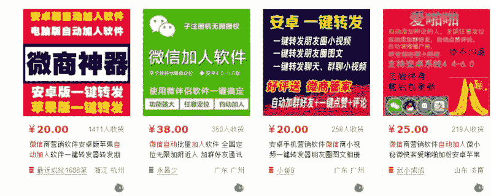
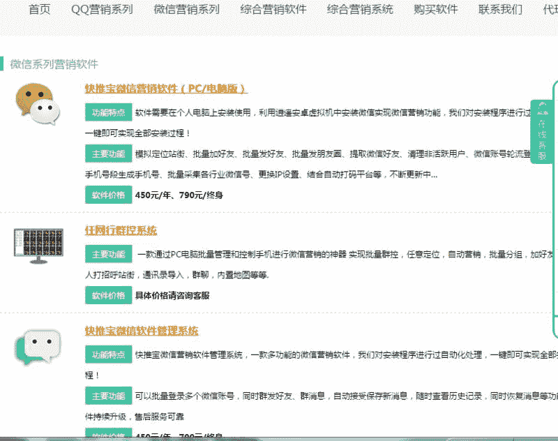
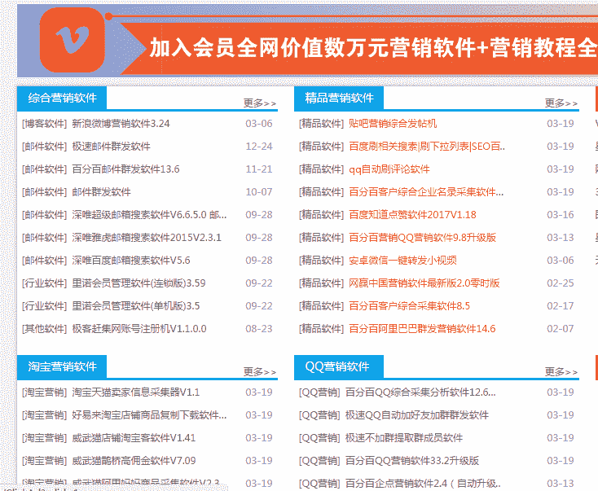

# 营销工具整合

一个案例，营销的工具一直有，看图 1 图 2，流量并不小。

今天搜了下有没有整合这些的，果然有，看图 3，把几乎能找到的所有付费工具都收集起来了，放在一个站点里，需要买网站会员才能任意下载使用，定价在淘宝和这些工具官网之间。

营销工具

营销工具

营销工具

评论：

fred：这个站点网址分享一下

niege 回复 fred：[星空营销](http://www.xingkongrj.com/)

niege 回复 fred：这个网站收费在 100-200/年之间，应该微商之类的才用这个，比起官网一个软件就几百更能吸引微商

fred 回复 niege：这个直接抄了，通过搜索来获取流量，比他快做起流量就行了

niege 回复 fred：很符合 seo 的思路

阿青 回复 fred：做程序猿教学资源的论坛也有

牛胖子 回复 niege：大哥引流平台链接再发一下。上条失效了。

[加入「生财有术」](https://www.ilangcai.com/jiaru/)

交流合作，请加微信：sige3638