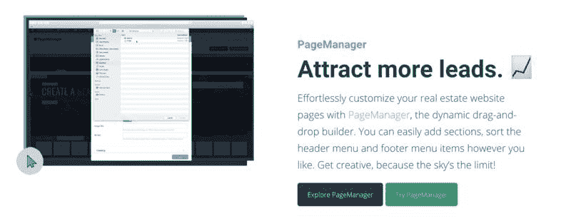
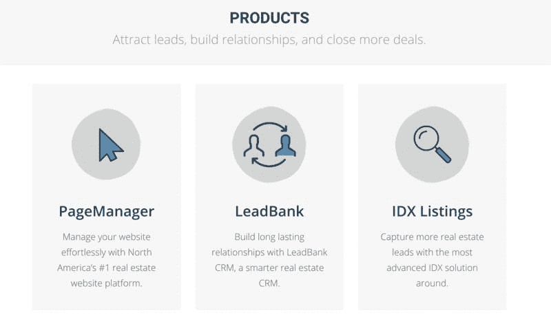
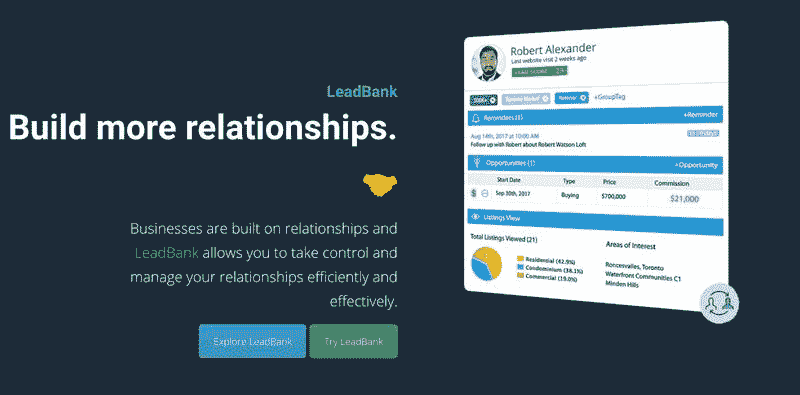
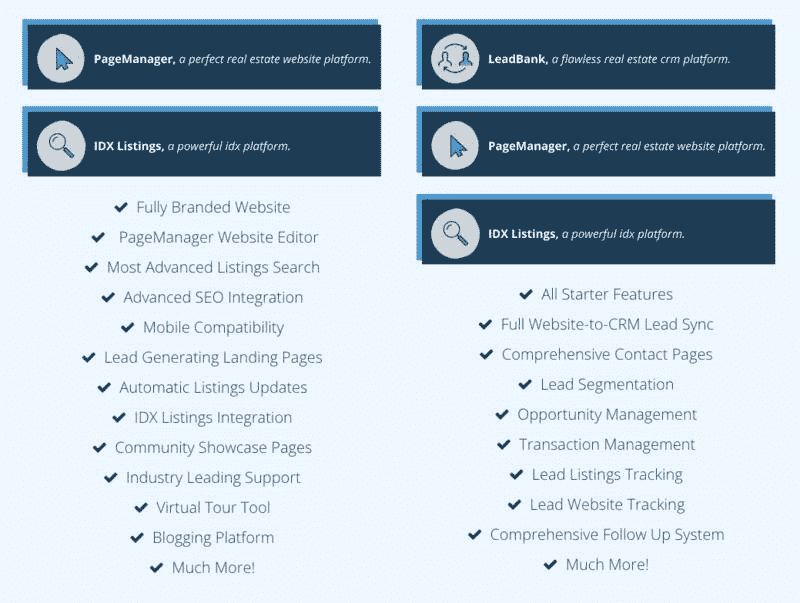
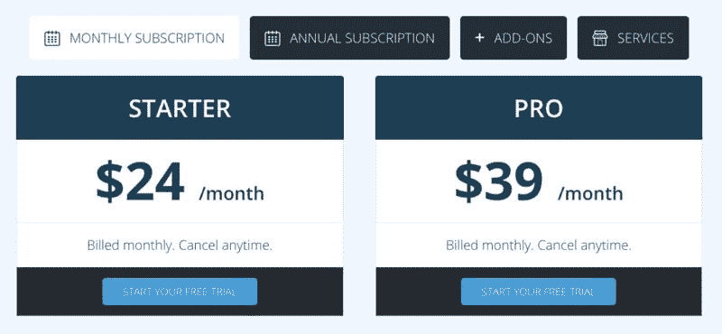
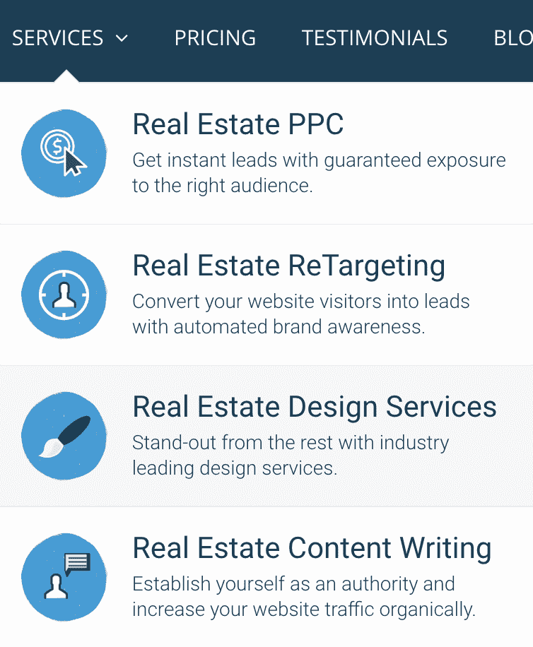

# 为房地产经纪人创建的 SaaS 网站，月赚 10 万美元

前几天，亦仁分享了一篇白鸦关于 SaaS 的文章。

今天#一起赚美元# 就来一篇新鲜的关于 SaaS 的案例，案例中的主人公，通过他为房地产经纪人创建的 SaaS 网站，每个月赚 10 万美元。

这个 SaaS 案例是 web4realty.com，它为房产经纪人提供网站建设服务、客户管理系统和邮件营销平台。

有意思的是，这家公司现在 14 名全职员工，并且远程协作完成所有的工作。

案例主人公学生时期，受百万像素网站（格子网站，将一个网页分成 100 万个格子，每个格子卖 1 美元，最终成功卖出 100 万美元）的影响，他们在时代杂志买了两页广告，并且分拆成很多格子，希望将这些格子卖给广告主，虽然最终没有完全卖掉，但还是一个很不错的尝试。

然后因为他们的一个合伙人进入了房地产行业，想建一个房地产网站，却发现市面上的提供商价格都很高，于是“更低价格更好产品”的想法形成，也就是 web4realty。

以下是产品的几个关键细节

1\. 调研阶段。装作客户打电话给几十个竞争对手，了解有多少用户，有多少员工，经营多久，入职流程，销售流程以及销售收入等；

2\. 产品开发阶段。没有钱请本国的开发者，找海外便宜的外包开发者，最后也成了他们的全职员工之一；

3\. 兼职赚钱养活产品阶段，两个创始人刚开始会做一些外包的工作，比如帮助别人运营 wordpress 博客，赚钱养活团队；

4\. 产品推广宣传阶段，得益于房地产经纪人四处传播他们的联系方式的特性，要联系到这些人，要做的仅仅是去收集，也许就够了，然后挨个发送电子邮件进行营销；

5\. 营销自动化，随着有稳定的客户和收入，他们开始用一些付费的工具提高效率，并且确实发现对业务进展有很大帮助；

6\. 扩展成为真正的 SaaS，内容营销建立信任，并将 60%的免费用户转化为付费用户，并且将目前这套解决方案拓展到海外市场。

*   

    web4realty

*   

    web4realty

*   

    web4realty

*   

    web4realty

*   

    web4realty

*   

    web4realty

*   

    web4realty

*   

    web4realty

评论：

fantasybei：鱼丸，这些案例都是哪里搞来的啊

🐶🐶🐶 回复 fantasybei：同问鱼丸哈哈哈

鱼丸出面 | 亦仁助理 回复 fantasybei：indiehackers.com

壹树：[Products by Indie Hackers](https://www.indiehackers.com/products)这里有不少