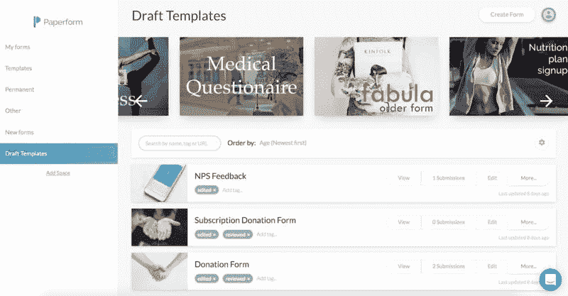
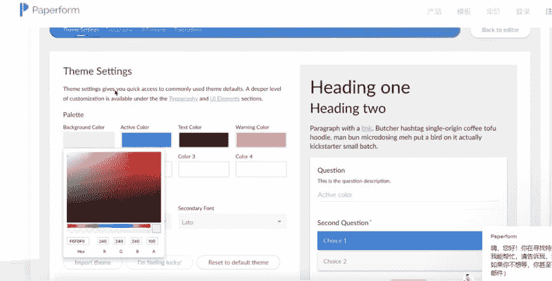

# Paperform：帮助业务人员在线创建表单的工具，月赚 24000 美元

一对生活在悉尼的已婚夫妇，通过建立在线创建表单的小工具，实现了一个月 24000 美元的收入。

男方负责技术开发（专业是音乐和哲学，后期自学编程）、女方负责运营、财务和法律。

上线时间：2016 年 8 月

截止现在每月收入：24000 美元，环比增长率：10-15%；

6000 名付费用户；

2000+活跃用户；

20000+注册用户；

Paperform，帮助业务人员在线创建表单的一个工具，比如产品的支付账单、活动注册表、或者健身课表，都可以快速在线生成，一大亮点是可以最大程度匹配用户所在公司的品牌调性，自主选择字体、颜色和图片。

鱼丸体验了一下，有点类似于 Wordpress 创建的网页、Shopify 的店铺模板，生成类似于网页一样的图文模板，参考图 1，图 2

一、需求产生

有一些朋友和同事需要为产品来定制表格，而市面上找不到合适的产品来满足需求。

二、MVP

16 年 5 月开始，老公早上 5 点起床，对产品进行架构，之后再去上班，3 个月后 MVP 正式上线了。之后有 300 个人过来测试，给了一些积极的反馈以及一些建设性批评建议。

三、冷启动

跟 AppSumo 合作，带了第一波流量。

四、花费时间：

从构思到推出，总计花了 5 个月，直到 17 年 2 月，产品持续在增长，两人结束了朝九晚五的工作，全职投入创业。

五、收入模式：

1.SaaS 订阅，前 14 天可以免费使用，有三挡套餐：

基础版：15 美元/月

专业版：39 美元/月

代理商：99 美元/月

六、产品推广：

1.BetaList 和 AppSumo 带来了第一波用户；

2.口口相传和媒体的自然关注和曝光；

3.博客上写文章，搜索引擎排到了第二位；

4.分销：新用户和老用户都能获得 10%的返现，推荐 10 位用户就能全免费；

5.建立合作伙伴关系，赞助大学竞赛、与 eCoach 合作，获得了大量潜在用户。

Paperform 图 1

Paperform 图 2

Paperform 图 3

Paperform 图 4

评论：

hoolaa：自学编程！自学能力有点强大啊！

鱼丸出面 | 亦仁助理 回复 hoolaa：身边也有这样的大神

hoolaa 回复 鱼丸出面 | 亦仁助理：是亦仁吗？

鱼丸出面 | 亦仁助理：夫妻天然适合做合伙人： 价值观一致减少沟通成本 利益一致，没有分配不均的困扰 有多少合伙人是因为这两个分道扬镳的！！

kk：是金数据、mikecrm 这类网站吗？

亦仁 回复 kk：不是我，尝试学过一段时间编程，没坚持下去。

自动机：类似于金数据吧

鱼丸出面 | 亦仁助理 回复 自动机：有点像

Katao：这个国内有一个表格-简道云也非常好用-可以关注这个