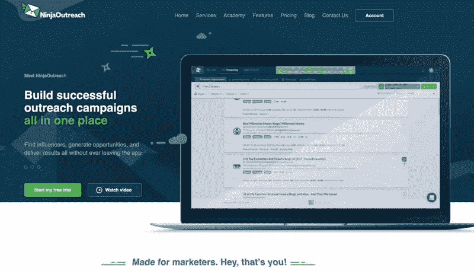
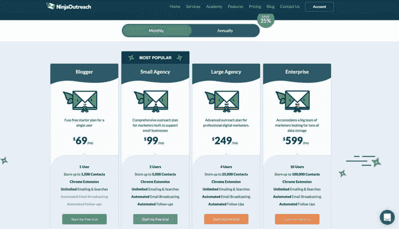

# 帮助用户提升营销业绩和影响力的工具，每月躺赚 5 万美元

一个帮助用户提升营销业绩和影响力的工具，每月躺赚 5 万美元。

主人公是一个哈佛应用数学专业毕业的小哥哥，厌倦了金融行业朝九晚五的打工仔生活，毅然辞职，跟女友一起环球旅游。

之后开始创业，做了这款，能帮助中小企业老板、创业者，快速找到 Instagram、Twitter 上的网红资源，并且能方便地进行邮件营销、品牌推广的一站式营销平台。

2015 年，也就是这款产品发布的第一年末，每个月的营收达到了 1 万美元。

2016 年后，达到了 3 万美元，上个月，突破了 5w 美元。

建立 MVP：

通过注册测试竞品的工具，结合大量的电话访谈，将收集到产品建议全部反馈给开发人员。

他们做了很多工具，并整合成一个工具箱，比如

1\. 建立线索库，抓取了众多网红和商业线索资源，只需要在他们的数据库中搜索相关的关键词，就可以找到有价值的关键人物和信息，比如聚合了几百万个邮箱，同时建立了自动邮件推广系统，可以一键发送广告；

2\. 抓取整合了众多 Instagram 上面的网红信息，并做结构化整理，如果你有品牌希望推广，可以在他们的系统中搜索并设置要联系谁，同时设置好预算，他们可以主动出击，利用人脉上面的优势，帮你迅速找到想要找的人；

3\. 类似的， 他们抓取了众多 twitter 用户的信息，可以检索任意关键词和国家的数据，需要联系谁，通过他们的软件可以一键保存并请求连接，同时有自定义的 crm 管理功能；

4\. 比如提供整合营销服务，可以帮你做外链建设、内容营销、广告投放、博客营销等多种方式的推广服务；

5\. 外链建设的软件，根据需求和预算自动发布有价值的外链；

6\. 开发出一个关系管理系统，方便用户搜索、保存、追踪用户和线索；

推广手段：

1.Twitter，邮件，和 Linkedin，短期起量特别快！

2.慢慢来，持续做：SEO，以及与 KOL，大 V 绑定关系

3.在 Warrior Forum 和 AppSumo 上引流，获取了很多外链和流量

4.利用主人公原有的博客发布文章进行引流，注册数和流量突飞猛进。

收入模式：

2015 年 6 月到 7 月，月收入从 0 增长到 3000 美元，当时只有 100 个订阅用户，12 月份他们正式提价，达成了月收入 1 万美元的目标。

收费套餐：

69 美元/月 ，新手版适合单个用户

99 美元/月，适合小企业主，综合推广服务

249 美元/月，适合专业数字营销从业者，高阶版推广服务

599 美元/月，适合大客户，需求海量客户源

未来的目标：多样化收入来源

建立了在线学院，做线上营销培训，为客户提供量身定制服务：潜在客户开发、外链建设、软文写作等。

踩过的坑：

MVP 第一版做了电脑端 app，而不是网页版；

把 paypal 作为支付处理器，而不是 Stripe；

（上线了以后才知道，这两个都是逆用户习惯的，导致后期重构非常痛苦、代价巨大）

界面丑且反人性的设计；

雇了价格便宜，做的活很粗糙的开发；

没能跟更多的用户去交谈；

总结最大的坑就是没有做足够多的调研，没有跟足够多的用户去交流。

一站式营销平台

一站式营销平台

评论：

鱼丸出面 | 亦仁助理：这个工具能帮助中小企业老板、创业者，快速找到 Instagram、Twitter 上的网红资源，并且能方便地进行邮件营销，品牌推广。

Amazing 海子 回复 鱼丸出面 | 亦仁助理：拒绝访问

柚子（别摸我头会长不大） 回复 Amazing 海子：我翻后可以打开

WTB 回复 鱼丸出面 | 亦仁助理：有类似的做抖音网红的平台吗？在广告主和抖音网红之间建立桥梁。

亦仁 回复 WTB：抖音的星图

Amazing 海子：这个网站打不开？刚试了一下。翻了也进不了。