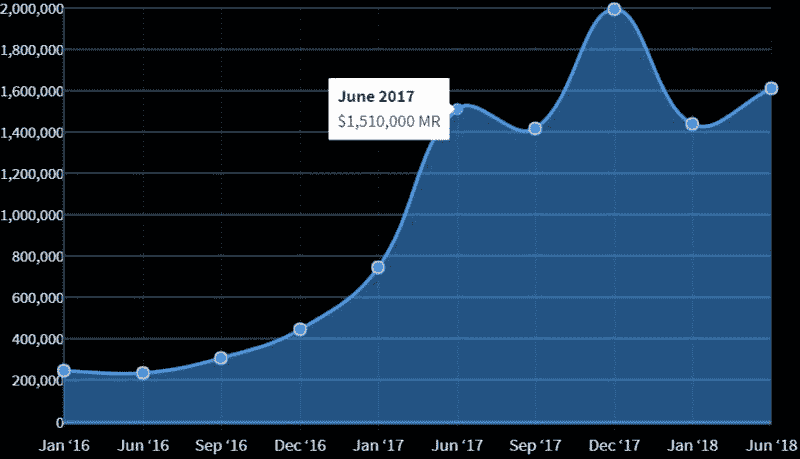
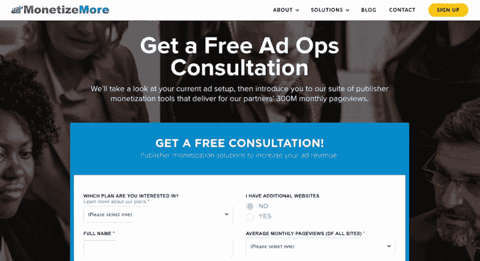
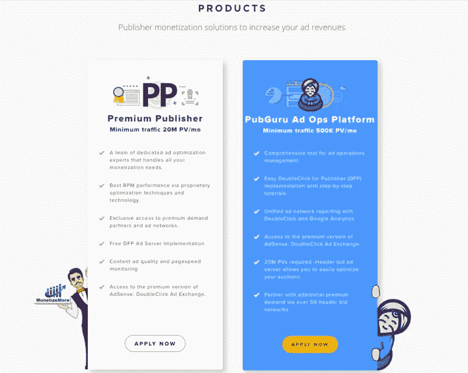

# MonetizeMore：为流量主增加广告收益的软件

一个被迫失业的小哥哥，在南美四个月的放逐旅行后，坚定了自己创业的想法，做了一套可以为流量主增加广告收益的软件，具体地说，就是可以为每个流量主的广告位找到出价最高的那个广告主，目前已成功为 40 多个国家的流量主增加了广告收益。

截止 17 年，MonetizeMore 总收入已达到了 1670 万。

图 1 是他们的收入表。

这套服务主要由以下一揽子产品组成：

1\. Google Ad Exchange 简称 广告交换平台，流量主可以直接将自己的广告位展示出来

2.Header Bidding，一种拍卖技术，可以确保出价最高的广告主获胜，从而确保了流量主的最大收益。

3.Premium Publisher，除了上面提到的这些工具，还结合广告优化专家全程操盘，最大化流量主收益。

从 2016 年到 2017 年，业务增长了 73%，在 2017 年达到了 1670 万美元。 增长这么快，主要得益于广告技术的快速规模化。

鱼丸去官网仔细研究了他们的产品介绍，具体可感知的实现的功能有：

1.专人配合流量主完成数据底层建设

团队会派程序猿配合流量主，搭建网站的核心基础建设，比如数据流量平台，Header Biding 的配置、收入报告等。

2.每日展示日报确保信息透明

这个小哥哥认为，在一段成功的合伙关系中，最重要的莫过于信息透明和信任，所以他们会将每日的收入统计图完整地展现给流量主看，并以此作为日后投放改善的依据。

3.优化算法，确保流量主找到最优的广告主

这一整套流量主工具相比竞争对手，可以实现更好的结果，运营团队使用了 PubGuru 的多变量测试环境，连续不间断地测试竞标者变量，设定竞标者超时、竞标规模来确保证流量主获取最大收益。

大部分潜在客户转化来源于内容营销：比如，博客、Youtube 视频、问答论坛、社交媒体、邮件营销、内容合伙人、应用商店、PR。内容营销效果特别棒的原因是，他们专注于为流量主提供价值，解决流量主们最关心的问题。

MonetizeMore 图 1

MonetizeMore 图 2

MonetizeMore 图 3

评论：

Killer：说了半天，不就是个 adx 么

雨亭之东：技术和业务完美结合做变现，内容营销驱动增长

Frank：为需要解决问题的人解决问题，赚钱是顺带的事情