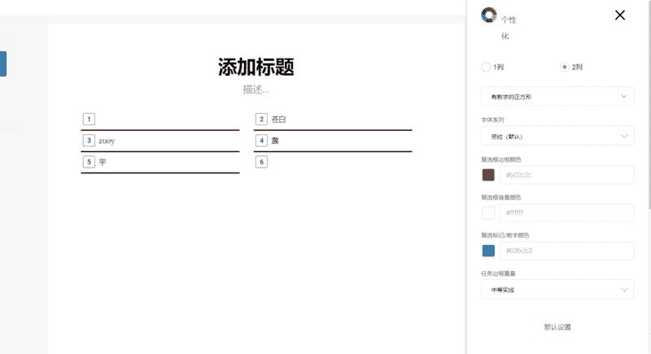
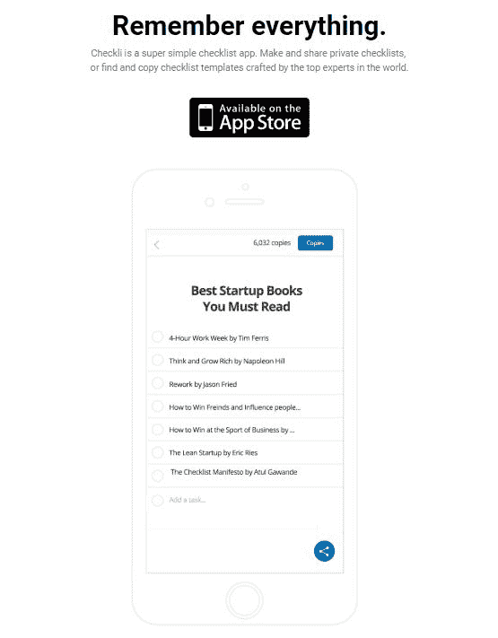
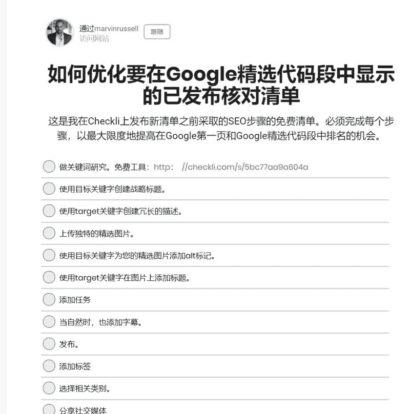
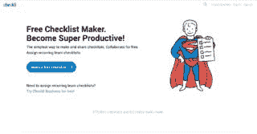
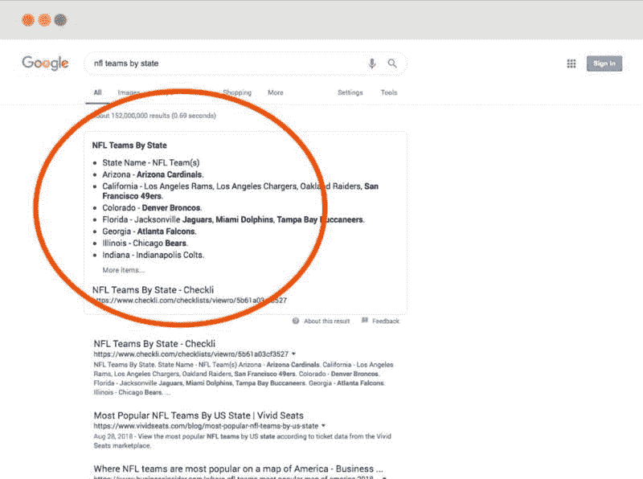
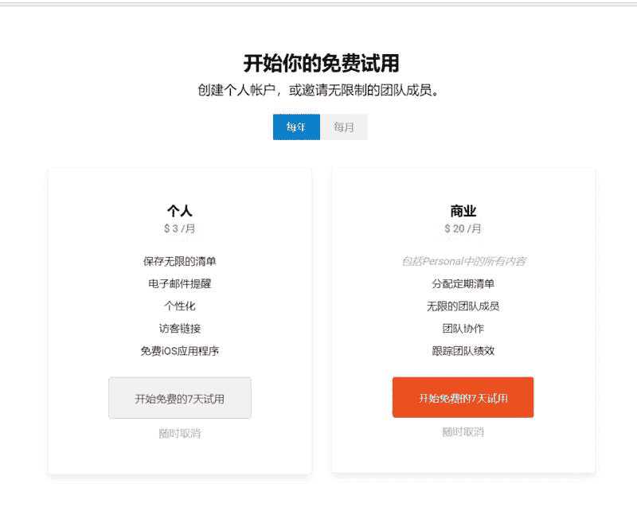

# 极简、可分享的清单工具，芝加哥小哥哥月入 2300 美元，他不是程序员

一个极简、可分享的清单工具，每月为这个芝加哥的小哥哥带来 2300 美元的收入，他不是一个程序员，第一个版本是花了 400 美元，在网上找的印度程序猿兼职完成开发的，截止到本月（19 年 1 月）的数据：

月收入：2300 美元

每月访客：80000 名（UV:55000）

主人公是一名在芝加哥，连续两次创业成功的小哥哥，之前创业做的一款 SEO 审核工具，2 年时间内月收入已达到了 4 万美元，清单是他的第三个创业项目，他以为这就是有一个帮助他自己理清杂乱想法的工具，但令人惊喜的是，发布后有成千上万的人都很需要它；

截止到 19 年 1 月，在 Checkli 上创建的任务数超过了 800 万条；创建的清单超过了 13.4 万，总计清单下载的次数达到了 20.2 万；

一、区别于普通的清单工具，Checkli 与众不同的点在于：

1.不用登录，用户就能免费与他人协作；

2.用户在几分钟内发布的清单，可以很快在 Google 上排序很靠前；

3.可以指派和追踪团队中重复出现的一些任务；

鱼丸体验完最大的感受是，用户创建的清单可以一键分享给所有人看，例如：优化 SEO 清单、减肥清单、好看的电影清单、书籍清单，很受一些用户喜欢，他们会收藏或者下载为 PDF 保存下来。分享的人因为看到自己的清单被很多人收藏/下载，会有更强的意愿继续分享；

二、想法来源：

1.小哥哥第一次创业完，有多动症和焦虑症的他，苦于无法集中注意力，每天有上百件事是自己想做和必须做的，但同时又有太多事情导致他分神；他需要一个工具帮助他提高效率；

此时市面上大部分清单工具，都难以在简洁和基础功能实现平衡，所以小哥哥决定自己做一个；

2.无意中看到了一本清单宣言的书，里面讲了大量的案例，各行各业都在管理过程中纳入了强制性检查表。而清单工具可以帮助人们结构化梳理自己想法，同时避免遗漏重要事项。

三、MVP

1.严格地说，这个小哥哥不是做开发的，但他几乎知道所有的技术术语；

2.在美国开发成本过高，他在 Upwork 上找到了一个印度程序猿，花了不到 400 美元搞定了一个简单版本；

3.花费 10 美元找到了一个域名：Checkli.com，完美适配这个项目

4.上线一个月后，他发现竟然有几百人在用这个工具，出于好奇，他发起了一个问卷询问用户为什么喜欢这个软件，得到的回答都是，这款软件功能极简！！借此他也收集到了几百条用户其他的改善建议；

5.之前的印度程序猿莫名其妙消失了，接着他找了一个中国的程序猿，结果代码写的一坨屎，完全不可扩展；（在一个技术导向的产品中，非技术人员的窘境在于：你压根不知道自己不知道什么）

6.小哥哥最终还是决定花 2000 美元重构 web 端页面，这样后期可以扩展收费功能，没想到由 2000 最后花着花着变成了 4000，4000 又变成了 6000，他有点受挫，为日益增加的成本，也为沟通问题，尤其是自己缺乏技术知识；

7.2017 年，小哥哥觉得必须得在芝加哥当地找一个程序员，他自己往账户里存了 50000 美元，用来支付这个程序员的工资；

四、推广手段

1.小哥哥虽然自己不是个码农，但他 SEO 方面的技能在行业里首屈一指，配合新来的程序猿，很快，Checkli 在众多的清单工具中脱颖而出。

a，在短短数月内，“checklist”，“ listmaker”，“ free checklist maker”等等关键词都排在了第一位；

b，小哥哥还将自己的 SEO 技能，用在了用户免费发布的清单上，比如用 seo 友好的域名，图片上加 tag 标签；没过多久，很多用户发布的清单排在了 Google 第一位，每天有源源不断的自然流量被吸引过来；

五、商业模式

1.18 年以前 checkli 一直免费，后来在免费的基础上增加了两个收费功能：

个人版：可以创建账户，保存清单，设置提醒

年会员：36 美元

月会员：5.99 美元

企业版：可以邀请成员协作、跟踪需要每天重复做的一些任务

年会员：240 美元

月会员：25 美元

checklist

checklist

checklist

checklist

checklist

评论：

柚子（别摸我头会长不大）：每天到公司的第一件事就是列 to do list，可以大大提高工作效率，也避免有些重要的事情忘记做～不过用了很多这类工具，最后发现纸笔最好用，跟作者感受一样，很多工具做的太复杂了……

鱼丸出面 | 亦仁助理 回复 柚子（别摸我头会长不大）：我常用的是桌面自带的便签，但不能存档，也不能标记已完成，好处是可以钉在桌面上。

retob 回复 柚子（别摸我头会长不大）：用了很久的 Google sheet

柚子（别摸我头会长不大） 回复 retob：今天试试

萧遥：纸笔清单没法回顾 我也头疼

鱼丸出面 | 亦仁助理：圈友们有上班时列待办的习惯吗，用的是什么工具？

Shadow：6～7 年前国内也有一个叫清单产品，现在应该还在线上. 可惜没有营收能力

千寻软件🔥达人：中国程序员这么惨。

千寻软件🔥达人：印度用英语说话么？没有沟通障碍么？