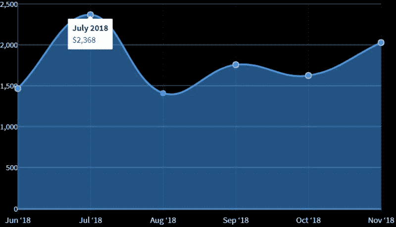
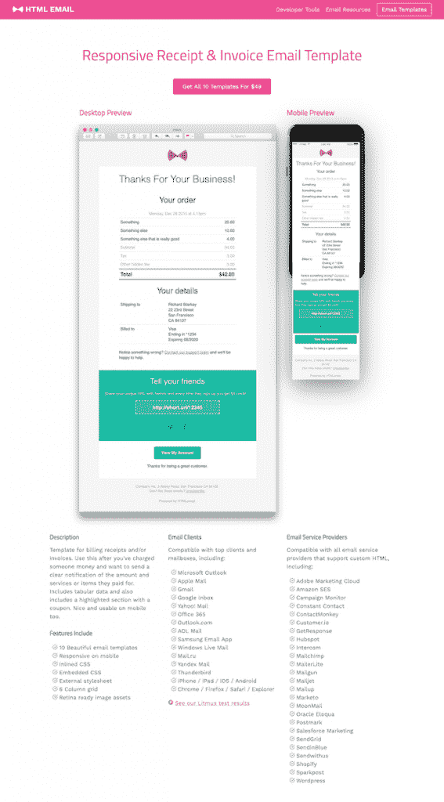
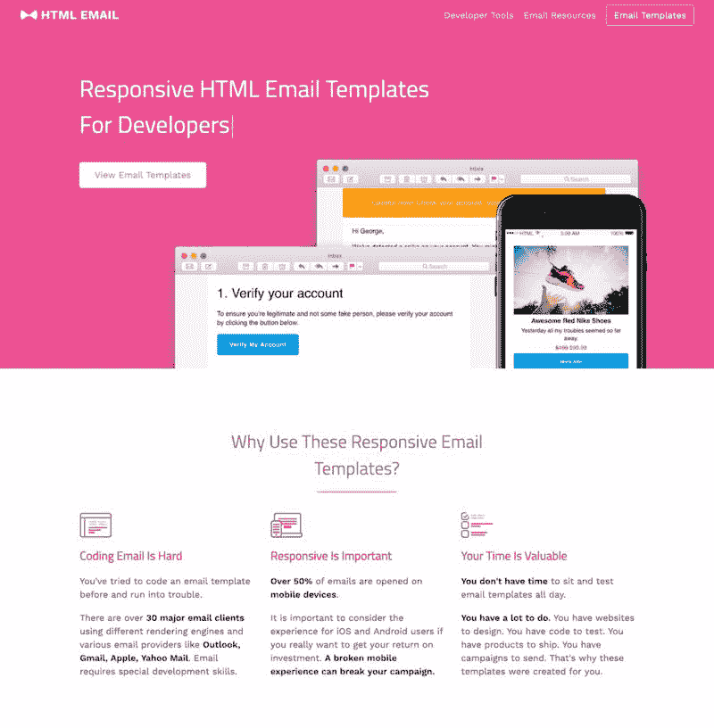
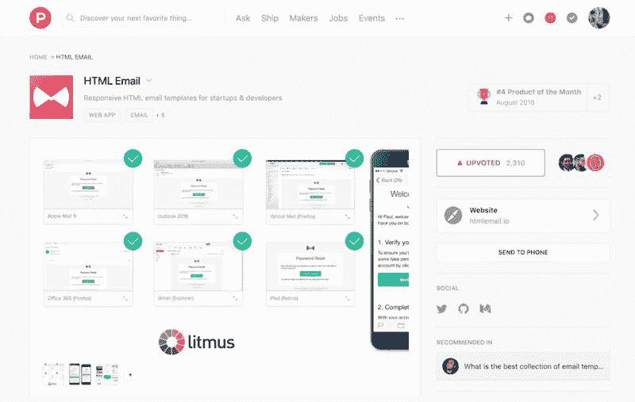

# 设计师兼开发小哥哥，做 HTML 电子邮件模板，月赚 1700 美元

一个来自北爱尔兰的设计师兼开发小哥哥，做了一套 HTML 电子邮件模板，从 18 年 6 月到 11 月，每月躺赚 1700 美元。

这个工具适用于什么场景呢？

可以说，各种我们邮箱里收到的广告邮件，都套用了某种模板，排版精美，重点突出。

比如，商家发给用户的商品促销邮件；银行每月发过来的信用卡电子账单等；

一、想法由来：

这个小哥哥，在实际写代码的过程中发现，虽然有发送和接收电子邮件的组件和 API，但程序猿真的不喜欢为邮件编写 HTML，而且有各类电子邮件客户端要测试，每种客户端呈现界面也不一样。

小哥哥将开发 HTML 电子邮件的经验教训写在了博客和 github 上，并且开源了一些基本的模板，发现有非常多的人对这个感兴趣，由此，激发了他做模板直接出售的想法。

二、冷启动

1.小哥哥有个人博客，每周会分享 3 到 4 个有用的设计模板链接；

2.在 Dribble 和 Twitter 上发布产品介绍，并鼓励有兴趣的人留下电子邮箱；

3.给一些 KOL 免费模板，引导他们转发；

4.产品提交到 Product Hunt，幸运地成为了当日最佳，导了了很多流量；

5.发布一些营销活动，引导用户留下电子邮箱，方便之后促销触达；

三、商业模式

从产品第一天上线起就开始收费，可能很多人会质疑市面上有那么多免费的模板，用户愿意为这个东西付费吗？

实际上在 18 年 6 月到 11 月期间，每月的收入基本维持在 1500-2000 美元之间。

如图 1：

基础版：10 个模板，售价 49 美元

高级版：售价 299 美元，适用于机构和大公司

四、未来的目标

目前，他们专注于面向销售人员的电子邮件模板，同时，还在做适用于邮件开发人员的其他工具，包括 Sketch 设计系统，CSS inliner 和测试电子邮件发送工具等。

图 1

图 2

图 3

图 4

评论：

千寻软件🔥达人：技术圈的业务，范围就难么大