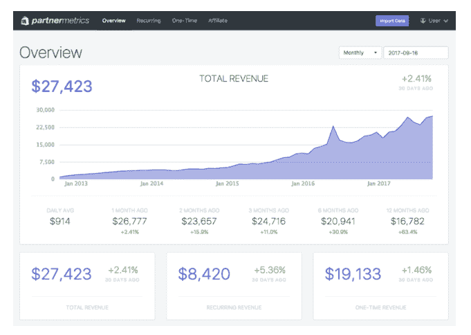

# 一位“卖水者”，开发小产品，卖给 Shopify 商家，年赚 30 万美元

像亦仁老板提到的那样，当淘金者狂热之时，最稳赚不赔的生意就是去卖水给这些淘金者。

今天“一起赚美元”介绍大家认识的就是这样一位“卖水者”，开发了几款小产品，卖给使用电商程序的 Shopify 商家，一年可以赚近 30 万美元，差不多 200 万人民币！

这些小产品分别是

1\. OrderlyEmails 一次性 49 美元；

提供优美的邮件模板，使得没有开发经验的 Shopify 商家可以很自由的通过拖拽完成一份优雅的营销邮件，并发送给客户，同时支持在邮件里面增加一些提高客单价和折扣的功能。

2\. OrderlyPrint 每个月 29 美元；

帮助商家批量处理发票、收据、提货单、打包条、退货单、税收单等，自动填写发货信息并通知用户。

3\. Order Printer Templates 一次性 29 美元；

专业的打印模板，可定制的发票、装箱单、退货单等，可以使得商家快速的打印文档，节约了很多时间。

出于意料的地方是，这几款小工具的作者并不是程序员，他的工作是数据分析师和产品经理，他的第一款产品 OrderlyPrint 是花了 2000 刀在 2012 年请印度的程序员外包做出来的。

与大多数人一样，这样做的目的是为了可以获得更多的时间和财务自由，进而可以陪伴家人和刚出生的宝宝。

刚开始的时候，靠着应用商店的流量，OrderlyPrint 就有客户， 但每天只有一两个。 每天晚上作者都要花 30 分钟，回答客户的邮件，思考新的功能，引导客户留下好评使得在应用商店的评分更高。

一开始平衡时间是个大问题，跟大多数人一样，下班回来已经累的半死，还得再花时间去做一些副业工作， 但世界就是这样，谁坚持下来，谁克服掉其中的困难，谁就可以在未来获得更多的自由。

最大的困难还不是时间，而是作者不会编程。

好在作者是一个产品经理，知道怎么可以入门编程，于是从最小的功能开始，逐步的去优化产品上面的体验，修复 bug，最终可以逐步将产品的编程工作从外包的手中接过来。

2 年之后，这些小工具的收入到了 4000 美元每个月，这时候有个大的突发状况是 Shopify 官方做了一个类似的小工具，而且是免费的！ 收入一下子停止了，增长变得很慢，度过了一段很痛苦的时间后，作者又上线了第二款 app，Order Print Templates。

穷则思变，不存在一劳永逸，没有永远赚钱的生意，都有其生命周期，我们得适应，就像马云爸爸经常说的，变化才是最大的不变，拥抱变化。

很多时候，我们缺少足够的耐心，而一件事情的成长是需要足够的时间， 产品也是一样。 一个产品从开发完成，到用户认可， 到有足够多的收入，非一天一月的事情，而兼职的好处是，耗得起。 作者就是在兼职的状态下，开发出了第二款产品，而且耗得起时间， 最终等到了产品有足够的回报。

第二款产品也不负众望，终于爆发了，每个月可以带来 1 万美元的收入，这时候开发者从原来的工作辞职，全力投入到产品的运营和开发中。

后续又开发了第三款产品，是一款免费的应用，用户帮助获取客户，第四个产品是邮件主题编辑器。

目前四款产品每个月可以带来$27000 的收入。

作者有一个想法与亦仁老板之前经常提的很像：

“专注于提供一些细分领域的小软件和应用，这些领域大的公司看不上，也不会进入去竞争，小开发者在这些细分领域有足够的回旋余地，也能生存的很好”

最后附一张作者自己贴出来的收入图激励下同路上的人。

收入图

评论：

千寻软件🔥达人：这些领域大的公司看不上，也不会进入去竞争，小开发者在这些细分领域有足够的回旋余地，也能生存的很好