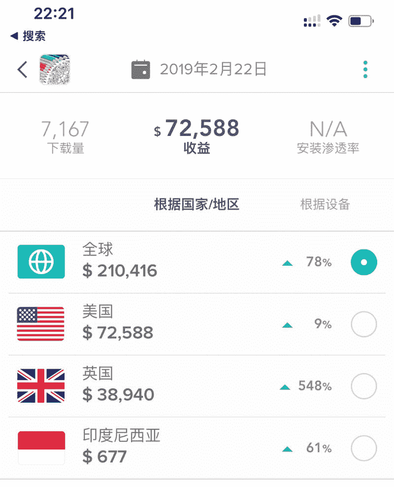
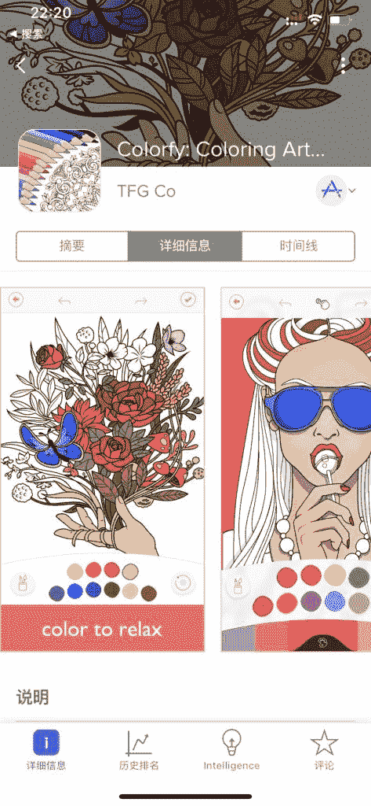

# 为什么像素/涂色/解谜类产品，在国外（欧美为主）的收入那么高？

背景：

1、美国畅销榜 Top200 的非游戏 App 里，有 3-4 款填色/涂鸦/像素产品。

2、排第一的是巴西的开发商，Tom 叔猜测一天收入保底 30 万美金以上。

原因：

1）AppAnnie 给出 IAP 收入，15-20 万美刀/天。

2）根据 eCPM 和 DAU，我拍了个广告收入：10-15 万美刀/天。

PS，欧美休闲游戏广告已经可以做到 20 刀的 eCPM 了。

和 @亦仁 以及「VIP 游戏研习社」群友讨论，为什么像素/涂色/解谜类产品，在国外（欧美为主）的收入那么高？而国内几乎没有特别大的玩家呢？

总结几点：

1、中国有时间的用户往往受教育程度一般，受教育程度高的往往很忙没时间玩这类游戏，欧美很多既有时间有比较愿意思考的玩家，与游戏设定很契合。

2、中国用户，还是要玩节奏快，烈度高的游戏。填色/涂鸦/像素/解谜类，都太温吞水了。

3、宣传是可以涂的很美，但实际上涂出来大多很丑，不如那些专业美术的人，所以有落差，得不到正向反馈，所以涂不完，久而久之也没兴趣了。据观察，很多人因为秘密花园的宣传画很美而买，买完了自己涂就很丑，不论是配色还是创意。

4、主要定位成熟女性，但是大部分中国女性没这闲情，没这耐心去玩这个。收入靠 iOS 订阅，GP 做不了的，大部分订阅都来自北美女性。不过后续有做广告变现的，也是行得通。

套路就是让用户尝试订阅后忘记去取消，然后持续扣费，因为之前很多国家的扣费只会在月结的时候才收到信用卡账单，如果不是有太大的数额，基本上没多少人留意。但是这套路在国内行不通，毕竟一扣费就收到短信了。

一代的填色产品的成本在于画本，那个真的不简单（类似第 3 点说的）。

后来才有了二代的像素填色。

也许，随着中国用户的审美情趣提升，以及老龄化社会的到来，未来几年，这类产品在国内也会火起来。各位老板可以提前布局。

图 1

图 2

评论：

Tom 叔聊运营增长：感谢亦仁赞赏。我觉得中国开发者有机会搞一波，这个产品目测研发成本不高。可以和欧美有高审美鉴赏能力的 UI/UX 设计师合作（甚至外包）。然后源源不断解锁出热门 IP 的皮肤 theme 就好了，还可以做关键词 ASO/SEO。

Tom 叔聊运营增长：门槛不在产品技术，而在设计审美，投放能力，商业化能力。

Alex 回复 Tom 叔聊运营增长：投放大概需要多少成本 商业化能力是指什么

灿阳：解压游戏

hoolaa：请问“GP 做不了的”中的 gp 是什么意思？

Tom 叔聊运营增长 回复 hoolaa：Googleplay

鸟人：不知道下面途径是否可行: 开发出来，在学校推广。学校以提高学生审美能力的想法来让学生下载，然后交作业。由于学生肯定不会画得那么美，或者说画得不正常，然后推销团队找出比较有意思的做对比，然后出知名度！

Tom 叔聊运营增长 回复 鸟人：可以有

千寻软件🔥达人：传说中的，解压游戏