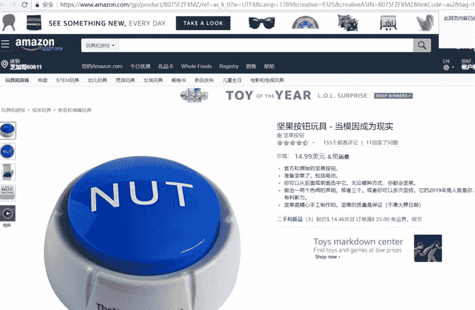

# 出售“坚果按钮”，学生小哥赚了 15 万美金

通过出售“坚果按钮”，还是学生的小哥哥已经赚了 15 万美金，近 100 万人民币，产品全程从阿里巴巴的工厂进货！

总计销往了 6 个国家，60%的毛利润，而每周最多只需工作 4 个小时！

鱼丸看到他们卖的产品，差点笑出眼泪！！就是如图 1 的一个按钮，手指摁一下，它就会发出机器人的声音：Nuts。（俚语里有疯狂，疯子的意思），除此以外没有任何其他功能了。

这个小哥哥和朋友有一天突发奇想，既然网络上的坚果按钮那么火，我们为什么不做一个实物出来，1000 个 nuts 的成本也只有 1250 美元。即便失败了，他们也可以送给当地的幼儿园小朋友玩。

所以很快他们在阿里巴巴上找了一家工厂，用很不流利的英语谈了一个价格，1000 个坚果按钮，在一个月后送到了他的宿舍楼下，他依然记得当时他的心情，一边紧张兴奋，一边又极度充满了怀疑。

相信圈子里的创业者对这种复杂的情绪并不陌生，创业者的情绪很容易像过山车，这一秒信心满满，觉得自己的产品是下一个爆款，下一秒又陷入深深的自卑，担心自己做的产品无人问津。

此后小哥哥花了 10 美元买了一个域名做了个网页，仅仅做了以下几个关键动作：

添加醒目的“立即购买”按钮

设置价格 11.99 美元

给产品起名，填写宝贝描述

为 Meta 描述里添加 SEO 关键词

除此以外什么都没做。

网站很新鲜，产品也刚出炉很热乎，但人们要怎么才能知道他们卖的产品呢？

网站在谷歌上排名还可以，所以他们又付费做了些广告，在 Instagram 上找人投了几篇帖子（大约一个帖子 75-150 美元之间）同时，在 Facebook 上投了 10 美元预算的广告。

接下来，他们就静静地等着奇迹的发生：

第 1 天，0 个订单！

第 2 天，1 个订单！

慢慢地，订单源源不断来了，到第二周，差不多每天有 5 个订单！

他给自己买了一个标签打印机，以及一些邮戳，小哥哥上学的大学对面正好就是邮局，每天早上上课前，他会打出标签，打包包裹，然后寄出去，到最后邮局的人都开始叫他：坚果先生。

这时候，他去亚马逊上开了店，一个月的成本是 40 美元，同时他也去 Ebay 上开了店。

他们意识到做这件事被别人复制的成本很低，所以他们花了很多钱购买商标、申请 IP 保护，事实证明这样做很值得。

他们的目标是做一个 nuts 按钮的实物，但事情的发展超出了他们的想象，在 2017 年 11 月，一个狗狗玩坚果按钮的视频火了，在 Twitter 上播放次数达到了 11w，他们的电话源源不断地收到订单通知，从 1 天 5 个订单，直接冲到了 100 个订单。

高兴之余，发现库存不够了，从中国的工厂订货需要花费 30 天，目前的货源只能支撑到 11 月中旬，但看着从他们自己网站和亚马逊上源源不断来的订单，他们不想直接放弃，于是他们一对一开始跟客户交流，会保证在圣诞之前将坚果按钮寄到他们手上，同时会补偿一个小礼物，或者用户不接受，可以无条件现在就给其退款，让人惊喜的是，取消订单的用户非常少。

到 12 月 11 号，快到学期末，库存的压力一直让他有些喘不过气，已做好了最坏的打算，有一天他在参加金融课的学期末考试，突然一辆大卡车到了他家门口，小哥哥终于长舒一口气，他欠的 1000 个订单可以如数还上了。

小哥哥雇了 3 个朋友来打包，到晚上 12 点，他的房间里堆满了黄色的包裹，他需要跳着才能到床上，到第二天早上，他来回来回从家到邮局往返了 20 多次，邮局的阿姨看到推过来的大箱子的包裹，整个人都震惊了！

为了奖励这次如期发货！他们给中国工厂的 7 名工人，每个人发了 20 美元的津贴，作为回报，对方给他们寄了手写的感谢信和照片。

有 1 年多了，每天小哥哥依然从网站上接到订单，然后把他们打包丢到邮局。最近他们加入采用了亚马逊物流仓储服务，可以自动发货，大大减少了成本。与此同时他们将价格提到 14.99 美元，奇怪的是，订单数量不降反升。他们通过亚马逊将其扩展到其他国家，如英国、德国、法国、西班牙、意大利。尽管有 VAT 的税，销售额总量还是增加了 15%，环比去年，销量总计增加了 75%，也大大提升了毛利润。

在即将到来的 1 月份，这个小哥哥计划去一趟中国，他们想去拜访下工厂里的员工，准备给他们再发一次奖金。

最终靠着这一个爆品，他们赚到了 15 万美金！

其实这不就是一个 facebook+dropshipping 的案例吗？

facebook+dropshipping

评论：

亦仁：很有意思，辛苦鱼丸。

鱼丸出面 | 亦仁助理 回复 亦仁：哈哈，我整理的时候也觉得很好玩。

专治信用卡不提额 回复 亦仁：真的很有价值

夏寒：机会无处不在，学习了

hz517：感谢鱼丸分享，这个案例有很大的偶然性，爆发点是网红视频

鱼丸出面 | 亦仁助理 回复 hz517：是的，可以考虑将一些流行的虚拟物品实物化。比如最近流行的运营地图，如果只是个电子版的的脑图，未必会有这么大的轰动，实物加强了买者的获得感，更好的满足收藏癖，也更容易与周围人产生讨论。

千寻软件🔥达人：学习了。不过美国的东西感觉怪怪的。