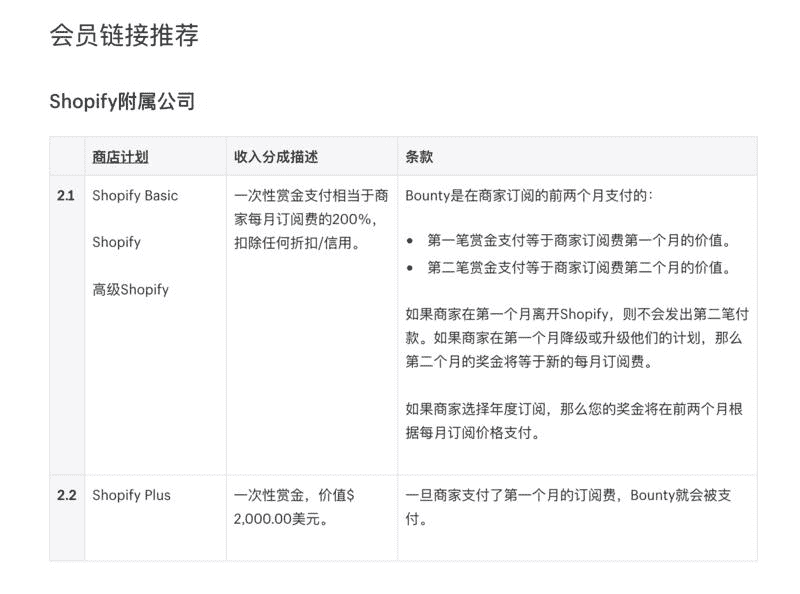

# 建立一个与 shopify 相关的权威内容网站，通过搜索引擎和社交网站获取流量

本周的“一起赚美元”来啦，晚了一天，抱歉~

随着亚马逊卖家流量竞争越来越激烈，几乎所有的跨境卖家都在考虑自建独立电商，而建立独立站基本离不开 shopify。

卖家了解 shopify 的信息和渠道有限，shopify 本土化不好，所以这个过程中就存在着通过信息差套利的机会。

具体而言，shopify 提供了 affiliate program，推荐新用户注册以及购买 shopify 的付费服务，可以获得 shopify 提供的比例不等的佣金，最高达到 2000 美元/人的推荐佣金。

比如在百度搜索关键词 shopify，第一页搜索结果中出现的多个网站，比如

1\. shopify 教程网

2\. 17shopify.com

3\. waimaob2c.com

这些网站中引导用户去 shopify 注册的链接，均是 shopify 的 affiliate 链接，有一些网站甚至成为了 shopify 的官方合作伙伴，获得更好比例的佣金分成，想必也确实给 shopify 官方带去了不少转化好的商家。

关于如何通过建立一个与 shopify 相关的权威内容网站，通过搜索引擎和社交网站获取流量，并将 shopify 联盟链接插入到内容中，以实现通过流量获利，这里有一篇不错的教程推荐给大家。

[The Shopify Affiliate Program [Promotion Strategie…](https://nichefacts.com/shopify-affiliate-program/)

附图见推荐佣金政策。

推荐佣金政策

微光：这样研究会不会很快就出师了

千寻软件🔥达人：美国的东西不太懂，这些东西，得翻墙吧