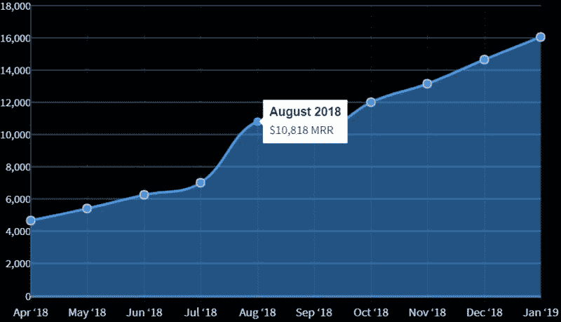
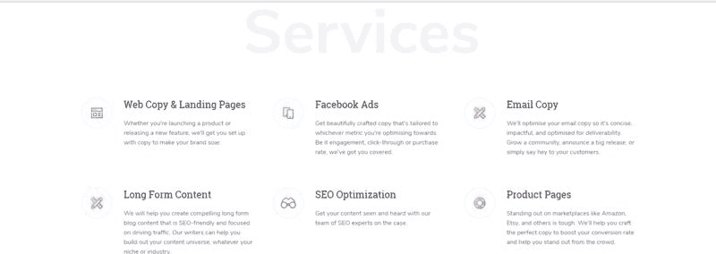
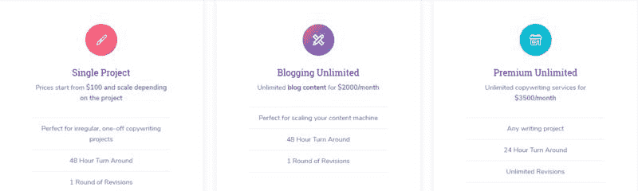

# 为初创型企业做文案写手，月赚 16000 美元

今天要跟大家分享的案例是，原本为公务员的英国小姐姐，几经周转，最终终于找到了适合自己的创业方向：写作。在 18 年 4 月份，她勇敢辞职，为初创型企业做文案写手，截止 19 年 1 月，月收入已达到 16000 美元。

小姐姐主修的专业是法语和俄语，毕业后第一份工作是在英国政府部门做政策规划，此后转型做了一名用户体验设计师，这些工作都让她感到很不开心，此后她又换过很多不同类型的工作，没有一项工作能让她内心安定下来。直到她发现自己真正的热情所在，其实是写作。

很快，她在工作之余，做了自由撰稿人，她发现她经常会迫不及待想尽早下班，以便能尽快回家开始快乐地写作。这坚定了她想长期以此为生的想法。

在 18 年 4 月辞职的时候，其实她对于自由职业毫无经验可言，且银行账户里并没有储蓄，说内心完全不慌是不可能的。

在做了几个月自由职业后，她决定做一个网站，继续做大这个项目。对企业来说，相比雇佣全职员工，成本能将近缩减一半。同时，在这个阶段，她开始以团队化运作，招募了来自世界各个地的写手，分别处于不同的时区，所以 24 小时有人在线，可以做到为客户随叫随到，因为大家都在线上工作，所以不涉及任何管理费。

鱼丸翻了他们的官网，她们团队提供的文案服务范围很广，包括了：博客文章、SEO 文章、社交媒体话术、落地页文案，以及 facebook 广告文案。几乎你能想到的所有产品文案，她们都可以做。

定价模式：

单篇文章，100 美元起步价，支持 1 次修改，适用于一次性文案写作；

不限量博客文章写作，2000 美元/月，适用于批量文章写作；

不限制题材写作，3500 美元/月，适用于所有类型的写作题材。

图 1 是网站上线以来的收入表，从她 4 月份辞职以来，每月的收入都在稳步上升，收益非常喜人！

为了保证信誉以及继续扩大写手团队，小姐姐与给团队里的人是周结，但与客户是月结，所以这中间需要她把自己赚到的收入先预支给团队里的写手。

推广手段：

1.第一阶段：

口口相传，作者在做自由职业写手之前，有积累到一批对她口碑很好的客户；她挨个发邮件，给了一个折扣价，可以长期为他们提供服务；在前 2 个月，她成功地转化了 7 名老客户到她的网站下单；有了这批用户的口口宣传，此后的订单就如滚雪球一般。小姐姐借此上线了分销机制，每个推荐客户可以获得 50 美元返现。

所以在这个阶段，出色的口碑和高留存率是这项业务的核心竞争力；

2.第二阶段：

① 内容营销/SEO，作为写手出身的小姐姐，在做内容引流方面无疑非常擅长，官网的博客文章一周更新 2 篇，在“unlimited copywriting”这个关键词下，她们官网排在第三位；这个工作才开始进行几周，但自然流量已经在逐步上升了。月流量增长率在 11.9%。

② 抵用券弹窗，新访客可以有 100 美元的抵用券，这招很有用，下单率从原来的 1 增长到了 6\.

③ 引入分销、精细化运营手段，如分别针对初创型企业、小企业、机构展现不一样的落地页。

④，在 IndieHackers 上参与讨论，在当天流量达到了高潮，还促成了一笔支付和 2 个新的写手；

未来小姐姐计划除了提供写作服务以外，还想上线一些工具包，帮助用户实现流程化写作；目前限制于时间不够用，未来还计划引入全职的员工来帮她打理网站，现在日常工作、营销、写文章、客户管理、新业务拓展，全部都她一个人搞定！

图 1

图 2

图 3

评论：

Boris 袁毅：全文都没提及这个网站的网址？

鱼丸出面 | 亦仁助理 回复 Boris 袁毅：[Scribly – Unlimited Copywriting to Scale Your Busi…](https://www.scribly.io/)

Spell：小姐姐，我可以加入你的团队学习吗

姣|深圳|自由主义者：有没有小姐姐的联系方式，想加入她的写手团队