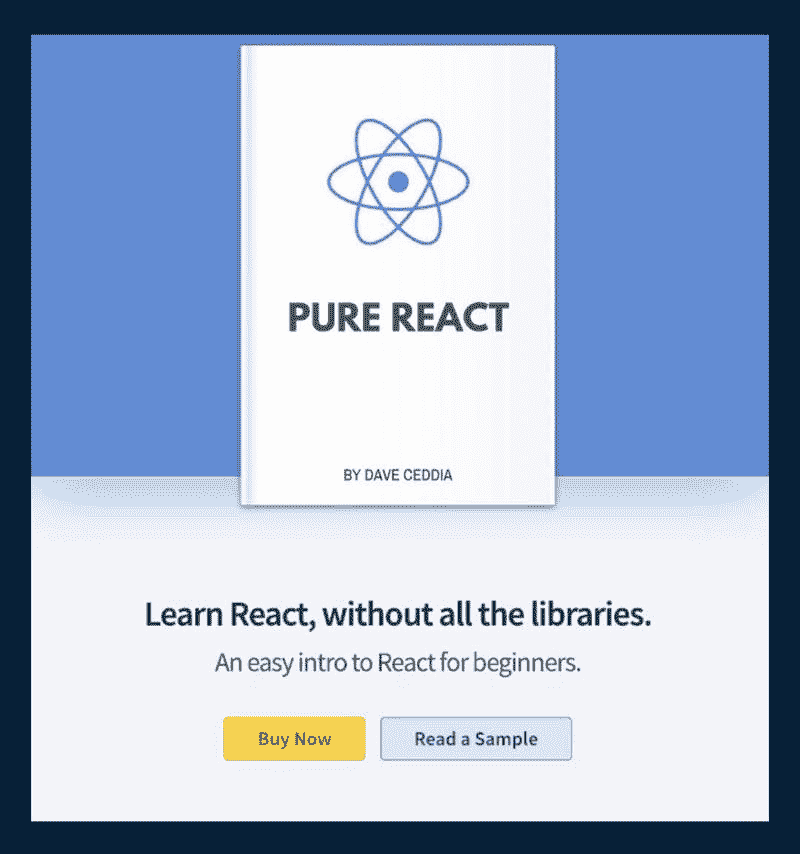
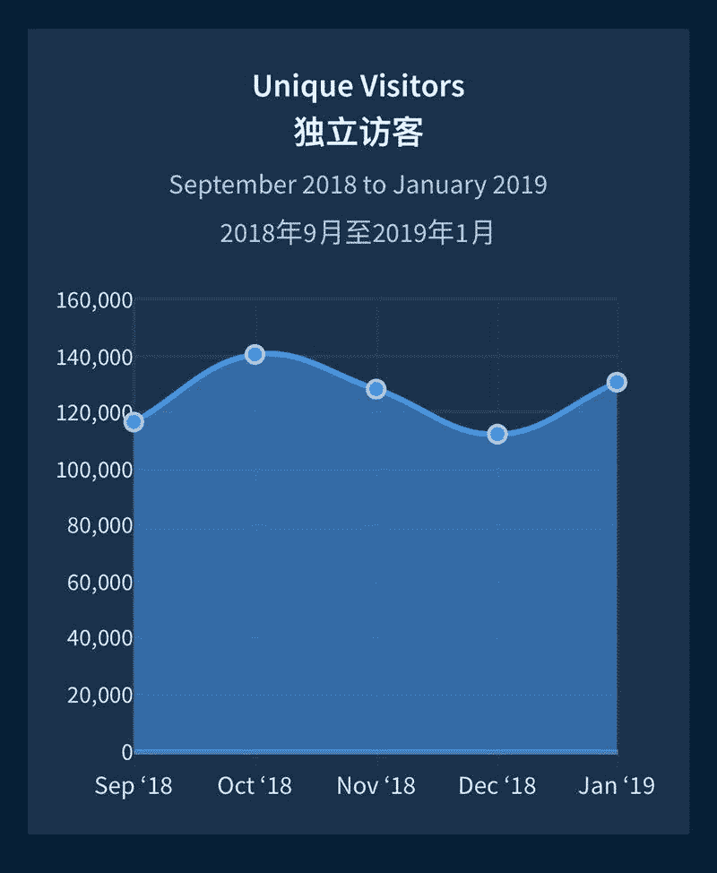
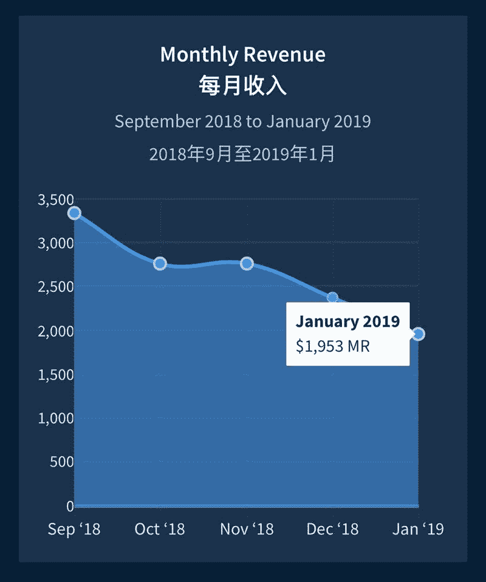

# 关于 React 的电子书 pure react，月赚 3000 美金

今天的案例没有开发产品，但设计上还是有一个作品：一本电子书。

不是创造出一个产品，而是写出一本电子书可能更适合生财有术圈子里面不会技术的圈友~

案例的主人公，写了一本关于 React 的电子书 pure react，这本小册子可以每个月帮助主人公带来 3000 美金的收入，很不错的一份兼职收入了。

作者发现很多人在学习 React 的时候遇到很多问题，作为一名程序员，作者可以很轻松的写出一门从 0 到 1 的入门指南，并且不影响目前的全职工作。 前后完成这本电子书的创作花了两个半月的时间，但在开始写之前，作者开发了一个销售页面，同时收集用户的兴趣， 以确保他在写作过程中不会偏题。

在写作的过程中，作者不断通过销售页面收集用户的邮件列表，在书本发售之前，一共收集到 2489 个邮箱地址，本来以为发送推广邮件会让很多人退订，然而事实上这种担忧并没有发生。

定价策略 1\. $35 电子书， 2\. $45 电子书+配套的代码，3\. $225 企业版，结果 70%的人购买了第二个套餐。

作者给我们带来的一些经验总结

1\. 如果你是一名开发者，大概率上有节俭的习惯， 但一定要避免重复造轮子，要克服“这有什么难的我也可以搞一个”的思维习惯，确实没什么难的， 但是时间最重要；

2\. 不要成为一名对 SaaS 狂热的人， 与第一条的人相反，什么 SaaS 软件都想付费买，当你没有赚到足够的钱的时候，不妨先找一些免费的工具；

3\. 时刻记着“ 你不是你的客户”这句话，也许一开始你是，但是过了一段时间之后，很可能你已经不是你的产品的用户了，这个时候要不断的去跟用户聊，了解他们的痛点是什么；

4\. 不要对高定价感到忧虑，只要坚持提供独特的价值，高定价不是问题，有人需要；

5\. 电子书卖到一定程度，可以考虑尝试重新编辑与出版，加上一些最新的内容与价值；

6\. 做影响力可以带来很大的价值，持续输出自己的有价值的内容在各个平台上，他们会帮助带来很多流量；

7\. 当一个东西成型带来一些被动收入之后，可以尝试多做一些东西，这样可以带来更多的收入；

React

React

React

评论：

公子睿：这个小哥卖电子书的网址是什么啊？

Richard.颜过 回复 公子睿：daveceddia.com

Richard.颜过：很好的案例。这个套路不光可以用于技术开发的达人。有独立的技能都能搞。谢谢鱼丸。

Barnett：看一下 design＋code 这本书

悉尼刘哥：时间最宝贵，现在已经养成付费思维了，能花钱买的，绝不自己动手做，时间成本太高

百川：1、很多人有些时候重复造轮子是为了节俭，但有的人是盲目自信，觉得能造出一个更好的，实则可能在中途感觉到困难放弃了，怎么做的核心是目的，看只是为了划算的用用，还是觉得别人做的不够好非要抛开自己用的目的也要去搞一个； 2、量入为出吧，经济能力允许的情况下尽量去付费，付费就是捡便宜，这么做的前提是你的价值判断：时间大于金钱 3、初期要明白别用自己的主观判断和对赢利的追求判断用户的需求，后期别以为有了一颗摇钱树就可以远离用户，不愿意去听用户的声音； 4、重新出版是为了复购，加上新的内容是为了提升复购的转化率； 5、持续输出价值才是获取信任和流量的核心，而不是去卡在入口发广告 6、一个产品成型有了被动收入的发展其他产品的关键是发展彼此高度贴合的生态产品，有的负责带流量，有的负责创收，是为了提升流量的重复变现效率，否则就是烤红薯生意

亦仁 回复 百川：说的很好

百川 回复 亦仁：亦仁大佬把这么久的帖子又翻出来看，我都忘记评论过，佩服了