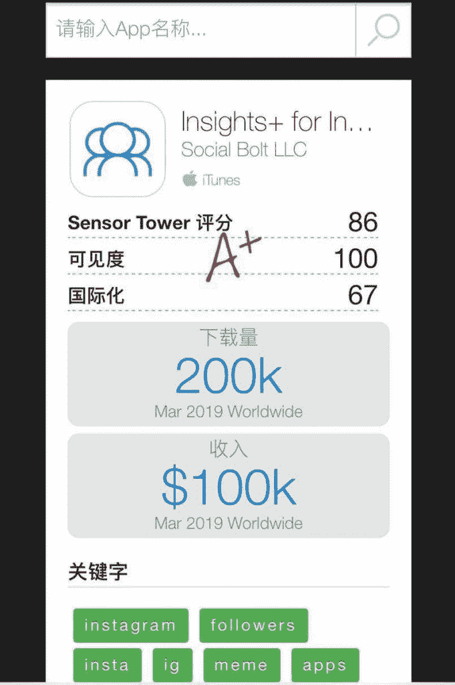
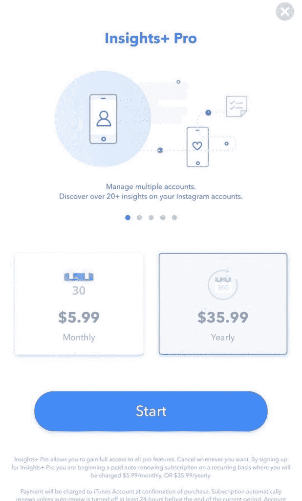
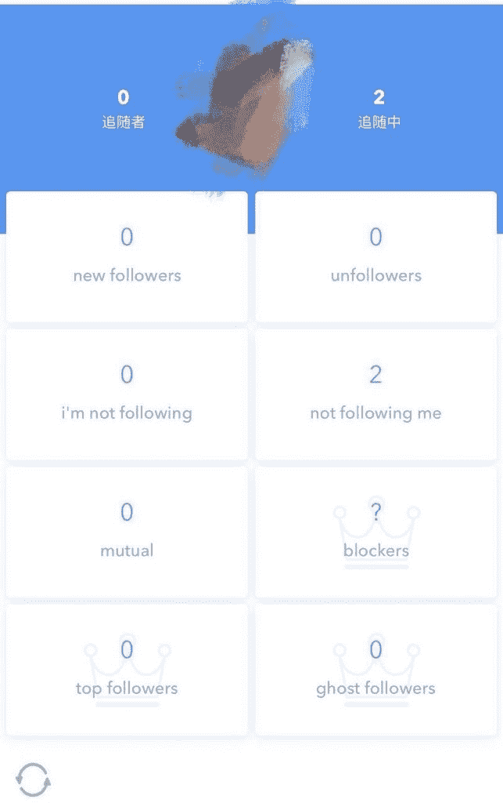
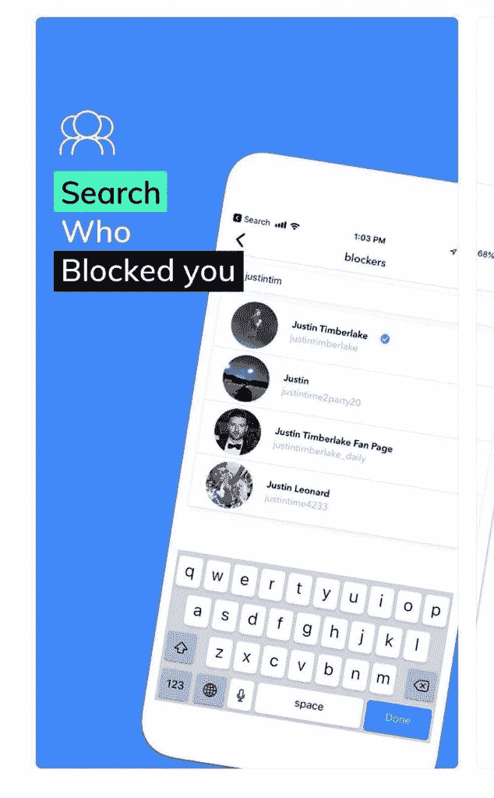
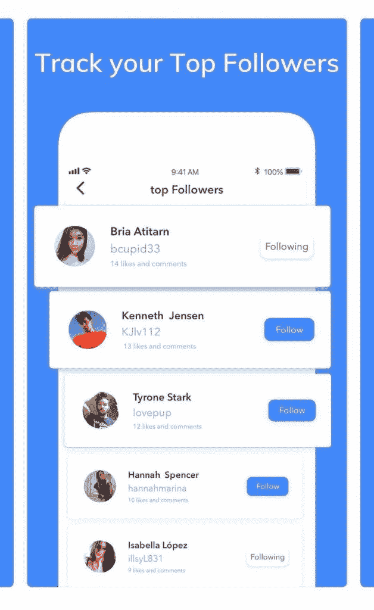
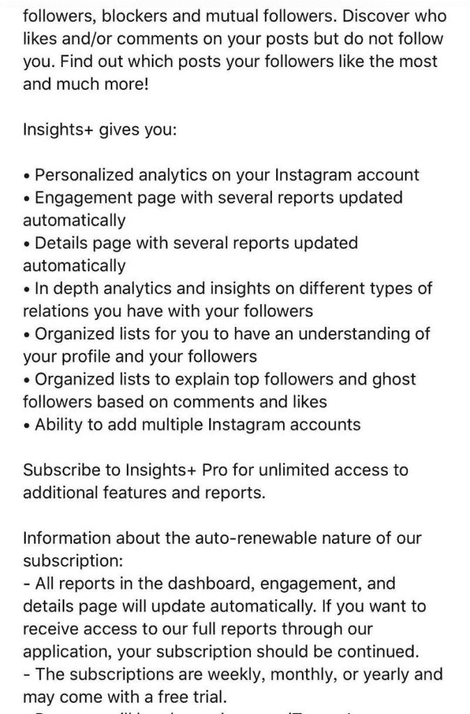

# iOS APP：Insights + for instagram,月赚 10 万美元

每周五，带大家一起看世界，分享一篇赚美元的案例。新加入的圈友可以点击上方标签查看之前的主题~

今天分享的案例叫做 Insights+ for instagram,是一个 iOS APP，从 SensorTower 上可以看到是，这个应用每个月可以赚 10 万美元，相当于 70 万人民币，每天可以赚 2.3 万人民币，一年可以赚 840 万人民币~

很厉害的收入了。

对应的下载量是每个月 20 万个，相当于每天 7000 个下载，貌似难度没那么大。

这个 app 提供的功能很简单，帮你分析谁取关了你，谁拉黑了你，谁经常查看你的动态，八卦之心，人皆有之~

收入主要看订阅会员变现，5.99 美金一个月，或者 35.99 美元一年，三天内免费试用，之后开始收费。

亦仁老板说，这产品技术难度不大，圈子里面的技术大佬可以试试看哦，或者有会英文推广的圈友联合圈子的程序员一起做一个类似的项目~

今天的#一起赚美元# 就这样，有合作需求的欢迎本帖底下评论。

Insights

Insights

Insights

Insights

Insights

Insights

评论：

敖翔：昨天晚上一点钟刷到亦仁老板发过一次这个帖子。今天在 chrome 上做插件做同样的功能，估计周末应该能出一个 MVP，打算到 chrome 插件市场做内购。有结果了来汇报。欢迎大家拍砖

D 回复 敖翔：数据哪来的？

敖翔 回复 D：浏览器上，就跟用户登陆以后，自己查看自己数据一回事儿

D 回复 敖翔：也就是 ins 的公开 API 就有？那这个有意思了

敖翔 回复 D：也不能说公开，我其实是模拟用户所有的操作

D 回复 敖翔：还是不理解。你只是模拟而已。比如 A 用户用这个产品，想要拿到过去一个月，谁谁看了 A 的主页多少次。这个数据你模拟？是什么意思？

亦仁 回复 敖翔：Key point : subscribe after free trial.

进击的 Milo 回复 D：我估计他的意思启用插件后，会收集相关访问记录。启用之前的就没法获取了。

敖翔 回复 D：目前只能抓取到谁没有关注我，或者拉黑。谁经常访问我的主页，还不知道怎么获取。

敖翔 回复 进击的 Milo：目前只能抓取到谁没有关注我，或者拉黑。谁经常访问我的主页，还不知道怎么获取。

敖翔 回复 亦仁：好的老板

ray 回复 敖翔：nb 的执行力

D：技术唯一的难点应该在，对应的那个 app 的数据抓取，其他的，好像没啥。不过 Ins 的这些数据，是公开的么？感觉不应该啊，需要分析下

无冬：我包这个软件 ios 推广，谁能做的私聊我合作

小白兔：不理解，就这样能赚钱，是不是帮别人调查数据?

Lynx：基于微信能爬这个数据就是好大一个口子了

敖翔 回复 Lynx：wetool 已经有这个功能

王伟琼：这种需求是否意味着抖音和快手的达人也存在？

Yang：需要登录自己的 ig 账号，然后调用了 ig 的 api 就完成功能。

ryojazz：2015 年时做过一款同类产品，用 who viewed my profile 当拉新/促活点，内嵌一套积分系统引导付费买赞买粉变现。一个重要版本提交审核时被 Ins 拒掉了，且被拿掉了几个重要的权限如以用户的名义点赞/关注等。当时脑残居然自己主动撞枪眼联系了一个在 FB 香港工作的熟人去打听，结果告知平台 policy 里此类软件不被官方认可。因为主要变现手段告吹，索性项目 close 了。当时没有马甲包意识，没有骗审意识，不然应该还能活三年（2018 年 ins 拿掉了赞 fo 相关 API，同期积分系统买赞买粉类全灭）