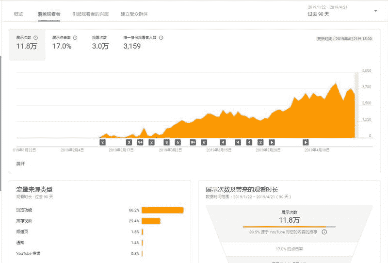

# YouTube：推荐才是最重要的流量来源 | 赚钱靠的是细水长流

YouTube 赚钱靠的是细水长流，很多人等不到挖井的水就另寻出路了。 分享我两个号的推荐数据（在 YouTube，推荐才是最重要的流量来源）

……………………………………………………………

人生起起伏伏，跟妹子的 S 身材一样，会有某个点突然爆发，也有某个点突然沉默，但只要趋势的不断向前，我们就赢得了自己。

图一是获利号的数据，刚开始熬了 2 个多月，数据一直平平淡淡，就像生活，循环往复，多是琐碎。

然后在某一个不知名的夜晚，那个一直在暗中观察你的人，出现在你面前，并且诚恳地告诉你：

“hi，胸弟，我注意你很久了，我觉得你是一个值得深交的人，所以从今天开始，我打算给你更好的位置，让你站在更多人的面前，接受更多人的目光，但如果你承受不了这份荣耀，你可能会跌倒属于你的位置。”

正如数据所言：“当你想尝试往更高的地方飞的时候，不是天空不够宽广，而是自身的飞翔的力气没有跟上，所以又回到了曾经的一个高度，当然，历经大风大浪之后，你的心态，会有更远的着想，也比曾经看的更远、也获得更多。”

图二是现阶段的一个数据，熬了 2 个多月，数据一直平稳发展，也一直在蓄力，它在等待，等待一个人，等待一场狂风暴雨，等待一次更高更远地飞翔……

YouTube 推荐数据

YouTube 推荐数据

评论：

南方以南：变现情况怎么样

卢其大叔 回复 南方以南：靠平台广告变现

老九：请问下大佬，是原创内容还是搬运呢

卢其大叔 回复 老九：搬运和原创都有，2 条路走

雪风：正准备搬砖到这个平台，搬运视频过去收益如何呢，求指导！

卢其大叔 回复 雪风：目前搬运开通收益很难，搬运只是为后期原创做铺垫

用生命在投资的康凯：大佬，可不可以详细讲一下玩法。

卢其大叔 回复 用生命在投资的康凯：如果我说靠耐心（持续更新垂直领域内容）你信吗

沐文 | 精准引流&高校资源 回复 卢其大叔：这是任何项目最为直白的攻略

Baron 回复 卢其大叔：请教下大佬，是如何处理版权问题呢？之前折腾过一段时间的搬运，不到一个月，号就全被封了。

亦仁：126 万播放收益 2000-3000 刀吧？

卢其大叔 回复 亦仁：我是中文频道，CPM 是 3.1 美元，100 万有效播放是 1700 美元

亦仁 回复 卢其大叔：看来我猜的还挺准。