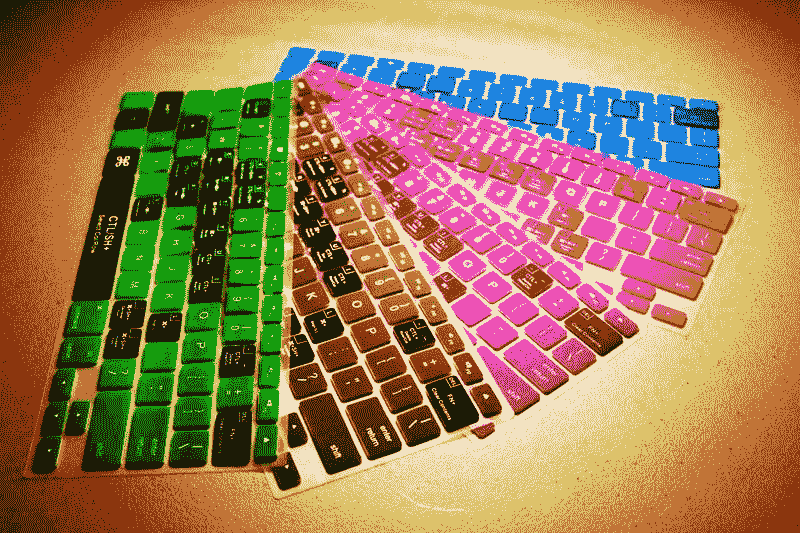
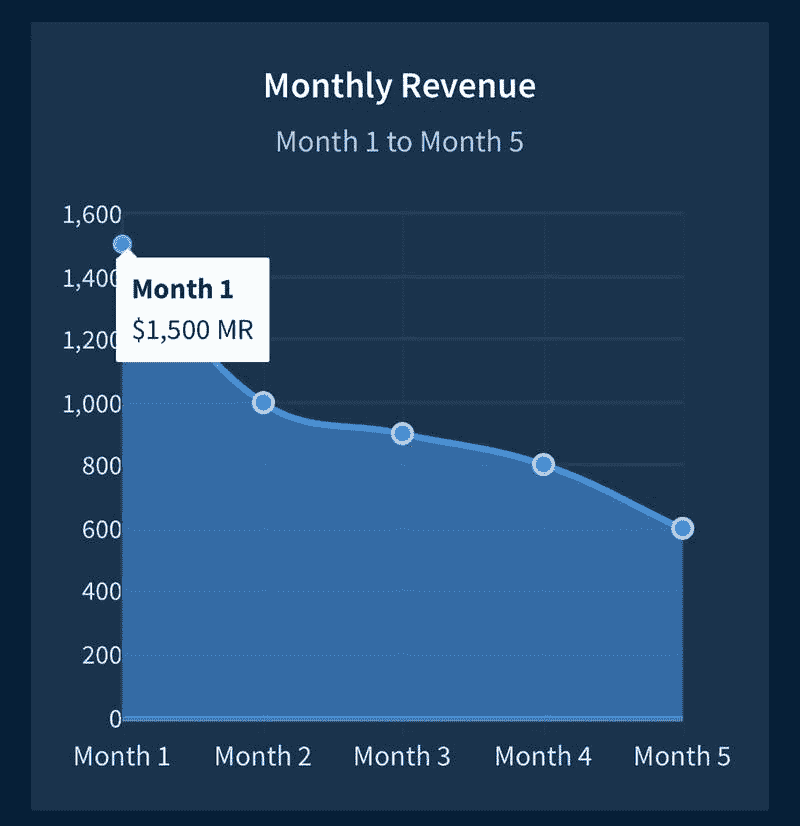
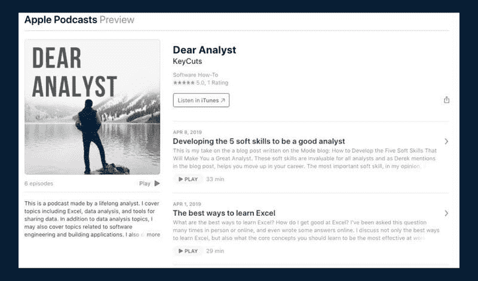

# Excel 快捷键 键盘膜，月赚 1500 美元

最近这段时间“地图”类产品很火，特别是“运营地图”火了之后。国外之前也有一个类似实体“地图”的产品，但不是地图，而是 Excel 快捷键键盘膜，虽然这个键盘膜不是很赚钱，最高点也就赚了$1500 一个月，但是鱼丸觉得是这是一个很有意思的案例，还是整理出来跟大家分享。

产品起源：

主人公原来是谷歌的一名程序员， 在他们团队，他经常被安排去通过 Excel 完成一些事情，包括一些公式以及格式的处理。为了更高效的帮助同事，他在内部做了一个小分享，并把最常用的 Excel 快捷键整理了出来。

分享之后，有个同事提议可以把这些最常用的快捷键做成实体的东西，经过一番讨论，他们最终决定做 Excel 快捷键键盘膜。

用户调研：

主人公将自己认为最重要的快捷键系统的梳理了一遍，并与很多同事交流了一圈，同事都认为这是个好主意，原因有三：

1\. 有人这个键盘膜，不需要再去看整个快捷键的目录了；

2\. 这些快捷键，基本就在你手敲键盘的覆盖范围内；

3\. 当你不喜欢的时候，你随时可以将键盘膜拿下来。

产品 MVP：

虽然说只是一个很小的快捷键梳理，但实际上却花了主人公两个月时间，可见任何一件事情，都没看起来那么简单。

好不容易把最常用的快捷键都梳理完成后，主人公在 Alibaba 上找供应商，并给定位在广州的硅胶套供应方都发了一遍信息，最终花了 50 美金，在两周后，收到了 20 个样品。

拿到样品后，经过一些设计上面的微调，主人公找供应商定制了 5000 个键盘膜，5 种颜色，每个颜色 1000 个，到此，整个产品算做出来了，他整理了一些基本的数据如下

1\. 2500 美金的资金投入

2\. 4-5 个小时的设计

3\. 10 个小时在阿里巴巴和供应商的沟通和讨价还价

4\. 2-3 周样品的调整和来回运送时间

5\. 15 个小时的包装设计时间

6\. 10 个小时的网站设计时间

看着数据多，实际上绝大多数事情都是在业余时间完成的。

如何冷启动：

在用 wordpress 搭建了一个销售网站后，开始推广产品

1\. 推广给现在的同事

2\. 主人公的 Excel 培训班的学生

3\. 主人公在做金融的同学以及他知道的有同样需求的极客

然而，做完上面这些事情，并没有启动起来。

偶然的机会，主人公听说 PRlog 这个网站，于是在这个网站上推荐了自己的键盘膜，并分享到自己的 facebook 时间线上去。终于第一次，主人公感受到“火”是什么感觉，那一天一共 5000 个独立访客进入，也有了很多订单。

之后，他又做了 facebook 主页、YouTube 视频、分享主题文章等去吸引流量。主人公认为，自然流量非常重要，即使在文章写了之后的很长时间， 仍然会有一些订单通过搜索进来。

如何变现：

卖键盘膜，定价$24.95。

“聪明的创业者应该想想如何将他们的业务收入多样化，甚至调整原有的业务来获得更多的现金流”。

在这样的想法下，他们做了下面的事情

1\. 分销合作， 跟很多“值得买”网站合作，推荐键盘膜

2\. 在网站上植入广告

3\. 进入 Amazon 开店

4\. 培训 Excel 技巧

5\. 做 Excel 咨询

这些探索也帮助他们在收入上有了突破，但随着时间推移，主人公的收入重心也不在 Excel 快捷键键盘膜了，而是将重心提到了做一个与 Excel 相关的个人品牌，他认为个人品牌是更具有时间复利的事情。

同时，主人公给其他独立创业者的建议

1\. 保持好奇心，时刻对外面的世界问出为什么；

2\. 用最轻的方式，比如网络，来验证你的想法，而不是先做一个东西出来；

3\. 完整的做完一件事，花 80%的时间去认真的做事情， 20%的时间看看别人是怎么成功的，而不是反过来。

Excel 快捷键键盘膜

Excel 快捷键键盘膜

Excel 快捷键键盘膜

评论：

Keep fit：所以他最终赚了多少钱？看他的投入 2500 美金，产出只有五个月？

爱拆快递的小白兔：厉害了。我只知道 excel 快捷键鼠标垫，原来还有键盘膜这样的神器。我要去买一下，谢谢鱼丸

爱拆快递的小白兔：好啦。答案是淘宝没有

阿斌 回复 爱拆快递的小白兔：淘宝没有的话，正好是个商机呀

爱拆快递的小白兔 回复 阿斌：我知道鸭！但我眼里商机太多了🤣，钞票仿佛就都躺在大马路上，手太小、不够捡的，只能撇一缕清净，所以评论发出来，给看得懂且有时间做的人。哈哈。不如就你来吧

封封：信息值钱，行动也值钱

镌刻时光：尽然还有淘宝没的膜，牛逼，仿佛发现了一个金矿

开心粉：淘宝有这个产品啊

G 的 1ci 方：是啊，淘宝有的啊，还很多

Arno：我在亚马逊上找到了他们这几款产品，监控了一个星期，几乎不出单的