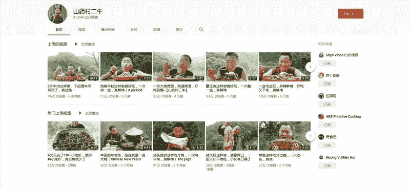
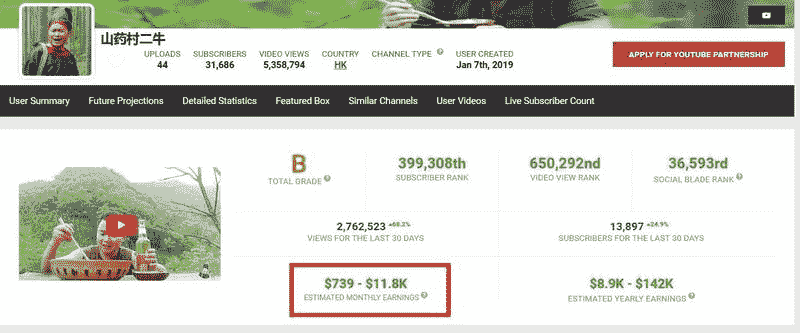

# 从打杂助手到月赚 3000 美元的博主

从打杂助手到月赚 3000 美元的博主，“山药村二牛”模式值得借鉴。

频道名：山药村二牛

频道地址：[`www.youtube.com/channel/UCd0ws1i2LNoIjP95RFzHA-g`](https://www.youtube.com/channel/UCd0ws1i2LNoIjP95RFzHA-g)

创建时间：2019 年 1 月 6 日

获利时间：1 个月左右 （2 月 20 左右开始赚钱）

每月收入：预估不低于 3000 美元（有专门的评估网站测评，图二）

频道简介： 此频道主角二牛是知名美食频道“山药视频”的助手，后自己做博主（应该不是独立门户，而是公司包装的第二个人）在短短不到 4 个月的时间，成为了一个美食领域的小 IP

给我的思考：一个频道起来之后，很容易带动频道里面的其他人，这也就是裤裙连带反应，这个操作模式就是集中火力打造一个大号，哪怕是烧钱去推也可以，然后再通过大哥带小弟的模式快速滚动发展。

这是一个关于美食的频道，但我看到了满满的江湖义气，虽然这是资本所为，但大哥带小弟的成长方式，还是让我想起了一句古话：

“苟富贵，勿相忘！”

山药村二牛 图 1

山药村二牛 图 2

评论：

乔里奥 ： 这个收入应该是油管这一个平台吧，二牛在 b 站的粉丝也不少。

卢其大叔 回复 乔里奥 ： 是的，因为我主要研究 YouTube，只放国外的数据

黄北钦 ： 能否分享一下那个评估网站

龙虾 ： 请问第二张图是什么工具？可以预估收入的