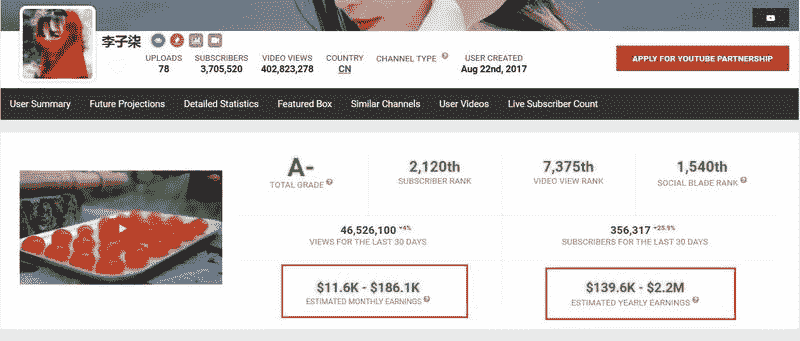

# 如何查询某个频道能赚多少钱？

这个专业评测网站[`socialblade.com/`](https://socialblade.com/)可以一探究竟！

如何使用呢？

第一，打开网站[`socialblade.com/`](https://socialblade.com/)

第二，打开视频网站 www.youtube.com

第三，打开某频道并复制主页链接，比如李子柒频道主页[`www.youtube.com/channel/UCoC47do520os_4DBMEFGg4A`](https://www.youtube.com/channel/UCoC47do520os_4DBMEFGg4A)（不低于 50 万美元/年）

第四，粘贴链接到[`socialblade.com/`](https://socialblade.com/)，回车

第五，回车之后即可看到数据（大概的一个收入情况，也有其他很有参考性的内容可以借鉴，慢慢挖掘吧）

我还专门做了一期视频讲解，能上网的朋友可以点击链接看看[`youtu.be/2BjmsdKb6sU`](https://youtu.be/2BjmsdKb6sU)

YouTube

YouTube

YouTube

评论：

乔里奥 ： 用这个方法看到的收入区间很大啊

tesths ： socialblade 还有 chrome 插件，更方便查询

亦仁 ： 有技术的圈友可以考虑做类似的工具。 引流方式：主要靠 SEO 变现方式： 前期 Adsense 广告为主，affiliate 佣金为辅，后期尝试 Youtube 周边的服务做会员。

萧帮主 ： 这种查网红的报价插件很多 ，socialbalde 算是做的很早的一款

小萌子 ： 关于翻墙，有什么好办法解决吗？

吞了六个日 回复 小萌子 ： 哈哈哈这个问题… 有需要的话我可以推荐你噢 按年费计的 我用了好几年的 稳定