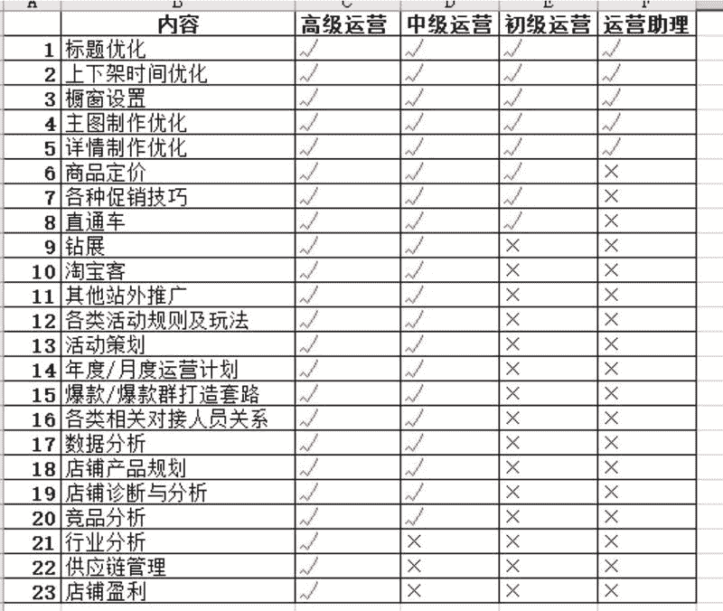

# 如何成为一个牛逼的运营

这是我今年年初的时候整理的一份关于运营层级的分类，至于什么是电商运营？这个我不好定义，我简单的理解就是：店铺的运营其实就是古时候店铺的掌柜。

1、 店铺运营：

是帮老板或者自己是老板实现年度目标甚至更长远目标的执行人, 干活的俗称打杂的,那么打杂就复杂了，你说你是打杂的？你有资格吗？？估计很多小伙伴目前还没有达到打杂的级别的 , 因为作为一个运营 是必须什么都懂，并且都能做的

2、 好了那么怎么运营呢？

第 1：学会做计划

A、年底计划 月度计划 活动计划 年度计划怎么做？
涉及内容有几个：怎么和老板一起确定全年的合理销售额目标和利润目标。比如你和老板根据往年数据和未来一年行业增长率等情况确定了 5000 万的年度店铺销售目标 , 那么就到了月度分解 , 每月要做到多少。

第 2：SKU 分解、新品分解、活动分解

什么时候要做什么活动 , 再接着就要确定活动销售多少？日销卖多少？再接着分解 活动有哪些？聚划算？淘抢购？天天特价？淘金币？还是什么？日销呢？怎么分解？自然搜索卖多少？直通车卖多少？钻展呢？淘宝客呢？手淘问大家呢？手淘首页呢？ 请详细分解，这个分解的过程就是你确定月度运营计划的过程

第 3：活动分解

A 就是活动策划，

比如 618 要来了，麻烦你对 618 进行详细的分解，SKU 组成？流量组成？推广怎么配合？客服怎么配合，活动话术准备好了吗？等等 麻烦做一份详细的活动策划方案来，这就是运营的一小部分 。

B、前面是说运营所必须有的技能，做计划。
接着第二部分就是必须懂的基础内容了，做好了计划，那得去执行啊，干啊，标题优化你回了吗？真的会？摸一下自己的良心，主图怎么才能设计出高点击的主图？背景色搭配？卖点突出？（你知道怎么提炼卖点吗？）还有其他呢？橱窗推荐这么基础的懂了吗？接着就是详情优化？你懂 fabe 法则吗？不懂就别说自己会做宝贝详情，麻烦百度一下什么叫 fabe 法则。

再说个细的，比如单品多个 SKU，你知道什么设置吗？为何选择黑色的款作为主图款，却不选择黄色款呢？再比如，手淘问大家你家维护了吗？马上看一下自己店铺问大家做了吗？攻心评价天天听别人说，你做了吗？你会写够攻心评价吗，是不是老掉牙，其实都是基础工作，这就是运营必须做的。好了那就到了产品定价！基本的定价法则还是必须去百度学习一下的，接着就是各种促销技巧。免单现在不可以做，但是你有别的路径可以做吗？做了吗？第二份半价、第二份 0 元、买二送二和买一送一有什么区别？OK 还有很多都是基础内功需要做好。

接着作为运营就必须懂推广，直通车的核心是什么？钻展呢？为何老板给你定 3 的 ROI？ 比如综合成本是 60 元，售价 199，ROI 做到多少才能盈亏平衡？

接着就是淘宝客，网站类型的返利网的淘客都有合作过吗，有木有这些网站的联系方式？效果怎么样，他们的规则都是什么？然后就是 QQ 群的低价类淘客联系方式有几个？关键时刻那些 QQ 群的淘客能帮你短期做到多少量?今日头条可以做精准投放，你家去投放了吗？等等……还有很多推广路径。

C、爆款怎么打造：

会做计划、有会做内功、还会推广，那么就要会做爆款了吧？爆款怎么打造？爆款类型有好多：直通车型、钻展型、淘客型、自然搜索型、淘宝首页流量型、聚划算等活动型，你有几杆枪、什么时候用什么枪？然后还有综合型，就是多种手段配合打造的，今天是说运营，这里就不说怎么打造了。

D、数据分析：

爆款也懂打造了，那你肯定数据分析了吧。点击率你这么定义？和大家分享一个思维模式，如果有人和我说他产品点击率可以做到 5% 我偷偷一笑，这人不是傻子就是弱智，为何，因为他的思维方式不对。点击率需要说明特定情况。
直通车图的点击率还是单品首图的点击率，还是词的点击率，还是钻展的点击率，还是其他的，请说明，或者先圈定特定语境下说。这个很重要，因为数据分析里面很重要的就是怕被数据迷惑 ，所以要学会最根究底。
比如你有个宝贝每天 1000 个 SKU，突然某天变成了 500，你这时候很紧张，怎么办？ 请用数据分析，如果宝贝没有被降权，那么查看一下流量到底哪一个来源除了问题，生意经和生意参谋都可以帮你深度解析清楚。

E、爆款之后的爆款群：

一个成功的男人背后，不能只有一个成功的女人，要有一大帮成功的女人。好了，学会了数据分析之后那是不是感觉自己很牛逼了？ 其实还有更重要的事情要做，那就是通过数据分析，找出店铺的潜力款，然后用打爆款的手法继续吧潜力款培养为爆款，也就是所谓爆款群的过程，有人说我店铺就只有 10 款宝贝，没有潜力款。
办法就很简单，学会产品规划，要求老板给你产品，单品每月你封顶只能做到 50 万的销售，那么怎么完成年度 5000 万的目标?那就做新品，开发新品。

怎么开发新品呢？就到了要学会行业分析，行业分析其实很简单，你把你所有竞争对手的情况莫透彻。

然后再结合前面的数据分析 你就会发现什么产品你可以做，能做起来，有信心做起来，你一看到新品就有一种莫名的感觉，可以干掉对手，这时候你就轻松做起来了。

F、产品规划

你都懂了，恭喜你，有机会做运营经理了,运营前面的都做好了，那基本不会吧店铺做得太差,那就可以深入到供应链了,做了 5 年以上电商的人都知道做着做着电商玩法都了解透了其实没啥意思，玩腻了，于是很多人都脱淘了。脱淘这一俩年的大趋势。我记得非常清楚 2012 年我刚做电商的时候，就有个人说他对淘宝不感兴趣了，要脱淘。所以很多人都开始把时间放到后端，供应链。

供应链是啥玩意，简单的来说其实就是：产品怎么生存包装出来给到销售端销售，把这个链路打通。

G、如何让全店盈利：

1、店铺产品你是否按梯队来划分？或者说按引流款、利润款、长尾款来划分，这个利润款和长尾款选择很重要，他是否和店铺引流款有关联，能否关联？什么叫产品关联，简单理解就是客户重合度高不高？

2、你的老客户能维护起来吗?用什么手法维护？（因为新客户获取成本基本都是几十块甚至上百块一个）这个也是贡献利润来源的手法。

3、前面说的黑色黄色 SKU 其实就是 SKU 获取利润法则之一，比如吸引流量的黑色卖 99，那么黄色你就加个 10 元的赠品，然后卖 129，那么你的利润是不是瞬间多了 10 元？等等细节。

4、阶段性亏损：

如何理解这个阶段性亏损？ 很多人听了估计就会回去尝试。然后过了一段时间就会回来找我诉苦，甚至骂我。因为这些人不懂做 excel 利润规划 。

比如 15 天内你投入了 20 万做一个产品，那么多久可以赚回来这 20 问你呢？这才是核心。你怎么确定可以赚回来？很多运营会和老板说，前期不亏损怎么做得起来，然后要求老板给他前期亏损，如果老板不同意呢，就私下骂老板不懂电商。其实这个是个误区，你他么做老板不想赚钱啊！谁是老板都想赚钱，一上来就和我说亏损，这不是扯淡是啥。

那我们运营应该怎么说服老板呢？要和老板说：前提投入（记住是投入，不是亏损，注意用词），投入了多少 然后我就可以把销量，流量做到多少，排名多少，卡主了什么词的来源入口或者是可以参加活动等等。然后有了这个前期投入，我们再过多久就可以实现盈亏平衡。

再过多久我们店铺层级就可以由第三层级到第五层级，到时候我们可以获得更多的官方扶持等等。

H、运营节奏：

这个很重要，比如 5000 万的年度目标 你分解到第一个月要做 200 万。

那么请你确认什么时间内做好内功优化、什么时候做好爆款打造、什么时候推新品、什么时候推第二梯队的产品？等等注意时间的把控。

放眼到全年，那就是什么时候需要做淘客冲销了，什么时候必须辅助聚划算来稳住销量排名，什么时候需要直通车、钻展猛烧，旺季来临前多久就要做好冲销量准备、冲之前什么时候把产品生产好、什么时候把原材料要求老板准备好？钱呢？是不是也要准备好。

根据自己类目的节奏，什么时候做什么事情，这个很重要，不然错过了时间节点，你请神来也救不了你，因为电商的规律就是这样谁先占领了山头，你要想打败他，请你拿原子弹来做武器，可是你老板买得起原子弹吗？

不分享，无电商！谢谢大家！这就是我所理解的电商运营。

电商运营

亦仁：越写越好了

七里香 回复 亦仁：谢谢亦仁大佬赞赏。请教一个问题：发帖时候，怎么插入 xmind 生成的文件？我有好几篇课件是用 xmind 写的。

亦仁 回复 七里香：把 xmind 导出为 PDF，然后在知识星球网页版插入 PDF 文件。

如果这个 PDF 文件在你的 iPhone 手机上，选择用知识星球 app 打开这份文件，就会自动插入到要发布的主题中。

七里香 回复 亦仁：好，我试试。谢谢大佬

三笙 回复 七里香：导出为图片也行，我给安装包，导出图片，有付费项

七里香 回复 三笙：谢笙哥，等我回杭州，我找你。

三笙 回复 七里香：OK，联系我就好

柳如婳：微信电商的分解

JOJO：写的真好，忍不住分享