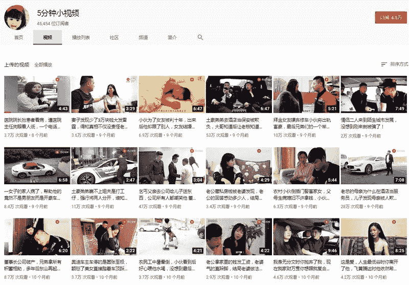

# 搬运的频道：如何二次利用、如何赚钱？

这个频道是群友发出来的，我一看，频道因为是搬运已经被取消获利了。

最近更新的视频是在 9 个月。

我觉得这样的频道这样浪费，非常可惜。

频道已经有 4.5 万的订阅了，而且是那种情景剧的订阅粉。

这个频道完全是可以二次利用起来的， 还可以赚到合理的钱；

如果是我怎么操作这个频道呢？

第一，我找内容产出方，是情景剧那种，双方谈一个合理的分钱比例。

第二，引流导粉或卖掉。这个订阅至少能卖 4500，但这么久不更新，卖出有点难。

第三，自产内容，这个方式要求蛮高的，自制短剧不是一般团队能做的了的。

频道地址：[`www.youtube.com/channel/UC79CKPz-wgSGCzLhNTM5Teg`](https://www.youtube.com/channel/UC79CKPz-wgSGCzLhNTM5Teg)

5 分钟小视频

评论：

兴和微生活 ： 从那可以看出取消获利了，是遭到视频作者投诉了吗？

卢其大叔 回复 兴和微生活 ： 没有广告了，博主也不更新了，这类内容多半是内容重复被取消获利

莱特 ： 大佬好，请教您一下，抖音那种无真人的的 ppt 视频，直接做英文版放到 YouTube 上，是否看过相关案例？可行性如何呢？读书类 名人名言类的

卢其大叔 回复 莱特 ： 没有看过，本身不懂英文，但你的想法理论是可行的。 有人把抖音视频翻译成越南语，一样获利