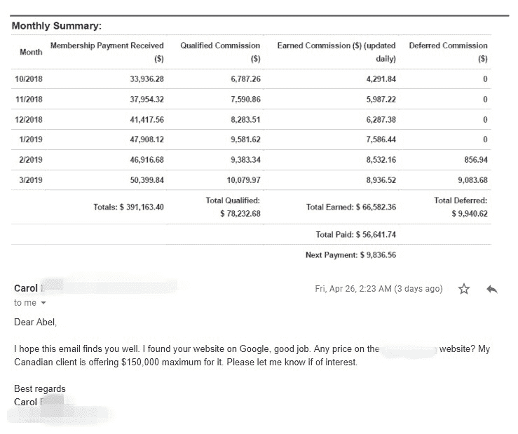
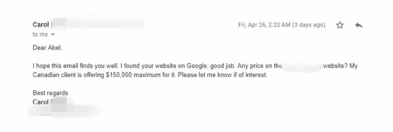
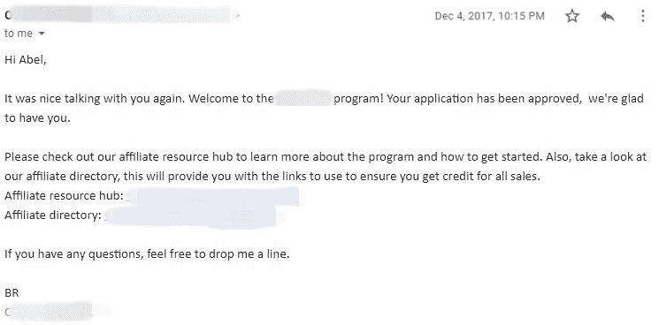
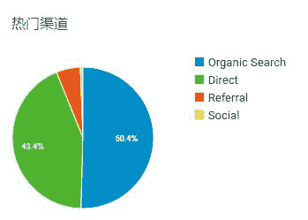

# affiliate 和英文 niche 站的入门玩法 | 新手科普

每周一，邀请一位圈友分享 TA 行走江湖的生财之术。

今天圈友@不二 来给大家分享一些 affiliate 和英文 niche 站的的入门玩法，给新手做个科普。

niche，中文一般翻译为利基，可以理解成长尾细分市场，这些细分领域一般来说，市场不大，也就意味着没有实力强劲的竞争对手出没，但是对于小团队或者自由职业者来说，找到一个好的细分领域，少的话一年赚几十万到几百万，运气足够好，一年甚至能做到一两个亿的收入。

自由职业者，需求很简单：赚些钱，不想做多大的事情，在投入时间一定的情况下，可以快速简单的说赚到些比职场高一些的收入，或者持平甚至少一些都可以，毕竟换来了自由。

大家不要小看利基市场，很多大的突破是从小众领域出现，逐渐变成主流，比如二次元。

废话不多说，下面进入不二今天的分享。

———

大家好，我是@不二 ，非常感谢亦仁的轻享邀请，受宠若惊。

简单介绍一下自己，英文小站长一名，运营 Niche 站，身在外贸行业，一心向往互联网，比较擅长谷歌 SEO、Affiliate Marketing 和外贸销售。

业余时间做 Niche 站，2 年半才突破月入$10K，差强人意，偶尔收到网站报价的邮件，算是对自己付出的认可，比较欣慰。

图 1 和图 2

咱们星球里大佬太多太多，单单是在海外流量领域就有：顾小北、Tom 叔、Jacky、John、Moss、富布斯、Daniel、Jack、Jersy 等等前辈大佬，过去一年从大家的分享和公众号里学到很多，感谢。我的水平只不过是刚出新手村而已，在此分享一些对于 Affiliate Marketing 和 Niche 站的粗浅理解，帮助新手入门，献丑献丑。

（一）

Affiliate Marketing 国内叫联盟营销，很多新手第一次接触时会问，AFF 是啥，联盟又是啥？而有些了解的人, 大多会提到 Amazon CJ、Review 站和 10beasts.com 等等。

AFF 中主要涉及四类人，

1.  Publisher 也就我们做推广的人
2.  Manufacturer / Advertiser 产品和广告金主爸爸
3.  Affiliate sites 就是联盟平台 Amazon，CJ 等等，他们一面吸收金主们的 Offer，一面把 offer 分发给 Publisher，本质就是中介，而我们主要在联盟平台里找 Offer 拿佣金，所以说是联盟营销
4.  Customers 消费者，最终买单的人

如果你只接收中文环境的信息，大概率会默认去联盟找 Offer, 因为在很多人的认知里“Affiliate Marketing = 联盟营销”。其实很多好公司好产品都有自己的 Affiliate 项目。

看上一款产品，复制网址，在谷歌中搜索 ”xxx.com affiliate” 就能找到 AFF 申请入口，如果还找不到，直接发邮件问呗，做销售要主动出击，我推广的一个产品就是打了好几次电话才拿下的，转化很好。

图 3

（二）

提到 AFF，一个必谈话题就是 Niche，什么是 Niche？

简单说就是，细分市场，满足特定的市场需求。

选择 Niche，就是选择人们现有的需求，你不能创造人们的需求，也不能抵抗人们的需求，你要做的就是把人们的需求引导到你的产品。

很多人做 Niche 站，包括我自己，都是小成本投入，一个人，没有团队。那我们的目标就现实点，赚到钱、活下来，至少收支平衡，只要市场足够大，人们的需要足够强烈，你能站住脚、喝到一口汤，月入几 K 并不难。

很多人总想着去垄断一个 Niche，不否认确实有人做到了，竞争对手不多，投入不大就能排到谷歌第一，这种人，只能说，我很羡慕你。我也在寻找这样的机会，除了自身实力，运气很重要。像我这种运气一般，冯大的抽奖助手从没中过奖的人，还是选择概率更大的事情去做好一些。

（三）

SEO 优化中，最基础也很重要的一点，是关键词选择。在日常运营中，我会首先定位好核心词，也就是找主关键词。

1.  头脑风暴找灵感，每个人的思维都有遮蔽性，所以第一步，找朋友讨论或者在相同 Niche 网站的留言中、Amazon 相关产品的评论中，看大家讨论比较多的内容有哪些，把出现频率高的词整理记录下来。
2.  查看谷歌排名前 5 的文章找灵感，关注同行动态，时刻了解对手的内容变化。
3.  在 Wikipedia 上查自己的 Niche 相关词，在“contents”板块，会有不少灵感。
4.  Reddit 上找相关话题，配合 keyworddit.com，筛选关键词
5.  谷歌，YouTube 等搜索引擎的自动联想功能，以及搜索结果最下面的 related search
6.  以及各种付费工具，Ahrefs, SemRush, Moz pro, BuzzSumo 等等

一通操作下来，整理几百个词并不难。当然不是每个词都会用到，需要筛选组合，把不适合的词删除，我会按以下三个条件进行筛选：搜索意图、搜索量、排名难度，具体每个条件如何判断由于篇幅有限，我把这段发到评论区。

（四）

内容写好后，一定要主动推广，比如发 EDM，在 SNS 中转发，在社区论坛里宣传等等，这些都是常规操作。

我建议大家留一些预算给广告推广，比如 FB 里筛选目标受众投广告，能够在短时间内测试文章的转化率，及时调整。

比如，我的 Niche 里很多博主会定期办线下活动，我会提前记录好信息，定位在活动地点周边范围投放文章，几十块钱就能在短时间内转化不少精准用户。如果你的 Niche 内也有类似活动，不妨试一试。

（五）

影响谷歌 SEO 排名的因素有上百个，也没有人能说清楚具体怎么回事。但是谷歌官方认证的当下影响排名最重要三个因素是：内容、外链和用户访问行为

在优化过程中，对我来说很受用一点是提高直接访问的流量比例。

我会选择简单好记的.com 域名，2-3 个词，其中一个词与网站内容和 Niche 相关，大家看一眼就能记住的那种。在 CTA（Call to action）和文章内容中有意暗示访客 Bookmark this page 等等，不确定这对于自然排名和流量的提升有多大帮助，因为我同时也在做其它优化，但确实能提高转化。

把 SEO 做到人们的大脑中，做不到垄断 Niche, 就争取垄断你粉丝的书签栏。他们可能不会每天点击访问你的网站，但是很有可能每天都能看到你的网站 Logo 和名字，这种日积月累潜意识中的影响力很强大，图 4

（六）

SEO 中另一个重要因素是外链，了解 SEO 的朋友知道，获取外链的主要方式之一是 Outreach，就是我们主动给其他站长发邮件，或者通过其他方式取得联系，请求转发我的文章，或者在他的网站中给一条链接指向我的网站。

很多新手站长第一次 Outreach 外链，而且没有被拒绝的经验时，往往内心戏很足，也很脆弱。自己精挑细选了几个网站，很用心地写邮件发邮件，但是迟迟等不来回复，好不容易收到邮件，不是退信就是 No, 一波操作下来没有效果，自己就颓了。之后想到 Outreach 就不愿意做，各种拖延，恶性循环…

我们首先要搞清楚，Outreach 得到外链是一个概率问题，发 100 封邮件，能得到 4-5 条外链已经很不错了。不是精挑细选了几个网站，而是尽可能地扩大分母，找到 100，1000 甚至 10000 个与自己内容相关的网站，使用 hunter.io 找出邮箱，群发软件或者找助理发邮件。我没说在一个星期或者一个月内群发 10000 封，那是恶意营销，很容易被判定为垃圾邮件。把时间拉长，一年内发 10000 封邮件，很正常的操作。就算转化只有 3%，一年也能得到 300 多条与你网站内容相关的外链，足以在大部分 Niche 中站稳脚。

很多人做 Outreach 总是盯着数据看，但不要忽略每个数字背后都是一个活生生的站长，是有血有肉有感情的人，你要通过邮件、通过文字引起他们的好奇和好感。

我在做外贸写开发信的时候，使用 mail group 的方法，几天内连续发好几封邮件，从不同角度介绍公司、产品、服务还有我的专业能力。很多新客户第一天基本不理我，但是几天内，我的名字和邮件每天都会出现在他的收件箱，而且每天内容不一样，只要我们的产品对口，大多数都能回复取得联系。

我把这个方法嫁接到 Outreach，第一封邮件就是很正常推广，如果 5 天内不回，我会追加一封，如下：

Sorry, you weren’t responding for a few days, so this article idea was taken by another blog.
But don’t worry, I’m sure I’ll be able to suggest something else for you, that would be just as good.
I’ll be in touch with more article ideas shortly.

我的文章可能没有被别人采纳，但是这封邮件目的是为了引起好奇，给他一种失去的感觉。隔几天再去 Outreach 时，回复率会高很多。把 Outreach 开发邮件写成一个系列，而不是同一个内容和标题用到死。

OK，感谢大家的耐心读到最后，以上六点便是我关于 affiliate 和 niche 站运营的粗浅分享。 对相关内容有更多兴趣也欢迎关注我的公众号：SEO 增长研究院

谢谢！

图 1

图 2

图 3

图 4

**评论：**

亦仁：第一个是关键词的搜索意图，人们在刚刚了解你的 Niche 时会搜索哪些词，深入了解学习时会搜索哪些词，准备购买相关产品时会搜索哪些等等，按不同时意图进行分类。如果一篇文章的功能定位是转化，那就关注购买意图明显，有商业价值的关键词。 对于关键词的商业价值分析，以下三个指标可以帮助做出判断， CTR 点击率 谷歌搜索关键词，如果结果前几条全是付费广告，那即使关键词做到自然排名第一，CTR 点击率也受到影响。或者第一个结果就是直接显示出关键内容的 Featured Snippet, 这类词即使做到第一，打开率也不高，因为搜索的人，简单看看 snippet 就已经找到自己需要的信息，大多数不会继续点击打开页面。 我通常会用 Ahrefs 里的关键词工具看 CTR，很直观，点击率太低的词直接 PASS。 CPC 点击费用 可以用 Keywords Everywhere 查看（Chrome 应用商店搜索插件下载安装），如果点击费用太低，甚至没有任何人竞价，费用是零，那就要好好想想，这个词是不是真有商业价值。有商业价值的词，通常会有人竞价跑广告，CPC 不太可能是 0。 搜索趋势 利用 Google Trends 做判断，关键词是不是有季节性和周期性特征，如果波动剧烈的词，谨慎选用。

亦仁：第二是关键词的搜索量 搜索量是流量和转化的基础之一，搜索、点击和转化层层递减，如果你选择的关键词搜索量过少，基数太小，那么转化变现自然是难上加难。 Niche 站每个页面都有不同的作用，比如，About 页面是介绍网站的整体信息，方便第一次访问的用户了解背景、取得信任；Start here 页面是整合梳理网站的内容资源；而 Blog Post 是通过高质量的内容为网站带来流量，这种负责引流的页面，我们称为 Power Page，所对应的页面关键词就是 Power Keywords. 在定位 Power Keywords 时，我的标准是月搜索量 50,000/次起。注意，这个搜索量并不是单一关键词或词组，而是一个关键词组合。 当你针对一个主关键词作内容和外链，页面排到搜索结果首位。因为这个页面已经积累了优质资源，内容、标题、H 标签中的关键词也随之受益，得到更高排名，从而为网站带来更多流量。 这里需要强调一点，关键词组合并不是把所有相关或者不相关的词都揉到一篇文章中，而是话题相关和内容聚焦。 因为同样一个话题，有不同的表达方式，在谷歌中人们输入不同的词组，但搜索结果是相近的。比如“how to learn SEO”和“learn SEO online”等等，把这些话题相关的词整合起来，就是关键词组合。

第三是判断关键词的排名难度 我主要使用付费软件做判断，但是每个软件工具的评判标准不同，市面上的主流推荐，ahrefs，semrush，moz 和 seoquake 等，选定其中一个作为标准，一直用下去就好。我常用的是 Ahrefs. 对于关键词词的排名难度，主要有两大因素：站内优化和外链。 站内优化大致有：内容与关键词的相关度、是否符合访客搜索意图、页面加载速度、移动端适配、UI 设计、用户阅读体验等等。主要与关键词前 5 位的结果作对比，和你的对手对比。 另一个就是外链，外链的数量，尤其是内容相关度高的外链数量决定着你是不是能排到 Top10\. Ahrefs 中有一个 Keyword difficulty，KD 指标。官方根据不同难度等级给出了外链数量建议，根据自身情况选择。 另外，Ahrefs 会估算页面的流量，经常会看到这样的情况， 很多排名较低的页面，比高排名的流量要多很多，因为同一个页面在其他相关的关键词中也会得到排名。可以利用 Ahrefs 反查这些页面的 top keyword 和其他关键词，筛选出适合自己的进行补充。 选择关键词时，尽量选择外链少，流量大的词，而且不要只看数据，也要关注分析对手，毕竟他们会与你直接瓜分流量。

公子京：虽然看不懂，但我要点赞

钱钰：虽然看不懂，但我要点赞

亦仁 回复 钱钰：楼上说看不懂我信了钱老板你说看不懂…hmmm

钱钰 回复 亦仁：隔行如隔山

陈文茂 回复 钱钰：隔山吃老虎

不二：感谢亦仁老大给面子，献丑了

边城浪子：感谢楼主和亦仁的输出，正需要相关内容

yeerya：楼主认识米课吗，里面大神很多，这些不是什么秘密，关键肯花时间去摸索。

亦仁 回复 yeerya：米课老板是嘉宾@mr.hua

yeerya 回复 亦仁：@mr.hua 华总，我变现给你拉客，啥时这里给大家分享下你的大三元

等一个晴雨天：怎么感觉就像是马爸爸生意参谋里的选词，，人气排序，来组建标题那样的方式

Ryan：虽然看不懂，但是我还是要点赞！ 虽然看不懂，但是学到了很多专业术语，感觉自己萌萌哒！

杜若：想请教一下，没有这方面背景的可以做吗?从事科研多年，学习能力尚可

🔱Alex：加入亦仁小蜜圈，主要目的其实就是 SEO 和 FACEBOOK