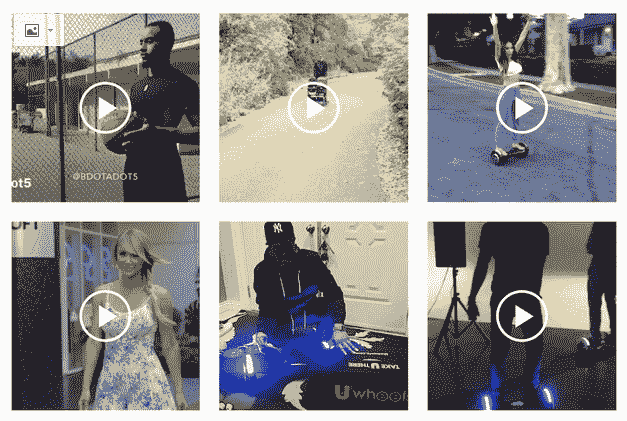
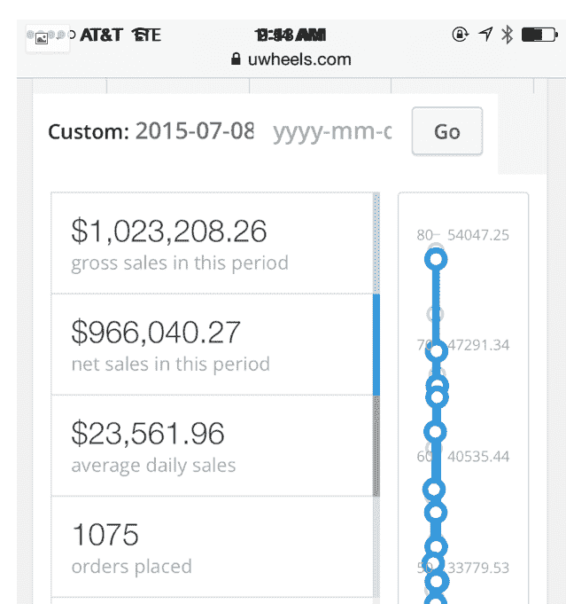
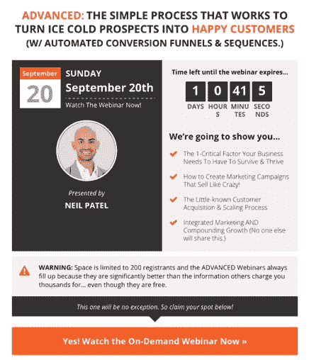
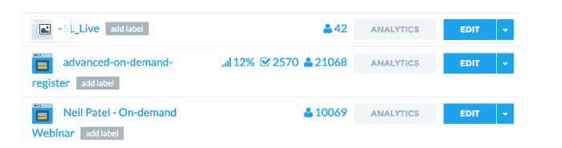
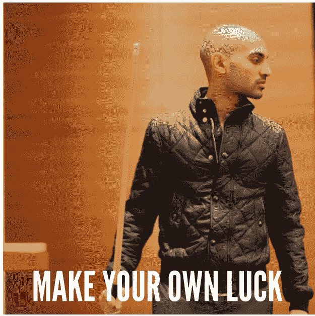

# 在 Instagram 找网红推广课程，赚到 332640 美元

每周五，来一篇海外生财有术的案例，帮助星友开眼赚美元。

虽然今天这个案例有些久远，距今有三四年，但是鱼丸觉得这里面的思路仍然是值得学习和借鉴的：

快速找到新平台的网红，在他们还没有做过变现，但想赚一些快钱的时候，请他们推广商品或者服务，找到他们就找到了非常便宜的流量洼地。 比如前两年的快手流量，非常便宜且优质。

这个案例讲的是主人公如何在 3 个月，通过 Instagram 找网红推广课程赚到 332640 美元？

在 instagram 赚钱的秘诀：找到那些愿意帮你推广产品和服务赚一些快钱但还没做过商业变现的网红。

第一个案例： Uweels （平衡车品牌）

花了 61200 美金，几百万美金的销售额，怎么做到的？

a. 找到很多著名的 rapper、歌手、运动员、模特等 instagram 网红；

b.给他们送 uweels 的商品或者付费请他们发文介绍 uweels；

听起来很简单，里面有一些小细节

1\. 创建了很多 instagram 账号，当开始推广 uweels 的时候，在多个账号发布推广信息，制造“刷屏”

2\. 广告宣传上做了差异化，考虑到平衡车产品非常多，在推广宣传的时候提到了“蓝牙”和“音响”， “Got my @Uwheels with the alarm and the bluetooth speaker system. @Uwheels.”

3\. 不断的与买了 uweels 的人交流，做到让买了的人不断的在社交网络上推荐或者提到 uweels

4\. 也在 facebook 上找到很多红人帮助推广销售。

细节上见图 1 图 2 图 3

第二个案例：作者本人的案例，也就是如何通过 instagram 3 个月赚到 332640 美金的案例。

简而言之，作者是卖课程的，他的课程着落页见图 4，通过 Instagram 引流的结果， 2570 封邮件订阅免费课程，免费课程 2.5 小时，之后是$5940 一年的付费课程，不过是按月支付。

最终实际产生了 56 个转化，每个月付费 495 美元。

作者在 instagram 用的宣传文案为 “If you want to learn how to skyrocket your business, you have to follow my friend Neil Patel. He’s the smartest entrepreneur and marketer I know. Click on my bio link to learn more.”

推广的图片素材为图 6

作者的总结

1\. 看起来简单，实际上可能并不简单。需要有好商品、好的服务、好的文案和推广素材，推广素材还需要反复优化；

2\. 保持耐心，正常情况，前 30 天不会有正面的结果，坚持去调整，结果会越来越好；

3\. 反复测试，从标题到图片，到文案，好的转化都是测试出来的；

4\. 不要在小的错误上纠结， 很多网红并不是专业的推广人员，很多地方会表现的不专业，没关系，不要太纠结于这些小细节，才能更好的跟这些网红合作;

5\. 看数据，关注流程中的每一个数据，没有数据，就没有推广，就没有赚钱;

6\. 做好准备在推广， 反复研究后再去推广，而不是一上来就去推广，这样你会亏钱。

关于这篇一起赚美元 ，看完后你有啥想与大家分享的没？期待你的留言。

图 1

图 2

图 3

图 4

图 5

图 6

评论：

Thompson ： 关于找 ins 网红，有自己的一点小小看法。很多人找网红的成功率很低，主要就三个问题。 1.对象，找的人不对再怎么沟通也没用，学会分辨什么样的网红对现阶段的自己有最大的促进作用非常重要，品牌初始阶段去找一些互动率高的 microinfluencer 比找中大型网红效果更好，还更容易撩，这些小网红当中的某一些一定会成长起来，如果能跟着你的品牌一起成长那再好不过。 2.预热，没做预热就硬上。如果你确定想要这个网红给你做推广，那一定要学会与该网红保持互动和温度。给人家点点赞，翻看别人很早的 post 并点赞和留言，先混脸熟，脸熟好办事，然后贡献自己的价值，这事情在亦仁大佬这也一样 3.不够勤奋。撩了 10 个没有成交 1 个确实挺打击人，这个时候稍微改变些方法和话术再去撩 20 个能不能成交 1 个？很多事情是可以在不断改进中去优化自己的流程 以上

鱼丸出面 | 亦仁助理 回复 Thompson ： 是这样的道理，谢谢分享