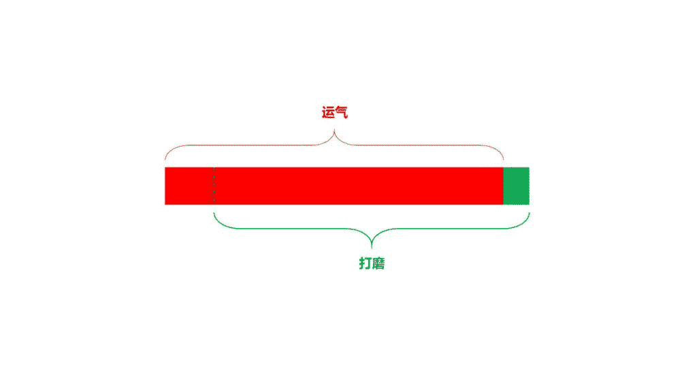

# 生财之路的反思

最近在自我反思：

为什么我赶上风口了不能生财？
为什么我随便冒出的一个想法别人拿去生财了我没有？
如何生财？生财必须具备哪些要素？

先说一下我的经历，圈子里应该没有比我更惨的了：
2012 年，微信公众号刚上线的时候，我用一个下午的时间注册了 10 个号，都荒废了；
2014 年，服务号火爆，我跟几个计算机系的同学用有赞开发了一个预约黑车的公众号，给那个号涨了 2W 粉丝，全是昌平区的，后来也荒废了，因为是用别的公司注册的，没法找回；
2016 年，每日优鲜等生鲜配送公司在高校里开店火热，我用自己当学生会主席结识的高校朋友，在北京高校里租了 8 个店面，转租给他们，赚了一点点中间差钱，随着毕业也荒废了；
2017 年，产品经理这个职位火热，我在人人都是产品经理、PMCAFF、简书写稿，拿到了他们的专栏作家、优秀作者等称号，后来转岗也基本都荒废了；
2017 年，学了前端做了几个小程序，后来开始对这个行业研究，上打通到官方团队，下认识了一大批头部的小程序开发者，还被腾讯邀请去参加公开课，后来觉得没啥意思荒废了；
2018 年，扒了抖音数据的采集逻辑，结识了小北，他给了我几十万条抖音数据，我做了数据推倒，扒出了抖音的推荐逻辑，很多刷量党都拿去用效果杠杠的，开心了一阵这事也就荒废了；
2018 年，还研究了裂变、增长黑客，年底开始研究下沉用户、老年用户，都打到了点上认识了一批圈子里的玩家，然后半吊子荒废了；
2019 年，开始琢磨知识星球，输出了一些不错的内容也算小有名气，还跟吴老板建立了不错的连接，半年过去了，没啥更大的突破。

回看过去几年，所有的大风口我都追上甚至超前于一些风口，但我狗屁钱也没赚到。

于是最近开始反思，怎么回事？

亦仁在圈子里说过不下五次赚钱运气很重要，这一点我认，但这不是阻碍我赚钱的关键点，相信大部分都不是被运气阻碍。

前面很多大佬还提了很多关于赚钱认知的问题，我也认，但这也不是阻碍我赚钱的关键点，相信大部分人也都不是被认知阻碍。

还有“人际关系”、“财力”、“团队”等等一大堆理由和借口，都不是阻碍我们的理由。

那我没赚到钱的原因是什么？

我想了很多，最终只有一个词戳到了我：精细打磨。

道理大家看太多了，举几个例子吧：

【1】
@明白 的爬虫课
说实话，webscraper 这东西我保不齐比明白接触的还早，我用它爬人人都是产品经理上的文章时，他应该还在做程序员。

但是明白做了什么呢？他把这个工具的使用方法一步一步的死磕明白，然后做成课程，并且做了很精细的课程海报、课程大纲，很努力的在他所有能触达到的渠道宣传推广。

从外部的表现来看，他对自己做的这个课非常之了解，甚至拿出大量时间来复盘、推演课程的研发和推广中会出现的问题。宣传物料、社群搭建、文案撰写都是经过了推敲后的。

打磨程度之精细让我不得不承认这事儿能赚钱。

他还有个知识星球精选的网站，很精细的做了 SEO，流量应该也不小。

【2】
@阿呆 的 WCplus

这项目最近阿呆在很精细的打磨，我能看出来。他写了一篇超级长的文章介绍了这个项目，把他怎么通过这个项目赚的第一桶金、产品的用户是什么样、产品有多大的价值、产品的使用方法做了非常详细的梳理。

且不说产品研发过程的精细，如果你用过那款产品你能感受到，它不是粗糙的功能堆叠，里面有很多细心的提示、经过优化迭代的产品细节。

从那篇文章里也可以看出来，他对这个产品的宣传做了非常精细的推演和打磨，文章内容几乎回答了你买这款产品会产生的所有疑问。

【3】
@TooBigData 和@三林 的抖音数据工具

这两位创业者我都认识，从产品刚开始做我就关注到了，并且有不少交流。

我看着他们的产品从零散的功能慢慢丰富到在线工具、社群服务、资讯服务等丰满的集成性平台产品。

从零散的聊天中，我能感受到他们对一个功能或玩法的思考、推演到上线整个过程中对细节的打磨。他们是全身心的投入这个他们认为可以赚钱的项目中，而不是“业余研究”。

【4】

@亦仁 的生财有术

这个案例我觉的无需多讲，大家都看在眼里的。是的亦仁赶上了知识星球的大风口，甚至多次得到官方的加持，这是他的运气。但是在运气背后，每周一次的采访、线下活动、案例拆解、资源对接，甚至那副扑克，都是团队一个细节一个细节打磨出来的。

没有这些对项目的打磨，生财有术很难连着三期火爆。

相信这样的例子你们应该也能想到很多，我总结了他们的一个特点：全力以赴的精细打磨。

他们确实占到了风口，这是他们的运气；但是我们也在这个风口上，我们却没赚到钱。

我甚至曾自诩比他们都懂这个风口，现在想来甚是惭愧。

我画了一个图，如大家所说赚钱 90%靠运气，但是运气后面藏着一个我们都看不到的“打磨”。

以此自勉，希望也能给看到的人带来一些思考。

运气

Luke：我觉得大佬就是不差钱，赚钱的动力不够。要是我有这能力，非得逮住蛤蟆攥出尿

张佳 回复 Luke：惭愧了，我比这个圈子的所有人都缺钱……

Owen：技术没你牛逼，错过的风口（收益）不比你少，不过都已经过去的事了，再说出来似乎也只能归结为性格决定命运。

李晨：半途而废很正常，重拾行囊，继续干就好。 人们真正注意到你的时候，不是第一眼看到你站在那里，而是发现过了这么久你居然还在那里。——《黑客与画家》

耿直哥：真心觉得，每次都能踩中风口的人也必定有过人之处。受教了

莫一多：找一小事，先全力以赴的干起来。 赚到 1 之后，一切都有了。

无知与偏见：有切身体会

Tyler durd*：总结的很好啊

TripleU：2014 年 黑车服务号是一个很好的风口啊

公子京：就是干！谈，大门敞开，打，奉陪到底！

wulujia：这么看下来，是不是缺了点定性？应该咬住一大块肉就别松口了，哈哈。慢决策，下重注。

张佳 回复 wulujia：我就是缺少定型的典型…

邓皆斌：事情初步验证了方向，接下来要一点点去打磨，需要一点耐心。这个耐心来自于哪，我觉得还是认知。

亦仁 回复 邓皆斌：赚到过钱的人 才能有更大的机会 再次赚到钱。

追影：所以哥们你现在准备去精细地打哪个项目了吗？

scalers：持续行动，持续做一件事情

张五哥：精打细磨只是一种行为，有多种因素影响这种行为。比如天赋上是不是容易从精打细磨上积累优势，是不是容易从精打细磨上积累成就感，还有就是环境的影响刚好你精打细磨获得了足够好的回报，这可能和运气有关，巴菲特不是说他是投胎红利，时机不对再牛逼的成就不一定被认可，历史上埋没的才华其实太多了。微观上反省自己细节上问题尽量优化自己可控制的部分然后把结果交给时间。就互联网来说，现在的机会已经好太多了，以后会越来越好。以兄弟过往的经历进了亦仁的星球，时间放长远些，生财是一定的

Joke：抖音刷量的工具能推荐一下吗？谢谢

ykk：佳哥，能不能详细分享一下如何每次都能紧抓风口？我觉得这个是第一步，真的很重要，因为有了第一步你才能精细打磨，如果没有正确风口的第一步，你可能精细打磨的本身就是一件毫无用处的样品，回过头来自己醒悟了，精力和时间已经都浪费了许多，岂不是感觉更糟。

潘迪凹：经常看佳哥的奇技淫巧。隐约觉得佳哥应该是好奇心很强+研究力爆棚的人。喜新厌旧没跑了！

张佳 回复 潘迪凹：本来只想喜新，发现喜新就是会厌旧…

凡不易：厉害了，也有过类似遗憾，2012 年那会我给我负责的学生组织注册了学校最早的公众号，顺手注册了两个个人的号，就没管了，后来看着一些号没多久开始做起来接广告。

飞猫：我觉得还有一个因素也挺重要：耐住寂寞把一件事做到底。很多事情开始做的时候，增长曲线飙升的很快，做完一段时间时间的投入和正反馈相比没那么高了。人也就自然而然淡化了兴趣，转移了目标。我一个 2010 年就开始注册玩微博的人和 2011 年就开始接触比特币的人现在也还不是 996……

王伟琼：认同一件事要做成需要持续沉淀和打磨，其实后面精益求精比前面的一个 idea 落地要更费时费力

四爷(Joseph)：谁说过的我忘了：很多时候，放弃和坚持很难说是哪个更有勇气 文章看了很有感触，我来简单说说我的体会，可能有点离题 首先，想法多肯定比想法少好，抓得住机会肯定比看不见机会好。我们这个圈子的人，很多人应该都一样，每天可以有 10 个以上的新想法。其中一些去试水了失败了，而事后会发现其他人做成了。 要做减法没错，但你得先有能力做加法，才有资格做减法 影响成功的因素太多，确实，说千道万，都可以归结到’运气’一个词里 坚持打磨我觉得可能不是问题的正确结论，因为这个过程中变量太多了，坚持打磨只是一个变量 精细打磨的另一个说法就是一条筋 要承认世界的本质就是随机漫步的，但正是因为随机性，所以回归均值也是确定事件，换句话说，胜率可以被提高 所以问题在哪，问题在于机制 对于机会的选择，要有确定的筛选维度，例如利润率、启动成本，增长空间等等，甚至可以上权重计算，比如我这种死理性派就是这么干的 对于启动后的展开，要有明确的退出或继续的标准，比如花多少时间做到多少营收，做不到就放弃，快速小步试错，每个阶段都持续这样做，这样感觉上就不是’荒废了’，而是战略性放弃 反复这个过程，根据基本的贝叶斯，成功是大概率事件 所以，最后，要精细打磨的，是这个执行的框架

逸隆 回复 四爷(Joseph)：有没有介绍这种机制的书籍，求推荐

阿正：聪明人的烦恼

wikimo：1\. 精打细磨的前提是方向正确，如果方向错误，再怎么精打细磨也是白忙； 2\. 为什么遇到了各种风口机会，别人做了同样的事情，人家成了，自己没成，通俗说还是能力不足。方向对了，事情具体怎么做没做对，只是我们不愿承认； 3\. 成功是小概率事件，需要天时地利人和，人家 1-2 年成了，我们可能需要 10 年，加油吧，可以的。

朱进：想到几点对自己的感触.写下来自勉吧 1.看了然后看懂,看懂然后学会,学会然后做到,做到然后看哪儿做的不好.持续改进迭代上升.事儿一件件干一件件成.看到了和做到了还是很大的差别. 2.做事有恒心,长久有耐心,相信复利的力量. 3.弃坑有成本 4.看不懂的模式就和自己没关系.堵对了也的稀里糊涂的赔进去. — 能押对众多的风口也不是一般人能干的事儿,大佬还是会成事儿,迟早的问题罢了.

JO.：个人感觉，其中一个原因是你一开始就没有抱着赚钱的目标去做。你这更像是搞研究，赚钱只是附带的。

张佳 回复 朱进：你最会鼓励人了