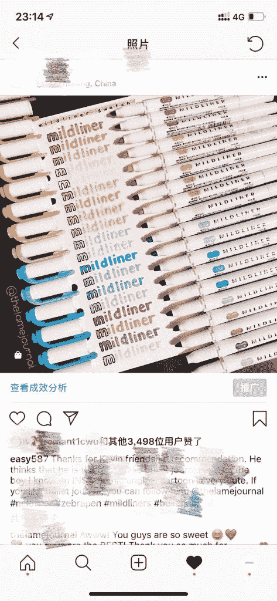
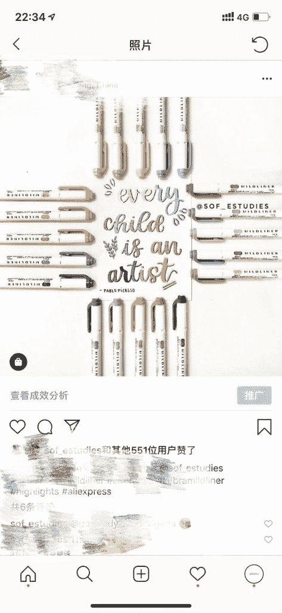
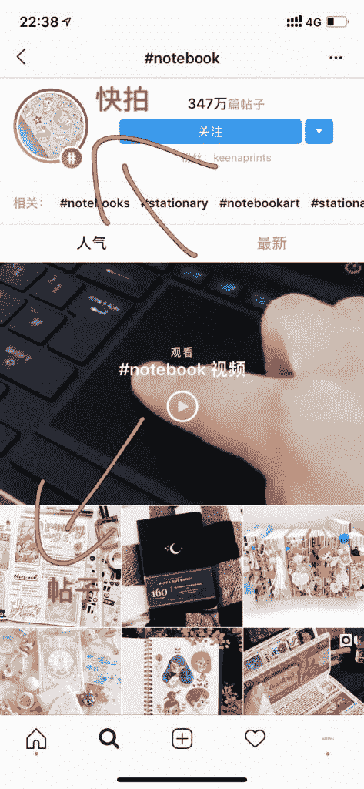

# 如何涨粉？instagram 新手

平时大多时候只是一个看客，今天晚上坐下来刷生财有术，看大家写的这么起劲，我也打算写一篇，也当给自己用了这么久做个小总结。

介绍一下自己，目前从事跨境电商，主做速卖通，instagram 于我来说，更多的是引流和跟顾客建立信任感用的，现在平台的流量越来越贵，而且不够精准，必须要建立自己的流量池，毕竟社交电商还真是很重要的。

进入主题

instagram 更多的是图片社交平台，你发的图片越漂亮那么你得到点赞的数量会越多，当然这和你的粉丝数量也有关。

发帖

在刚开始做 instagram 的时候，我都发一些自己的产品，连续发了好多天，但效果平平。

后来同行发帖才知道原来需要有好看的或者说你的目标人群喜欢的照片才能有更多的点赞（见图 1，图 2 对比）

除了好看的图片之外，你需要会写#tag，就是和你这个产品有关性的词，有些人会在搜索栏里搜这个词，这个会展现近期热门的帖子（图 3），所以这也是一个流量入口

快拍

微信去年推出时刻和快拍类似，一个快拍只能发布一个 15 秒的视频，有效期 24 小时。当你发布这个视频之后，它会出现在所有好友的页面顶部。

你在这里可以发视频、图片、还有一些 ins 独有的视频形式，有人觉得你这个快拍好玩那么他可以分享到自己的快拍或者单独发给朋友

快拍也可以写#tag，和帖子的道理一样热门的快拍更容易让人搜到（图 3）

赞助

顾名思义，就是送产品给博主，通常 2w 粉丝以上的博主我才会合作，当然也不只能粉丝量，帖子没有活跃度也不行，比如粉丝 5w，但每次发的帖子就几百个赞的，这种博主的粉丝质量是不合格的

赞助的好处是什么？当博主收到产品后，他会 po 帖子，那么在图片里面他会#tag 我，粉丝越多曝光度越大，一些我在合作的博主也会有 youtube，据我观察 youtube 广告的流量通常转化更高（这里不展开）

giveaway

相比于上面的几个方式，这个涨粉的速度超级快，为什么快？白送呗！

指定一个规则，比如关注这个账户，并且@5 个人

等，规则你自己定，目的是为了吸引更多的人参与进来

具体能涨多少粉，这也和你的照片是否受人欢迎，赠送的产品是否有吸引力等因素有关

通常这种活动我会联合多个大博主一起做，每个账户选出一个获胜者，想想如果 5 个账户，每个账户 10w 粉丝，那么影响力就是 50w，然后参与活动的人还要@更多人，所以一次活动下来涨个几千粉丝不是难事

广告

当你觉得某个帖子点赞数不错的时候，你可以直接推广这个帖子，投放可以根据国家还有关键词、年龄、性别等参数做选择

facebook 和 instagram 已经是打通的，所以你可以在 facebook 创建一个广告策略，通常我用的比较多的是 10 张图片或一个视频的帖子推广，10 张图片就代表可以插入 10 个链接，facebook 会自动投放到 ins 的页面上去，关键是 facebook 的单次点击还便宜，就我们行业的，一个点击不超过 0.1 元

还有一些引流的渠道，比如线上直播，目前我还没有涉及到。还有可以做个小活动把所有在平台购物过的买家引到 ins 并 po 个产品的帖子，社交平台真的可以好好深挖，那些做独立站的流量，十有八九都是靠这些平台撑起来的。

这些算是我的一些经验分享吧，还处于学习阶段。

谢谢大家

图 1

图 2

图 3

评论：

严 yan ： 商品标记这个功能有些帐号最近失效了（检测到是中国地区），之前是可以的，你的店铺地址的是国外吗

easy 回复 严 yan ： 是的，最近失效了，是统一失效吗？我以为是我的设在出了问题

严 yan 回复 easy ： 反正很多都挂了

爱拆快递的小白兔 ： 这个笔不错啊

easy 回复 爱拆快递的小白兔 ： 这是日本很火的荧光笔