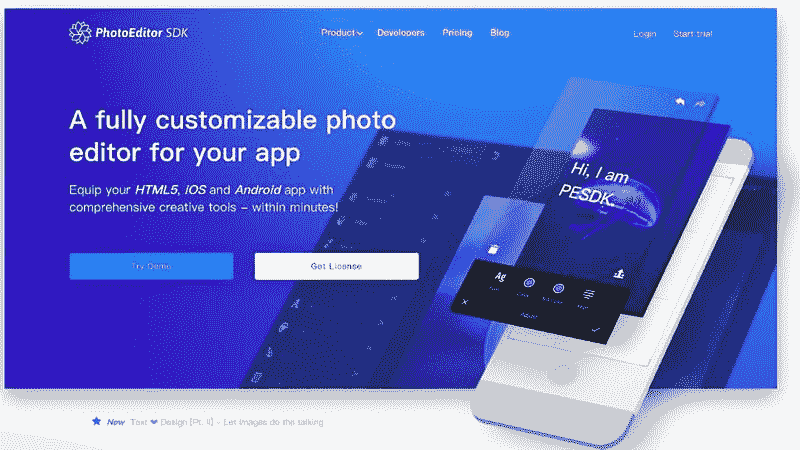
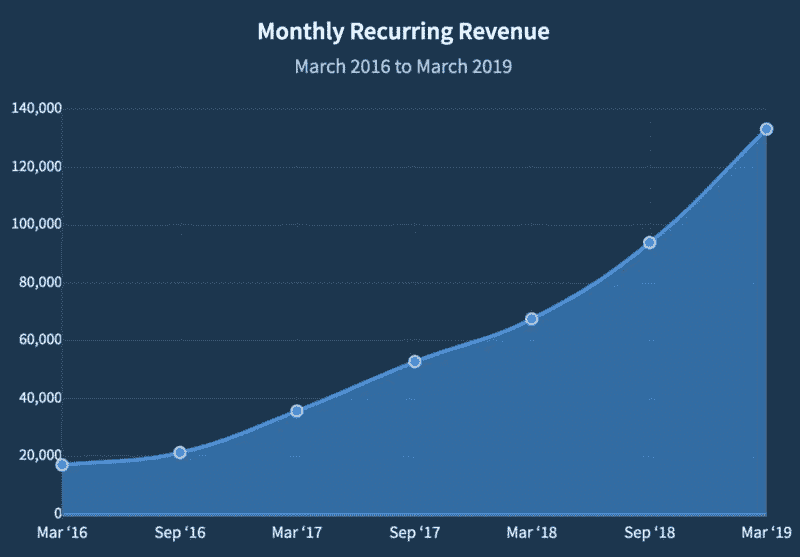
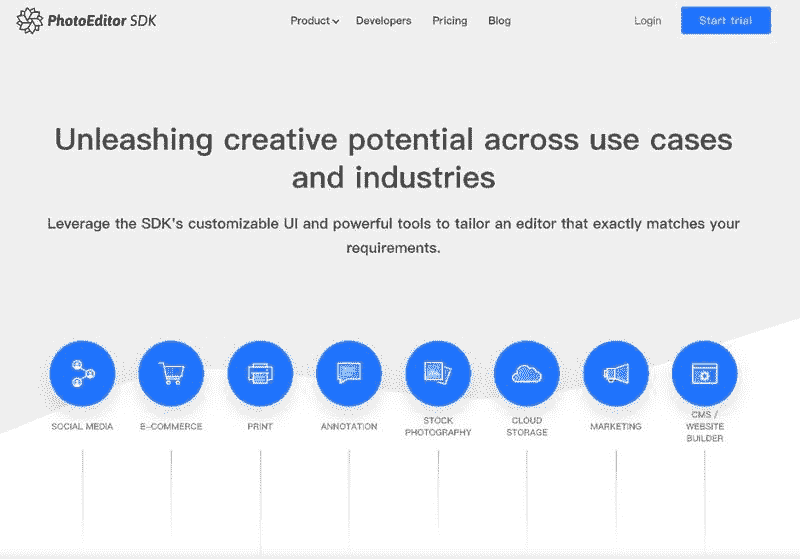
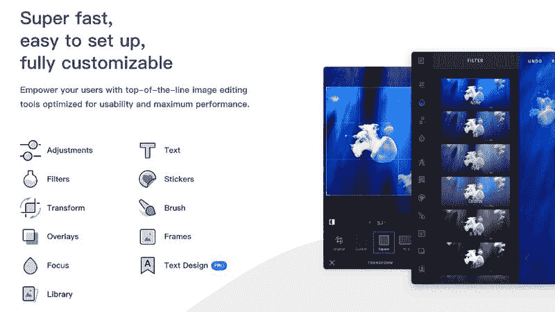
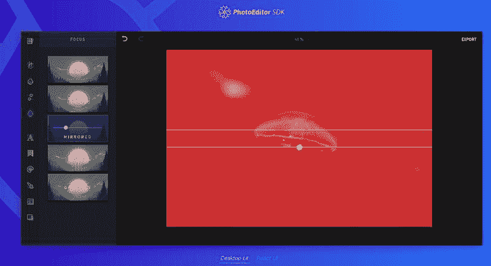
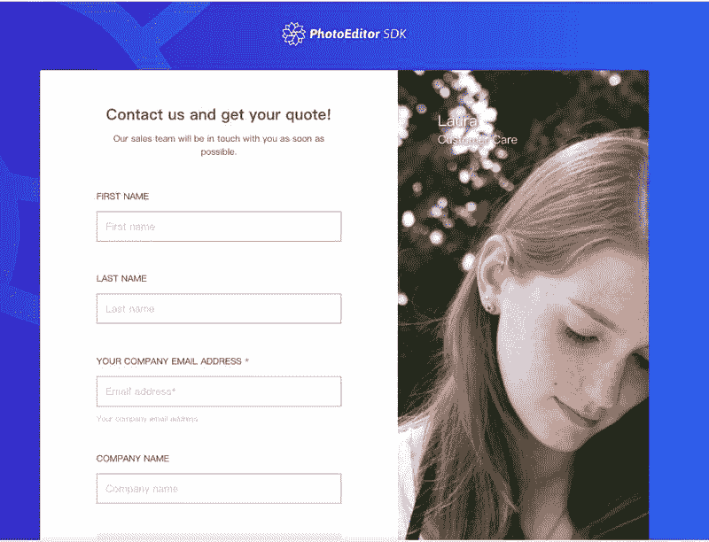

# PhotoEditorSDK：每月赚 12 万美金，也是厉害呀！

每周五，来一篇海外生财有术的案例，帮助星友开眼赚美元。

今天给大家分享的赚美元案例，有一点技术含量哦，但他们每个月可以赚 12 万美金，也是厉害呀！大家不懂的可以留言，有懂的技术哥哥给解释下。

产品名称：PhotoEditorSDK

产品网址：[The PhotoEditor SDK for HTML5, iOS and Android by …](https://photoeditorsdk.com/)

产品解决的问题：照片编辑器 SDK， 嵌入他们提供的 sdk，可以让自己的 app 具有高度可定制化的照片编辑功能，从而免去重复造轮子。

月收入：每个月 12 万美金，包含产品以及附带的服务

付费用户量：350 名客户，包括创业公司和 100 强的大公司。

产品出发点：主人公自己在多个产品中需要用到照片编辑功能，为了避免重复开发，他们构建了一个可在所有这些项目中使用的照片编辑器。 考虑到别的开发者也有类似需求，他们把这个照片编辑器开源了。 开源之后，有一些公司找上门来想商业合作，自然而然的觉察到这是一个好的创业机会。

整个创业过程中，主人公总结了很多心得与感悟，鱼丸从里面提取了下面 10 点~

1\. 产品早期，尽可能与每一个客户深入交谈，了解他们的需求并为他们提供解决方案或者解决问题，而不是急于去扩张市场，主人公的产品经历了两年的自然增长才开始找销售去推广；

2\. 一开始没有宣传产品，只是将产品开源到 github 上，但是持续维护优化 github 上面的信息，做好最小的一个展示面，这样可以 github 上获得一些持续性的流量；

3\. 主人公的一个反思：应该聚焦在一系列小工具，而不是不断的往老产品上加新的功能，产品最后做的很复杂，实际上将很多功能拆开会更好；

4\. 主人公关于工作和生活的另一个反思：如果你被动的回应生活中的每一件小事，你很快就会陷入到紧张的困境中，并因此倦怠。

5\. 在确认你推出的解决方案有真正需求的时候，不要迷失在技术细节中，精益的去验证需求，而不是深入的完善细节；

6\. 多出去和别人交谈和分享，不要担心自己的想法被别人盗走，如果别人批评了你的想法，这其实是一件非常好的事情，接受批评并继续；

7\. 为产品找到合适的定价是一个漫长的过程，需要大量的试验和测试，难点在于：需要靠产品赚到可以支撑团队继续下去的钱，且同时让客户觉得产品价格合理；

8\. 主人公为产品选择了付费订阅的模式，因为这样可以持续激励团队，并为产品做出真正有价值的更新；

9\. 兼职团队虽然是可以降低成本，并某种程度上有效果的， 但是全职团队，特别是销售团队，可以明显的提升团队的工作效率和业绩；

10\. 在产品真正的稳定之前，大概花了 2 年时间去优化产品，很多时候你难以去判断，到底是方向问题，还是能力问题，坚持可能会有一些奇迹，但这个过程中有一些小的正反馈很重要；

以上，就是今天的一起赚美元，喜欢的话给鱼丸点个赞~

PhotoEditorSDK

PhotoEditorSDK

PhotoEditorSDK

PhotoEditorSDK

PhotoEditorSDK

PhotoEditorSDK

评论：

萝卜 ： 都开源了？