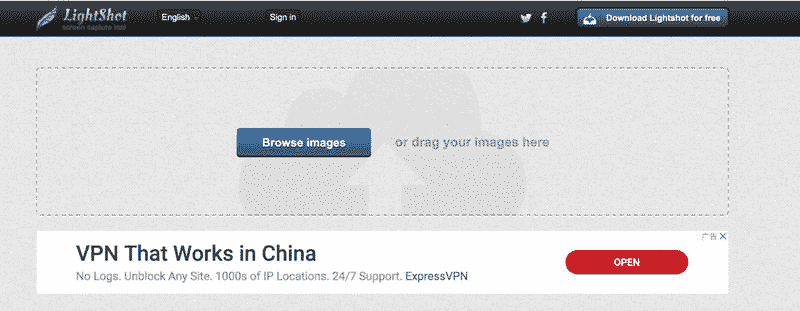
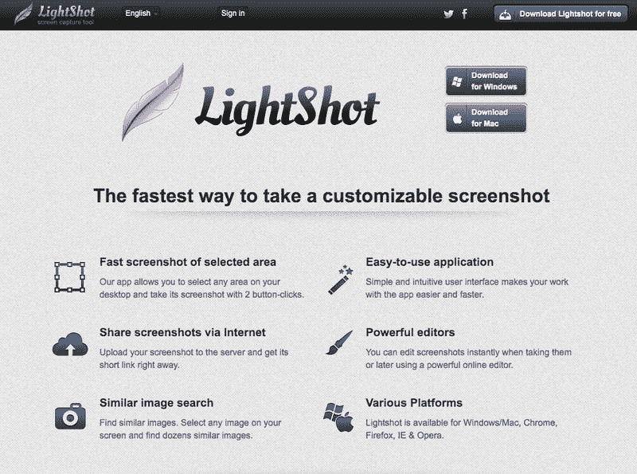
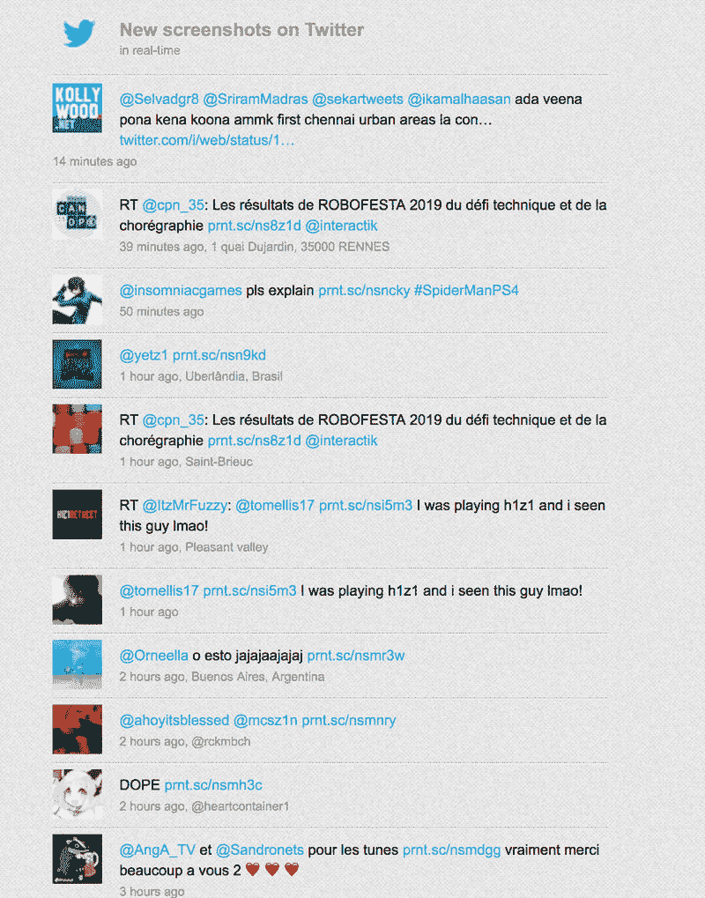
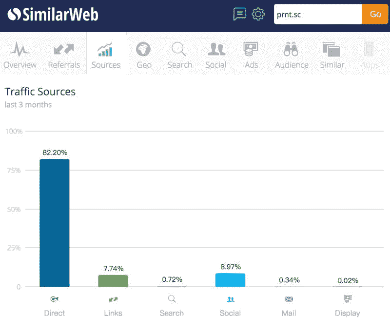

# 躺赚：这个网站每天约 4000 美金，每月 12 万美金的收入

分享一个赚美元的案例。

老英文站长可能比较熟悉这个工具：prnt.sc，在 skype、twitter 上很常见。

这个产品已经存在 10 年，不过产品功能仍然非常简单：上传图片，生成一个链接，可以在社交网络中通过链接的方式分享图片。

跟国内美篇有点像，上传多张图片生成图集，绕过朋友圈九张图片的限制。

这个简单的功能带来每天 100 万次的访问用户，200 万次的 PV，目前盈利方式是 Google Adsense 广告，按照 1000PV 带来 2 美金广告收入的值估算，这个网站每天带来约 4000 美金，每个月 12 万美金的收入，完全躺赚。

比较爽的点在于，这个产品天然带有裂变属性，生成的图片链接被传播到社交网络上后，又会带来新的用户。

类似的产品不少，现在做同样的功能很难再有这么大的量，不过在网上还是可以看到一些对 prnt.sc 的吐槽，比如不支持批量上传图片生成分享链接，不支持上传图片生成二维码等。

Lightshot

Lightshot

Lightshot

Lightshot

Lightshot

Lightshot

评论：

Jarvis ： 懂了，这就去做一个 prnt 短链接变二维码的网站，名字就叫 prnt2qrcode.com

亦仁 回复 Jarvis ： 草料二维码海外版

雁鸣 回复 亦仁 ： 每天的 UV/PV 怎么来的？好像和 SimilarWeb 的估算差很远

亦仁 回复 雁鸣 ： 这个数据就是 similarweb 来的