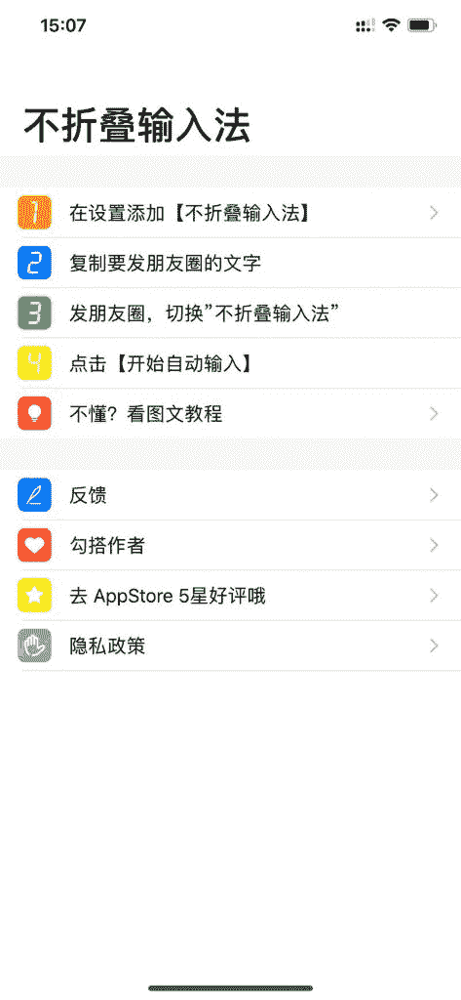

# APP 推荐：不折叠输入法

苹果手机下载需要 1 块钱，这款软件就是为了解决新版微信长文案折叠的问题，我们普通人用一个微信号就不需要，也不怎么关注折叠的问题，但是对于 5000 万微商来说，真的是抓住了痛点，特别适合微商人发圈需要，一下子赚到几百几千万，真的是有挑战就有机遇，这个软件新出的，还需要看后续是否稳定，会不会封号等问题

不折叠输入法

不折叠输入法

**评论：**

KyXu：作者刚好在我独立开发群里，哈哈

社会耶 回复 KyXu：这款产品的开发者吗

KyXu 回复 社会耶：对

社会耶 回复 KyXu：哈哈想认识，执行力超强的，看到微信上的问题，看到微商人的痛点

许鉴鑫：刚在安卓的手机搜没有搜到

社会耶 回复 许鉴鑫：安卓现在没哦，安卓的可以用剪切板

企鹅哥哥 回复 社会耶：剪切板咋用

bengcaca：畅销榜 1100+名 ，应该也木有多少收入吧，不过产品还是很吊，很会抓需求

社会耶 回复 bengcaca：新出的，看后续发力吧

xiaolan_ 小兰：不是输入阿拉伯数字，再复制内容，再把数字删掉就可以不折叠了吗。 没想到一个小技巧可以解决的问题，还能做成一个产品，还能有那么大的需求

社会耶 回复 xiaolan_ 小兰：这个方法微信更新后就用不了啦，还有种方法可以:把超过 3 行的内容剪切，退出保留，然后再发粘贴剪切的内容，直接发布，也不会折叠，不过有点麻烦而已

xiaolan_ 小兰 回复 社会耶：我用的最新版(V7.0.4)还可以这样复制呀，估计还没有灰度到我吧

社会耶 回复 xiaolan_ 小兰：是的，有些机型可以，有些机型到后面才不可以