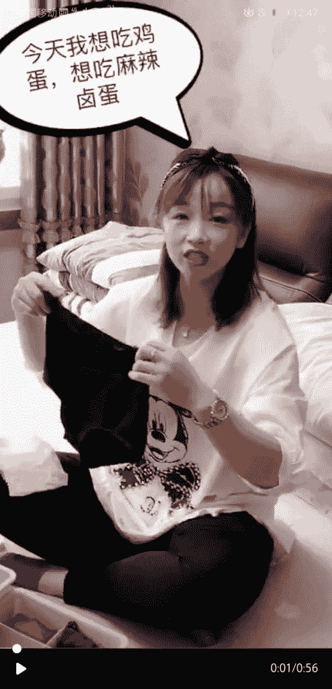
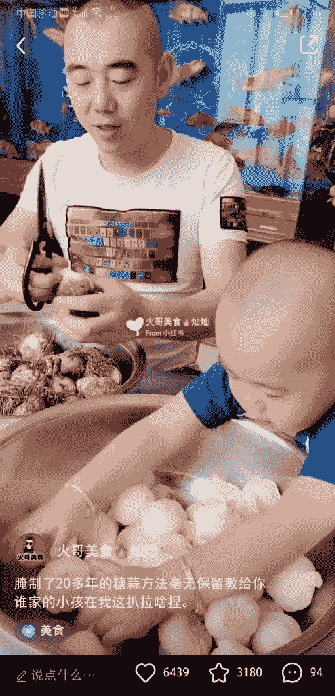
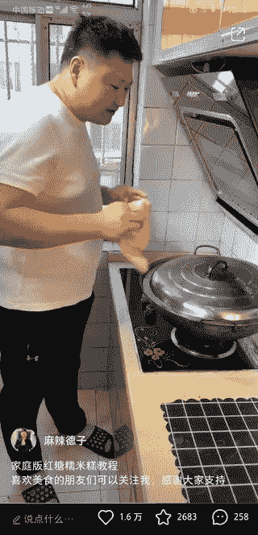
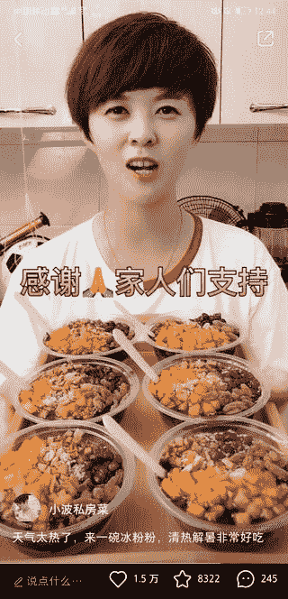

# 运营思路复盘：小红书美食类

前段时间学习小红书运营，发现美食这块大家力求的是真实和温馨，做出来的味道不一定是好吃的，但是只要把握住五大元素，就可以快速爆红

1、要有自己的口头禅，比如麻辣德子的口头禅：放，放往里放

2、名词替换：把一些常规词汇加入趣味成份，白开水要说成是“生命的源泉”

3、夫妻档树立爱妻形象会特别容易吸引别人点赞和留言

4、镜头要稳，镜头切换要有层次感，要把每个步骤都分拆清楚

5、适度加入两个人的对话，显得有情景会让视频更加丰满

最后我发现在小红书上做美食号有一个贤内助是必不可少的！

小红书美食号

小红书美食号

小红书美食号

小红书美食号