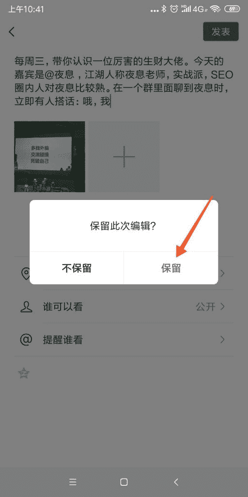
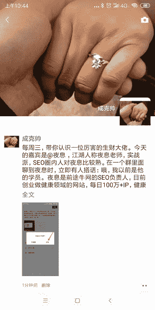

# 朋友圈文案防折叠技巧 | 不用任何工具

刚才看到有圈友讲到关于朋友圈广告防折叠的工具，ios 和安卓的，首先为圈友的思路和执行力点赞！任何信息不对称都是商机，我要是有技术，我也想做个这样的工具，又可以收割一波，哈哈~~

说正题，朋友圈广告防折叠非常简单，朋友圈的文案如果是原创的，比较长的话，也只显示前五行，那我们就利用这个规则就可以完美的实现广告防折叠，步骤如下：

1、复制文案（截图示例里是我复制亦仁的#生财合伙人）

2、选择朋友圈图片（截图示例里是 25 号郑州见面会随拍）

3、将广告文案第五段以下全部剪切，只留前四段。

4、点“返回”，微信提示对话框里点“保留”（图 1）

5、点朋友圈右上角相机，进去能看到刚才保留的内容。

6、粘贴你剪切的广告文案，发表。

这样操作微信会认为你的文案是原创文案，就不会折叠，效果如图 2。

图 1

图 2

**评论：**

稻草：先写 2 个字，然后把要写的内容粘贴到这 2 个字之间。然后把第 1 个字和最后 1 个字删除，就可以了。

成克帅 回复 稻草：测试了下，确实如此

王亚瑟：Ios 不行

成克帅 回复 王亚瑟：多复制一点，留下三行半