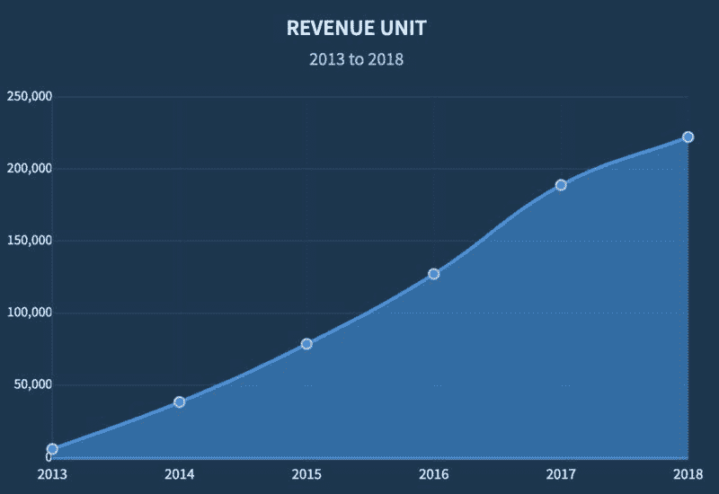
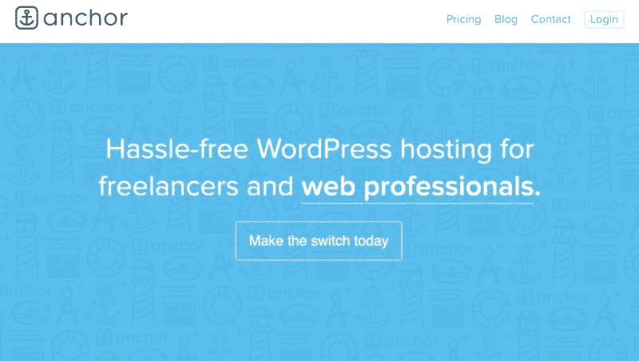
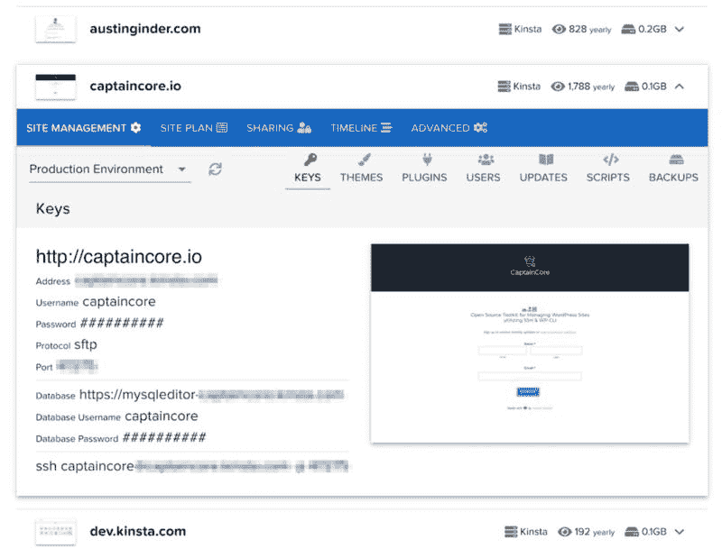

# 针对小企业的 WordPress 托管服务 | 月赚 2 万美金

大家好，又到周五啦！ 每周五，分享一篇赚美元的案例，我们一起赚美元。

今天分享的案例，以星球里面各位程序员大佬的视角来看，应该没什么技术含量:为小企业进行 WordPress 托管服务，就是这么看上去不起眼的服务，帮这个主人公每月赚到近 2 万美金的收入。

WordPress 应该是最受欢迎的博客程序，每天都有无数的 WordPress 博客被搭建，也有很多大小公司将官网介绍放在了 WordPress 程序上。今天的主人公就是在帮非技术人员做一些 WordPress 相关的服务，具体而言，包括:

自动更新博客

帮助每天备份数据

域名配置

博客程序安装

技术支持

高级主题/插件

可配置的主机

博客搬家

https 配置等

邮箱配置

自定义的主题设计等

主人公提供的这些服务，帮他每个月可以赚到近 2 万美金的收入。

一、产品名称：Anchor Hosting [Anchor Hosting](https://anchor.host/)

目前的收入：为 900 个企业进行 WordPress 托管服务，每个月赚 19750 美元

二、收费模式：基于使用情况的按月收费，最便宜的是 20 美金一个月，最贵的是 100 美金一个月，取决于托管的 WordPress 网站的年度访问量。

三、作者的一些思考

1、收入或者付费用户是成功的标志，真正重要的是为客户解决了什么实际的问题。

主机运营商提供的网络托管服务与企业所需要的，还是有很大的差距， 这中间的差距就需要像主人公这样的人来提供服务，解决问题，并赚到相应的钱。 圈主亦仁曾经说过，赚不赚钱完全不取决于你提供的服务或者产品是不是有技术含量，而是你提供的服务是不是在帮助一些人解决问题。

比如 WordPress 的搭建在任何程序员眼里，都是一件没有技术含量的事情，但不妨碍主人公获得了 900 多个忠诚的付费用户，并且每个月可以带来近 2 万美元的收入。

2、找到关键人员，而不是自己出去找客户：主人公将核心精力用于与网页设计师、网站开发人员和代理商进行沟通，通过撬动这些人，去吸引最终的客户。 因为客户非常相信这些人的推荐。

3、如果不知道自己要做什么，那完全没问题，重要的是开始做，做着做着，你就会发现目标清晰了；圈里条形马也说过类似的话，重要的是开始行动。

4、当你被逼着用有限的资源做事情的时候，你会发现自己的效率提升了，特别是对于那些每天工作很忙的人来说，试试看逼一逼自己，通过优化流程，你会发现自己还有很多可改进的潜力和空间。

5、如果可能，多写作，多表达自己，这样会带来很多额外的机会和惊喜，除此之外，写作也是很好的记录生活的方式。这也和亦仁一直倡导的越分享越有价值，观念一致。

不一定是要开个公众号，买个日记本，可以从此刻开始，在生财圈里发个帖，讲讲自己的第一桶金或者发个自我介绍。

大概率，你会找到共鸣者。

WordPress

WordPress

WordPress

WordPress

评论：

小白- 厦门 ： 是时候把我的 WordPress 捡起来了

shine_fore* ： 是时候学习英语 赚美金去了