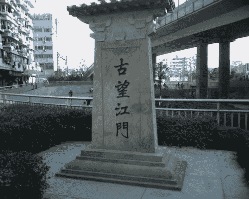
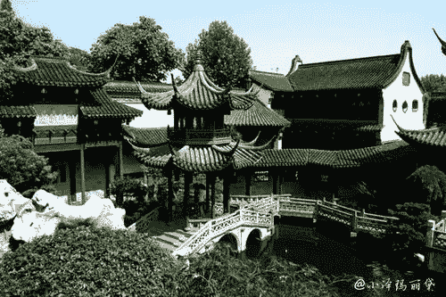
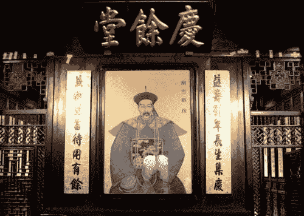
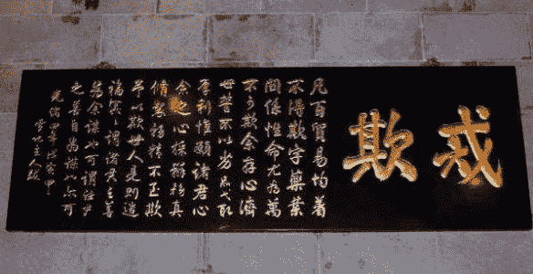

# 没享受到流量红利 | 创造一个新的流量入口

我们都知道当今电商行业需要面临淘宝，京东这样行业巨头，很多平台缺少实际可行的流量解决方法。

然而 150 年前，胡雪岩却用互联网思维解决了这种经营危机，彼时胡先生授母命衣锦还乡开创胡庆余堂，遍请两浙名医，却门可罗雀，眼看就要身败名裂。

胡先生开始暗中观察同行，发现自己的对手都太强劲了，杭州人买药只去最大的药号种德堂，而且种德塘就开在钱塘江望江门的港口处，当时的人们坐船过江，都会在望江门路过。

因此种德堂在客流量上有天然的优势，胡雪岩当即做出了一个惊人的决定，在自家药店附近开设免费渡口。

他还贴钱让所有人免费坐船，一夜之间胡庆余堂门口就有了川流不息的路人，久而久之，庆余堂起死回生，成了杭州当时最赚钱的买卖。

*   

    种德堂

*   

    种德堂

*   

    种德堂

*   

    种德堂

**评论：**

杨文斌律师：胡庆余堂还组织现场杀虎、杀鹿，即吸引人围观，也显示货真

狂奔的蜗牛：最近看了爱奇艺纪录片《天下徽商》里面有讲到胡庆余堂。