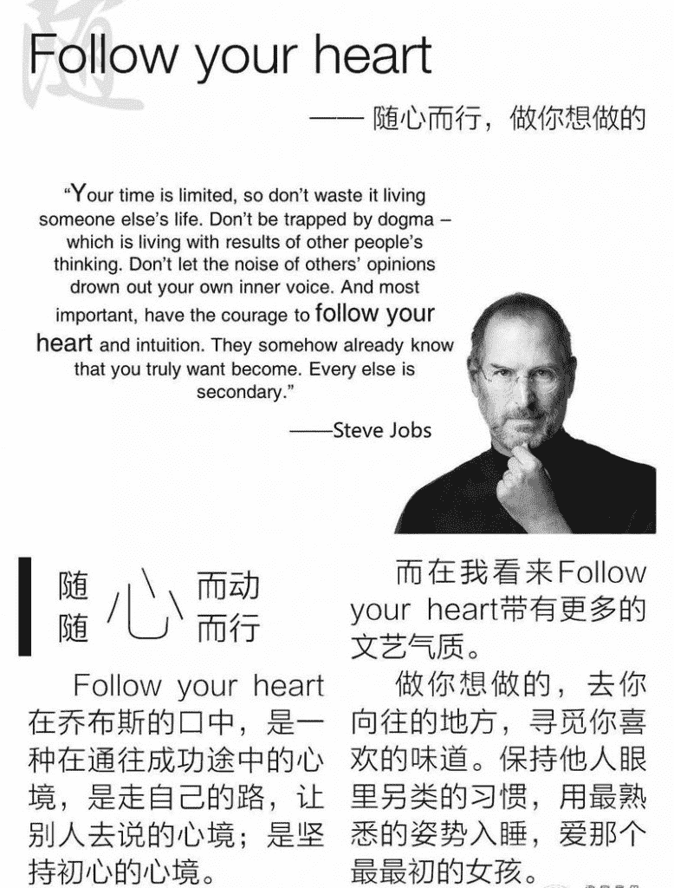
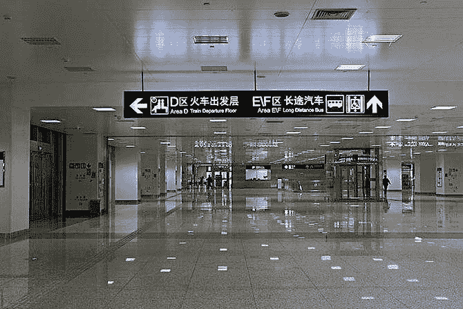
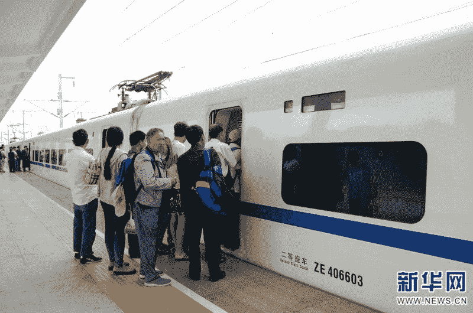

# 为创造而做事，顺便把钱赚了

这是阿里小二朋友分享给我的一个她的想法，现在客流量最大的地方应该就是各大火车（高铁）站了，能不能将这种流量有效利用起来呢？

我们知道人们大多是低头族，如果铁路做一个陌生人即时交流 app，给一个车厢的人们自动拉进一个快闪交流群，下车自动离群，同时聊天双方可以根据友好程度，来确定是否交换真实联系方式，一方面给经常出差的人们找到了新的乐趣，另一方面也使流量有了一个载体，高铁广告可以作为像高德地图那样的语音导航一样。

比如说，五粮液提醒您本次 d371 次五粮液品牌列车 5 车厢快闪交流群已经建立，欢迎唠嗑。

后边再加上一个 30 秒的弹窗视频广告，这样品牌就有了更高粘度的曝光场景。

*   

    高铁

*   

    高铁

*   

    高铁

*   

    高铁

**评论：**

耿直哥：同样的场景还有：商场、公园、学校食堂……

陈紫威 回复 耿直哥：商业壁垒和抓手才是难题

elsewhere：大约在 14 年我基本有过一摸一样的 idea，还调研了技术方案，但没想明白对使用者而言有什么使用的价值。 音乐节，则是个更好的场景，人群更明确，若有官方加持会更好推广

陈紫威 回复 elsewhere：同道中人

苏秦：认为这个场景不存在：一个车厢的人肉眼望去，老板、白领、大妈和学生等各种角色一览无遗，看见无聊天欲望，也不知道聊什么，如果聊天为什么不干点别的事情，是有好看异性还是有共同兴趣 ，是手机不好吃还是泡面不好玩。

壁虎看看-周胖：有人在验证这个最小化模型哦，有一次做高铁看里面有个二维码，扫进去是活码加群，然后进了个高圈荟的群，锚定的还算是高净值用户，不过观察了下，也没有玩出啥名堂，后面就还会变成广告群

亦仁：人群太杂，不够细分，没什太多可聊的

Tiger 回复 亦仁：贵宾候车室应该就更精准了，不过人太少

阿斌：我当时想的是怎么没人在这里投游戏广告…… 刚刚想到一个做法：开免费 WiFi，搞个游戏大厅，或者推广某个游戏？

推广大使：好想法，美女帅哥愿意加群，就有会有人玩，不然就没人玩。