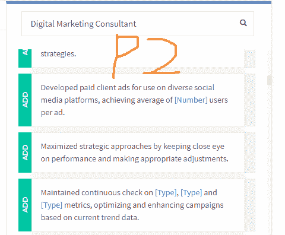
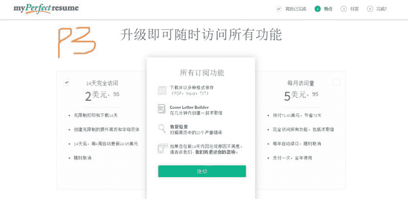
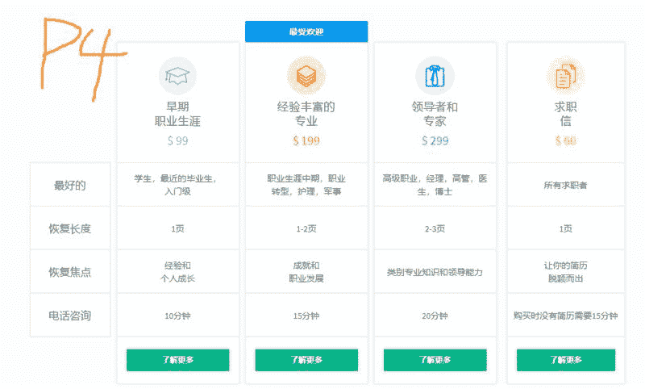
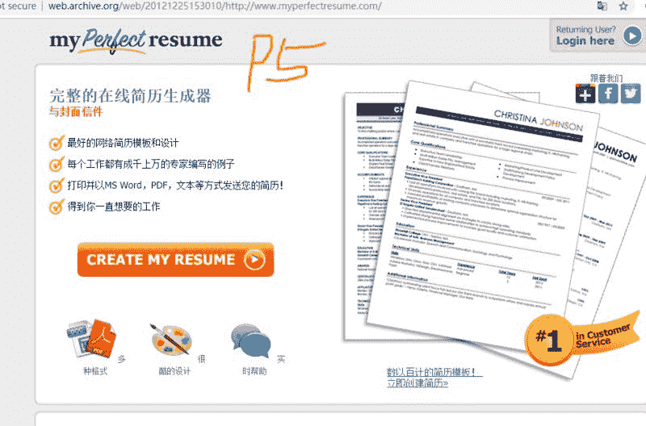
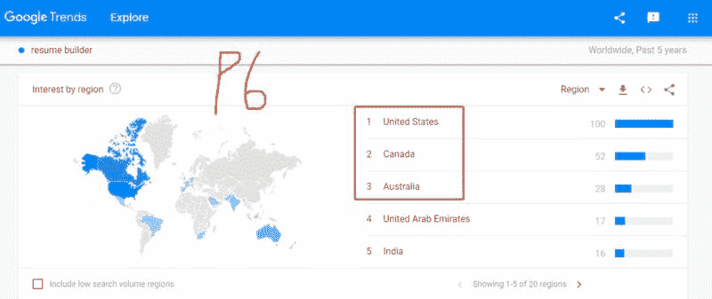
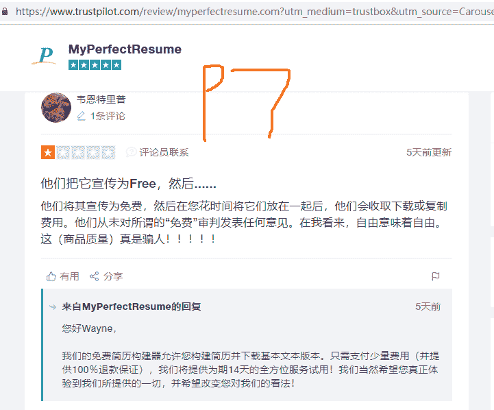

# 小伙伴提到的简历项目

昨天下午，终于跟瓜叔面基了。

面基时，有小伙伴提到简历这个项目。

刚好前几天，有看到过一个简历站。

分享一下捂脸。

大概的思路。

如果有兴趣，具体再深挖，请参考亦仁的《通过 Google 挖掘细分市场的一个案例》帖子：[`dwz.cn/0X6xcOlo`](https://dwz.cn/0X6xcOlo)

国外简历网站例子： myperfectresume.com

a, 运作模式：

按照各个职位，会给你精简的模板, 按照你的过往工作经历，教育，技能，见 P2 图（数字营销顾问的例子）, 你可以组合几个点。也可以从它的精简介绍里，再延伸一下。

b, 收入模式：

入门级，如何只是按照他给的模板，自己写，然后下载，就收费 2.95 到 5.95 美元/月（见图 P3）。

升级版，找专业人员改简历从 60 美元到 299 美元不等（见图 P4）。

c，流量小解：

这个网站做得早，从 2012 年的网站首页图（见 P5）来看，应该先是用免费模板来积累原始用户的。

现在基本也是用优质内容（简历模板）来收费 2.95 美元—5.95 美元/月，从 similarweb 数据来看，至少 61%的流量是来自欧美国家。

按照常规电商的 2%的转化率（具体可能更高）来看，他每月至少新客有 2 万个人不等。

如果算上高级服务的客户的收入，整体收入应该还是不菲的。

d, 如果我们有兴趣，能不能做，怎么做（只是简单说）：

从 myperfectresume.com 这个网站的自然搜索词来看，resume builder（google trends 过去 5 年的搜索趋势来看，虽然有所下降，但需求国家前 3 是美国加拿大澳大利亚（见 P6），证明市场付费的需求是 OK 的，但同时竞争也大。

但好处，这样的模板（可能有版权问题？），你可以借的轮子很多。

如果先以活下来的状态来说，可以从免费提供简历模板下载+google adsense（网站，app 都搞）+只收费一次的方式来做。

（trustpilot 评论站（见 P7）上，myperfectresume.com 被吐槽，明明免费，到下载简历时，要求扣费，还有按月订阅收费，这个绝对是收入利器，看苹果 app 订阅增长趋势就知道了）。

但要保留用户邮箱，方便后续高阶收费模式推荐。

P2

P3

P4

P5

P6

P7

评论：

微光 ： 这个点子不错的

Richard.颜过 回复 微光 ： 需要再深挖，找到更利基点。

微光 回复 Richard.颜过 ： 是的，还不清楚国内的付费意愿怎么样

Adgrowing ： 之前研究过这个分类，做了一半没有坚持下去

Richard.颜过 回复 微光 ： 国内，没有去调查。可以查几个指数，看看需求。