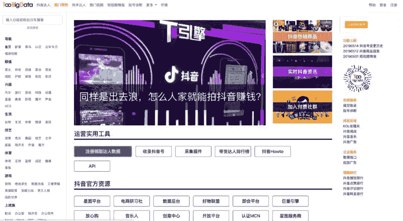
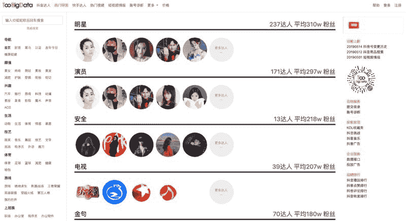

# 如何用数据进行“忽悠”：货真价实的“忽悠专家”

每周一，邀请一位圈友分享他行走江湖的绝技。

很多人应该是抖音快手数据工具 TooBigData 官网 – 抖音快手网红排行 这个产品的用户，没错，这个产品的创始人也在生财有术星球，他就是@wentao。

当我邀请他来做一个#轻享#的时候，他却说想分享关于“忽悠”的内容，他说他的工作就是用数据“忽悠”人，而且有多年的“忽悠”史。

为什么这么一个从北大毕业，做出了非常好用的数据工具的创始人，却说自己是个“忽悠”？

让我们看看他是怎么理解“忽悠”这件事？如何用数据进行“忽悠”的？他是一个货真价实的“忽悠专家”吗？

以下内容来自@wentao 的#轻享#，enjoy。

大家好，我是 Wentao，从二零零九年开始，我的工作是用数据忽悠人，现在具体做的事情是一个叫“数据青年”的小社区。

有人问，你不是 2011 年才毕业的吗？没错，我在学忽悠时已经开始忽悠了，用练功的时间忽悠，用罚跪的时间忽悠，用上茅房的时间忽悠，用休息的时间忽悠。每一天，当整个城市都还在酣睡之中的时候，我就已经开始忽悠了。你肯定没见过洛杉矶凌晨四点钟的太阳，可能没见过中关村凌晨四点钟的抱着孩子卖光盘发票和假证的大姐，而我，都见过。

我刚上大学时学的是计算机，后来因为过于优秀而放弃了这个起薪九十千的专业，投向无论在哪个公司起薪都只有四千的广告学专业。有人问为什么要转专业，我说就一个理由：为了理想，和找姑娘。

广告学本质上是一门忽悠的学问，这不是现代广告之父大卫奥格威说的，也不是现代广告之父克劳德霍普金斯说的，也不是现代广告之父阿尔伯特拉斯克尔说的。这句话是我说的，而不我想跟他们争着当爹。我在广告系里混得如鱼得水，忽悠到了自己的第一个女朋友，并且在学术忽悠的路上越走越远。

我在做学术的的道路上学到了很多技巧，每个技巧都能受用一生。比如说，如果你的标题需要一个数据来支撑论点，怎么办呢？你就可以写“有调研表明”。进一步地，如果是尼尔森或者波士顿或者益普索什么的出的报告，那就太棒了，可以直接写机构名字；如果调研机构不是很出名，就写“英国/美国一个调研公司的数据显示”或者“硅谷调研机构称”；如果没有任何机构出过这个数据，就说“我们做了一个长达 x 年的跟踪调研，由 y 人的专家团队经过 z 年的反复论证得出一个惊人的结论”，然后大力说服自己这些事情确实存在过。

如果有知名人士说过相关的言论，就用直接引语；如果名人没有直接说过完整的句子但是提到过相关单词，就可以剪掉一句半句多加几个引号拼起来；如果名人说的不是这个意思，就改一改使用间接引语；如果没有名人说过，那就写“某知名专家说过”；如果不是很需要名人背书，那就直接编个名字括号注明是化名，或者写成“一位不愿意透露姓名的郝正常先生”。

学界的人忽悠，自己多少会有些心虚；业界的人忽悠起来则非常坦然，他们经常写“根据公开信息整理”或者“通过专家访谈/行业访谈获得”，也有一种写法叫“XXX 自主研究”，大意是说，不管有没有根据支持，我就这么写了，爱咋咋地。总之作为一个懂忽悠会忽悠的数据青年，只要看见这些字眼，就知道这报告不能看。

我被逐出师门的那一天，师父在众弟子目的睽睽之下，在山前参天的桃树下握着我的手说，你现在学会了忽悠本领，就要去江湖上忽悠了，一定要记住，艾瑞、易观、DCCI 的报告千万不要看，看了也不要信，信了也不要对人讲，讲了会挨打，他们忽悠起来走火入魔胡说八道。就在那一刻我还没有完全清楚，直到后来吃了很多亏才明白，师父的良苦用心。（延伸阅读：Google 搜索艾瑞造假）

只要忽悠能赚钱，就会有很多艾瑞会前赴后继，甚至会英勇地前仆后继。比如某大数据公司把 SDK 探测到的“不卸载率”包装成“留存率”，比如某平台把小样本的随机爬虫数据得到的结果谎称为抖音达人的粉丝画像，比如某些短视频 MCN 和导师刷完数据之后还收钱讲课传授“上热门技巧”，比如某些社群声称抖音粉丝几十亿，比如某些工具说自己能查抖音权重还是内部人做的。金庸新先生曾经说过，有钱的地方，就有忽悠。

金庸新先生还说，忽之小者，骗骗傻逼；忽之大者，骗所有人。这句话翻译成中文的意思就是说，忽之小者，骗骗傻逼；忽之大者，骗所有人。

比方说近几年非常流行的“增长黑客”理论，就是一个忽悠创新的教科书级案例。增长黑客这个理论也有一个“之父”，有且只有一个，这个人就是肖恩埃利斯肖老板。肖老板曾在快速成长的 Dropbox 等公司有过就业经历，通过行之有效的忽悠方法（比如定一个数据指标然后把它搞大，比如教人出卖朋友赚空间）让产品快速圈人。肖老板提出一个 AARRR 理论（Acquisition->Activation->Retention->Revenue->Referral），将增长做成一个模型，分成若干个环节。这些年还有人鼓吹某某大公司把 CMO（首席营销官）职位给撤掉了，换成了 CGO（首席增长官）。有人说这是一个变革，我倒不这么觉得，因为 Growth Hacker 们做的事情，本来就是营销人员的工作，巧立名目而已，不过是把原有方法论里加了些“数据意识”。

我这么讲，一定有很多 Growth Hackers 不舒服，但是真正懂忽悠的人一定能理解。肖老板的 AARRR 并不是什么创新发明，这个概念可以追溯到 1898 年美国忽界学家艾里亚斯路易斯的 AIDA 消费者行动模式，大意是说，想要忽悠消费者花钱买东西，就需要经历这么几个阶段：Attention->Interest->Desire->Action，简单易懂，非常美丽。在此后的一百多年里，无数人在这个理论的基础上做了无数次 fork 式自主创新，每一个新的理论都加入了新的实践反馈，都有着鲜明的时代特色。其中 star 比较多的有 1920 年代山姆罗兰霍尔的 AIDMA（Attention->Interest->Desire->Memory->Action）理论，21 世纪初电通公司的 AISAS（Attention->Interest->Search->Action->Share）。肖老板的 AARRR 其实脱胎于 AISAS 模型，主要变化在于将描述消费者行动决策的第三人称视角，改成了商家忽悠消费者的第一人称视角，将消费者上门找到商家的前三步（Attention、Interest、Search）变成商家主动出击去触达消费者（Acquisition），因为主动出击容易造成“强扭的瓜不甜”，因此加上了两个强化的步骤（Activation、Retention）将消费者激活留下来，把 Action 变成了更加赤裸裸的 Revenue，而 Share 则换了个词叫 Referral。

肖老板是优秀的忽悠大师，因为把旧理论加打上了“快速赚钱”的标签，在国际上获得了众多追随者，特别是中国。国人继承和发展了肖老板的理论，并加入了很多中国特色。比方说“裂变”。国外所有的增长实践，在中国的从业者看来，都是小儿科，因为只有中国人能够在把产品做烂的同时又把裂变做好。

比方说市面上很多知识付费课程，整个课程投入精力最多的就是设计一张精美的海报。引人扫码，进报名群，发朋友圈，截图，裂变，扫码，进报名群，发朋友圈，截图，裂变……到真正免费听课时，才发现课程的价值还真是配得上免费。如果不涉及传销，那裂变就是个好猫，但它带来一个问题，就是让人过分在乎数据和流量，而忽略了产品本身和用户本身。肖老板的理论中有个关键步骤是验证产品的不可或缺性，也就是说首先产品要好，后边的步骤才可行。而大多数国人实践者往往只关注流量转化这些辅助工具，而忽视了产品本身，硬要拿着不好的产品去做裂变，结果可想而知。上纲上线地说法是，如果没有产品，只有忽悠，就不是好忽悠。

忽悠是一门好手艺，但好手艺有利也一定有弊。增长理论能使产品速成，也能让公司速朽。因为数据的增长往往使人迷失方向，忽略了对产品质量的持续改进和对商业模式的积极探索。忽悠使人快乐，却不能让人变好。ofo、各种 p2p 平台都曾是增长黑客的优秀实践者，也都因此盛极而衰。马蜂窝则因为过于在乎数字指标，而陷入了造假的困境。但这没关系。无论哪个公司哪个产品或成或败，都需要优秀的忽悠人才。我们在经济上行时圈钱变现，在经济下行时潜心钻研。

想说很多，先到这里。关于数据，我想给大家一个忠告：别听人忽悠，也别听我忽悠，自己的思考很重要。以上内容来自数据青年忽研院，一个不存在的组织。

数据青年

TooBigData

TooBigData

**评论：**

路过：果然是大忽悠，看完也是云里雾里，不过好像知道了很多了不得的事情。

念念无住：首先是产品要好。确实是很多人忽略掉这个前提

Rock：请教：怎么识别忽悠

夏佳俊 回复 Rock：把复杂的事情简单化。

Eric：“忽悠的”很好

咕噜噜：是个明白人，还有所谓的私域流量，叫私欲流量还差不多

Tiger 回复 咕噜噜：韭菜不够了，大家互换流量，也可以理解成资源整合。

三林：倒数第二段极赞！

Barnett：广告中的经典 aida 法则

Tiger：挺好，感觉和 wentao 友很多共同话题，认识很多增长黑客，我真的不忍心也不想得罪人哈哈。

Teeeea 回复 Tiger：自从范冰的书在国内火了，一群做微商、卖课、爆粉的都叫自己 Growth Hacke 私域流量火起来后就快改叫私御流量主了

谢献锋：你这么会说，请多说点

Javinlee：说数据的基本忽悠

Alan：果然忽悠是门学问，更是一门艺术

秀探佳人：段位不够 看的云里雾里的

夏佳俊：说的是大实话。涨知识，服气+感谢

vince：果然是大师！只是我看不懂

房博士：倒数第二第三段是关键。课程质量最重要

david：大家集体皇帝的新装。

Allen 泽：注册了 toobigdata 很赞！！不知道有没有快手带货 top100 功能？

Allen 泽：以及公众号带货 top100 功能

小明：一时忽悠一时爽 ，一直忽悠一直爽