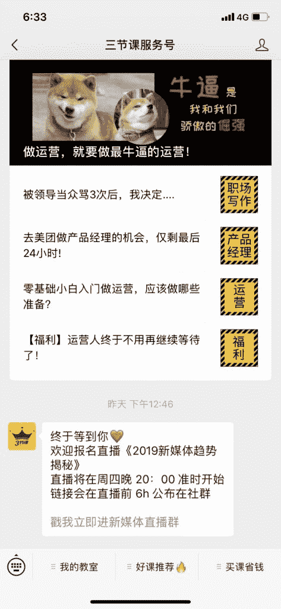
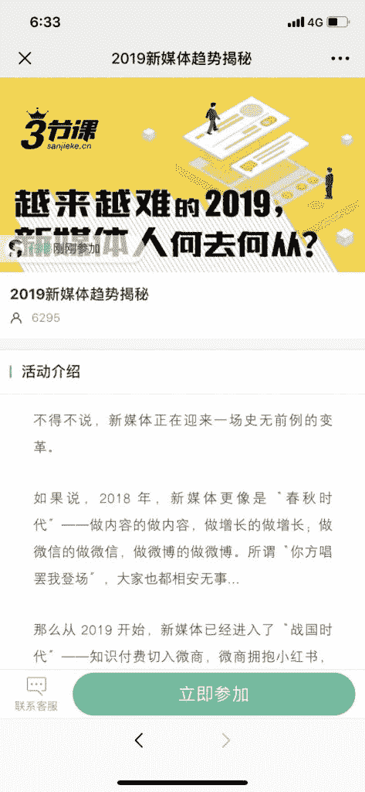
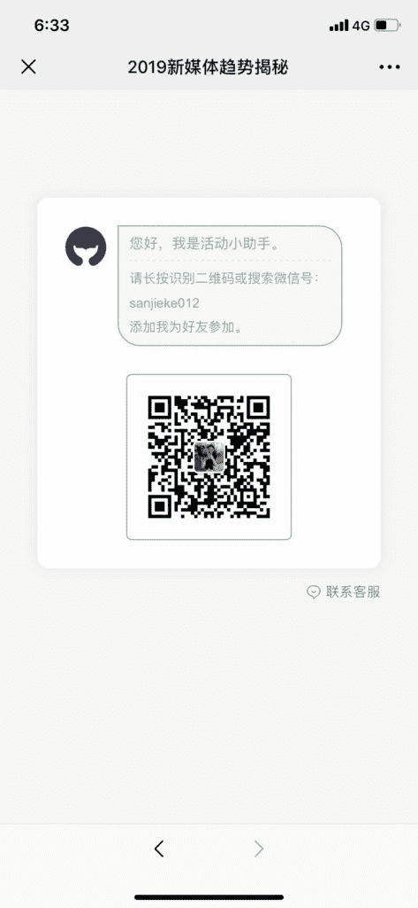
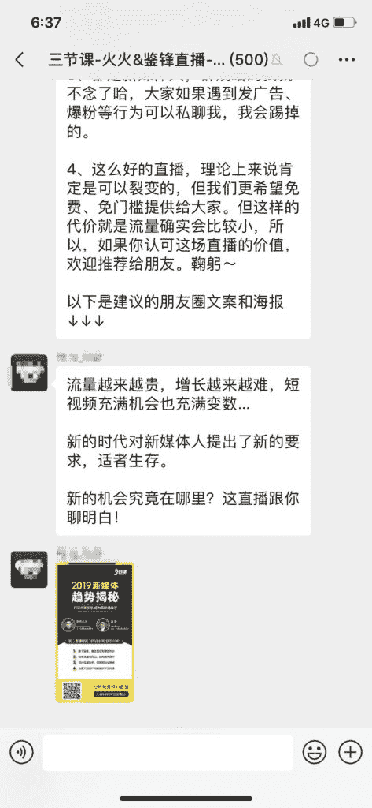
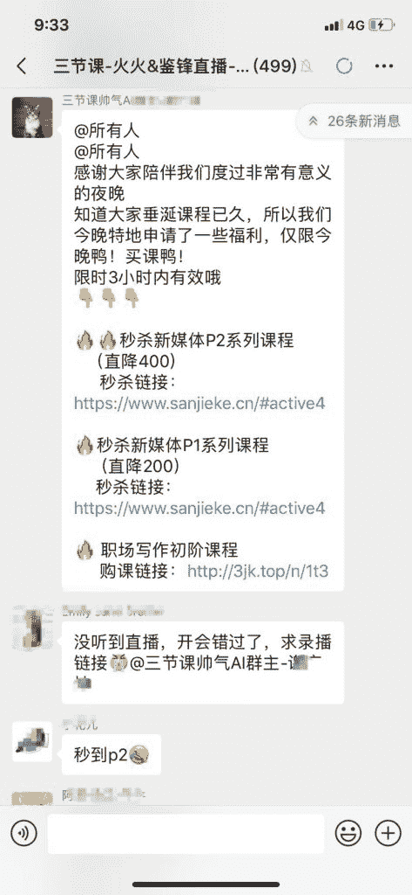
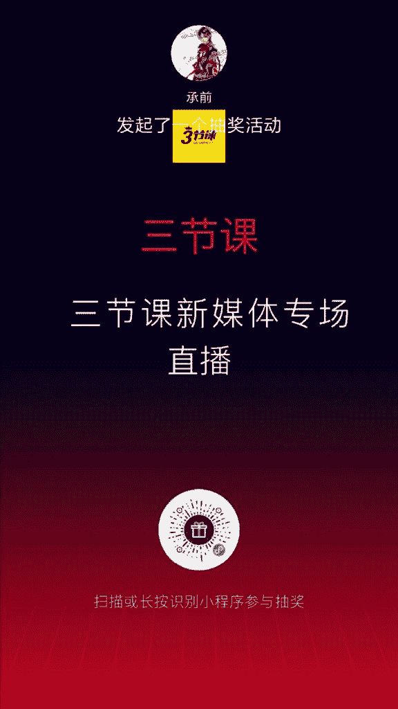

# 拆解：三节课-火火&鉴锋直播

▍核心玩法

1、公众号+个人号+微信群：以大咖直播为诱饵，完成从公众号到个人号，再到微信群的流量闭环。

2、工具

群鲸：个人号裂变和拉群

小鹅通：视频直播功能

抽奖助手：抽奖

▍参与路径

第一步，扫码海报二维码；

第二步，如果关注过公众号，则自动回复指定内容，带出个人号裂变链接；如果没有关注过公众号，则需要先关注，然后自动回复指定内容；

第三步，点击个人号裂变链接，进入活动页；

第四步，扫码添加个人号，这里的个人号可以轮流分配，并且每个用户只会被分配到一个个人号；

第五步，个人号自动回复话术，并邀请用户进群。

▍细节点

1、私域流量：用个人号和微信群沉淀用户

2、非强制性分享，但有分享的引导

3、关注公众号的自动回复指定内容，用带参数的二维码这个接口可以实现

4、抽奖环节：礼品不多但力度比较大，也是于用户有用的礼品

5、直播+付费转化：加入了限量降价的优惠。补充一句，直播配合降价的组合，是屡试不爽的转化神器。如果在微信群内直播，可以使用一起学堂

三节课

三节课

三节课

三节课

三节课

三节课

三节课

三节课

三节课

**评论：**

安一：对于所有借助微信裂变，做私域流量的活动来说，如何做好防控，防止被封，至关重要！