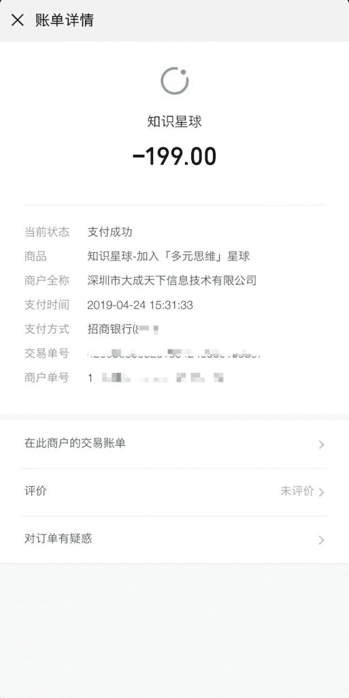
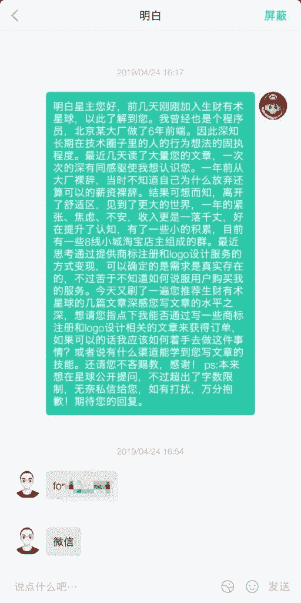
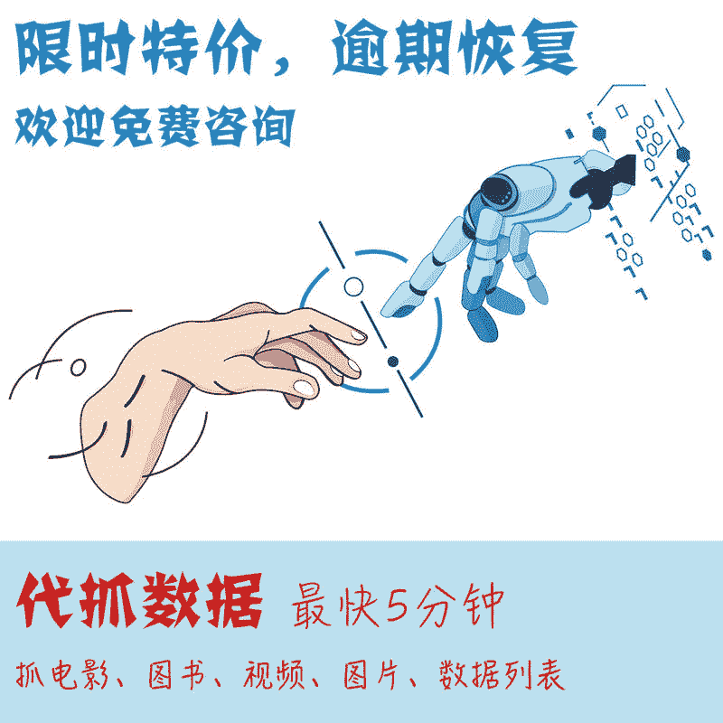
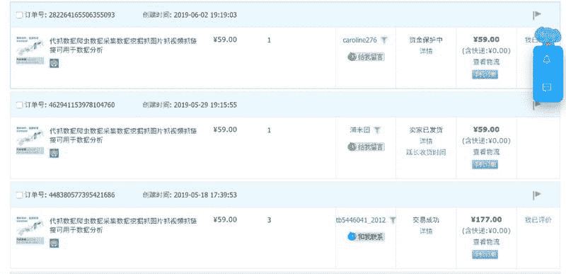

# 通过爬虫课赚回加入知识星球的费用 | 可复制 | 零门槛

一、源起

星球里的大多数朋友应该都知道 @明白 老师，他的爬虫课想必大家应该也都有所耳闻。

进明白老师星球的很多人应该也是通过购买爬虫课而免费加入的。

当然一定也有很多人像我一样是真的被明白老师的魅力打动而加入进去的，相信这部分人都跟我一样，看到进星球免费赠送爬虫课的时候都非常惊喜。

故事要从一个多月前讲起。

那天我像往常一样不断地在反刍生财有术的帖子，突然翻到了明白老师的那篇《生财有术第 3 期，我是如何做到邀请 245 个用户的？》是他复盘自己如何一步步地邀请了 245 个用户进了生财有术的，当然这篇帖子使用的方法和思想都无比精妙，但是最让我折服的还不是这些，而是写作技巧，行文流畅，引人入胜。

之后的两天里我开始集中看明白老师的文章，包括几篇经典的：

《普通人如何从 0 到 1，培养赚钱能力？| 6000 字讲透进阶策略》
《生财有术第 3 期，带你从 0 到 1，培养赚钱能力》
《30 岁前还没赚到 100 万？错过这个社群再等一年》

然后我找出了他的简书账号和公众号集中阅读了他的几乎全部文章，同时也得知他以前也是一个程序员。（我以前也是）

然后深深地折服了，一个程序员的技术思维抛弃地这么彻底的我只见过三个。同时文章写地这么好的（前）程序员我就只见过这一个了。插一句，这里定义的文章写的好并不是说写的像朱自清的散文一样优美华丽，而是在实际应用中非常有效。

二、主动链接大佬

于是我果断决定加入明白老师的星球，并且因为着急而忽略了邀请链接，直接搜索出来就付费了。（图 1）

加入之后先私信勾搭，顺利拿到微信，进一步咨询业务。（图 2）
再之后通过明白老师简短的提点之后，我通过简单的尝试迅速把主业打开了局面，已经服务超过 50 位客户，获利近 10 万元，并且还在增加，不过这个也有赖于我之前的资源的积累，不适合新手学习，未来可能会考虑讲一下。

这里顺带提一下，主动链接往往会有意想不到的收获。不用怕，大不了人家不理你。

分享我链接大佬的秘诀：

1、 真诚

真诚地自我介绍：主动加人一定要自我介绍，无论对方是不是大佬。最直观的，人家加你是需要改备注的，如果你不自我介绍对方怎么改备注？这也是我最近才想到的；

真诚地表达自己的膜拜：爱要说出口，喜欢就是喜欢，崇拜就是崇拜，佩服就是佩服，不是说你表达了别人厉害就贬低了自己，遮遮掩掩的反而显得很猥琐。但是一定要真诚，你表达了膜拜之后对方会一定程度上放低戒心。

真诚地提出具体的问题：提问题要具体，太泛泛的问题对方无法回答。也没有时间把你当徒弟教。（这点反思自己做的不够好）

2、钱

首次主动勾搭最好先发红包、或者购买对方知识星球，或者星球里付费提问，这样更加强化了自己的真诚。并且相当于暗示对方，我是愿意花钱买答案的，我比普通人多了付费思维，我未来可能也是大佬哦～快理我吧！哈哈

3、后续

通过给大佬提问，得到答案之后，你应用过对方的知识，解决了什么问题，这些最好后续陆续跟大佬讲一下。让对方知道你学到了实践了。这样有助于后续进一步勾搭。

曾子曾经曰过：“吾日三省吾身：为人谋而不忠乎？与朋友交而不信乎？传不习乎？”，每天三次问自己：做事是否由衷，对待朋友是否真诚，老师教了我知识有没有去实践？

所以我想老师教了知识，我去实践了，我让老师知道，老师一定也会受到鼓励继续教我更多。

跑题了。

下面开启正题，我是如何利用爬虫课，赚回加入明白老师星球的费用的。

三、复盘

有一天晚上忙完，看了曹大在他的星球里发的一段话，大意是说通过分享技术知识从 0 到 1 积累粉丝几乎不可能实现，然后他提到他曾经注册了一个知乎小号，在知乎上回答问题，然而两年过去也只有一两百个粉丝。由此他说自己也只是靠着多年积累的忠实粉丝才能有今天的粉丝量。

当然这里面一定有曹大很大程度的谦虚的成分，可是看完之后我变得非常不安，我想如果以后出现任何意外导致我的业务无法再进行下去，我是否还有能力从零开始做起呢？

然后我想目前我的业务还算稳定，我的任务也是很零散的管理工作。所以我其实是有时间做各种探索的。于是我决定，有什么想法无论能赚多少钱，只要想法成熟，都去尝试，干就完了。如果最后探索出来一条路需要非常消耗我的时间精力才能维持赚钱，那我就可以交给团队，自己依然可以抽身出来。

四、idea

怀着这样的想法，我决定先从明白老师的爬虫课入手看自己有没有能力从零开始赚点小钱。

为什么从爬虫课入手呢？首先，我进了明白老师的星球免费得了这个爬虫课，我以前又是个程序员，很看不上这样的东西，如果没有实际激励我一定不去认真学他。其次，既然明白老师能卖那么多课程，这一定不是一个伪需求。

于是我在百度、谷歌、淘宝、简书、闲鱼等平台搜索了爬虫、抓数据等关键词。意外地发现了果然有人通过明白老师的课程赚钱，方法很简单，把爬虫课下载下来摆在闲鱼上卖 2.9 元。为此我还通知了明白老师，说你的爬虫课被人在闲鱼上卖 2.9 元。那当然这也算是一条方法吧，但是这个太 low 了，而且赚钱也太慢了，一个 2.9 元，最少需要卖几十个才能赚出来入圈费，说实话，我不太看得上这么干。哈哈～主要是，我去闲鱼 2.9 元去卖明白老师的盗版课程，心里总觉得非常别扭，以后我还怎么面对明白老师啊😂，所以我不卖了，让别人去卖吧，祝他们大卖。

最后通过各种对比，我也想到了几个方法。说实话基本上每一个方法我都看不上，但是光想不做不符合知行合一的原则。于是我决定随便选择一个方式 try 一下，最后选择了通过淘宝卖抓数据的服务。

五、从 0 到 0.01

一件事情怎么开始去做呢？当然最简单也最快速最好的方法就是找同行模仿，但是我的同行太少了，于是我决定找个类似的。

然后想到了在哪里看到过的一个做“代找原图”服务的淘宝店做的很好。

于是找到了这家店（图 3），然后开始模仿吧。

说干就干，小号激活淘宝店，改店名：莱昂数据工作室，然后改头像。然后模仿“代找原图”的头图，ps 了一张头图（图 4）。又模仿他的详情页简单写了一下详情。并且用 ps 稍微美化了一下。

然后虚拟物品不知道怎么发货，去“代找原图”拍了一单，了解了流程。

然后就是上架等客户啦。

六、从 0.01 到 0.1

虽然流量很少，开始几天也就一两个人，但是好在我秒回，并且利用我的客服技巧只要咨询的转化率几乎 100%。只要是真的抓数据的需求的客户，我都能拿下。

这里提一下记得有一次星球里有个新人发言说自己是一个普通农民工，亦仁老师指点他去淘宝卖抖音/快手教程（不知道这位农民工朋友有没有赚到钱），当时我印象比较深的是，亦仁老师说这个生意的关键在于要秒回，于是我就在手机上装了个千牛，做到了咨询秒回。

这样到今天为止大概十几天时间一共成交了 7 单，59 一单一共赚了 413 元，已经两倍赚回了加入明白老师星球的费用。此外还有 3 单因为没抓成功最后退了款，惭愧惭愧，我对不起我的老师捂脸。

虽然钱不多，但是基本上也没费什么时间，关键是成功缓解了我的焦虑，也让我成功在 19 年中旬爱上了开淘宝店，说明我还是有东山再起的实力的，哈哈哈哈（黑人问号）。

总结一下：

1、提醒自己务必要主动链接大佬。

2、行动一定要跟上认知，想到哪里就做到哪里。
不要让自己的思想白白飞舞，行动一定要跟上节拍，否则思想的飞舞也是一种玩物丧志，并且是在玩弄自己的思想，非常羞耻。

3、这世界上 99.9%的赚钱都是在模仿，杨涛老师说过，任何加戏行为都是致命的。不要用“我认为”、“我觉得”来指导自己的方向。开启一个生意最好的方式，搜集尽可能多的信息，然后抄，能 100%抄就 100%抄如果不能就尽可能接近地抄，100%的抄袭是唯一能保证成功的方法。

4、明白老师的星球能量无限，懂的自然懂。

5、后续还会做更多的小实验，希望大家也能把自己的实验放出来参考，小实验也许会发展成大生意 ，比如我这个实验过程中了解到有的公司是有大量采集数据的需求的，并且有单独的预算来做这件事。这个生意是可以按照做大客户销售的思维去走的，如果我认真起来去做，我想一定能量无限。无论多小的点子，认真你就赢了。

6、以前做程序员的时候圈子里流行一句话“talk is cheap,show me the code”，小晒晒思想，大晒晒实践。

分享完毕，感谢大家耐心阅读。

最后附上微信号欢迎各位老师来撩: jyl1246505492

付费加入星球

微信咨询明白大佬

代找图片

代抓数据

淘宝销售记录

淘宝销售记录

**评论：**

亦仁：很棒 继续搞事，下一个明白

乔里奥 回复 亦仁：多谢亦仁老师夸奖

明白：这个不是托

旺小哥 回复 明白：感受到了真诚

白猫队长 回复 旺小哥：反手就是一个购买，你应该留一个推荐码的，又可以转一比入场费

乔里奥 回复 白猫队长：明白老师 广告费转一下 谢谢

千寻软件🔥达人 回复 明白：不是拖，估计是亲戚

-：好的文章要带链接哈，好观摩观摩

明白：这种抓数据的需求，用内容影响吸引用户最有效：朋友圈，公众号，简书等

Adgrowing：老板，微信多少 私聊

乔里奥 回复 Adgrowing：jyl1246505492

爱拆快递的小白兔：帮明白赞赏了，做任何事都需要这种执行精神…优秀啦。

今宵：有过程有思路，关键是都是零起点，我们看了就完了，你能通过行动赚钱，很有启发。

乔里奥：感谢大家的认可、打赏，还是一个小学生，感到非常惶恐，以后会尽可能多产出干货

mofan：你淘宝介绍文字里有错别字啊：知识数据的搬运工

lin：现在数据抓取抓得很严吧

小白：我们想做个小程序，加老板微信了