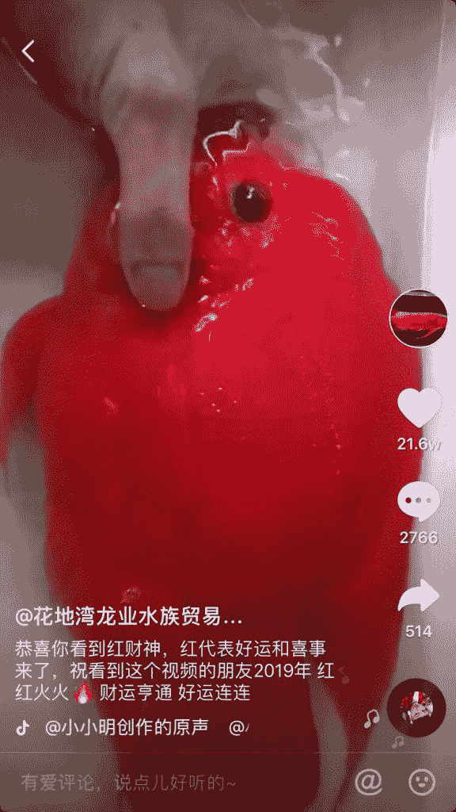
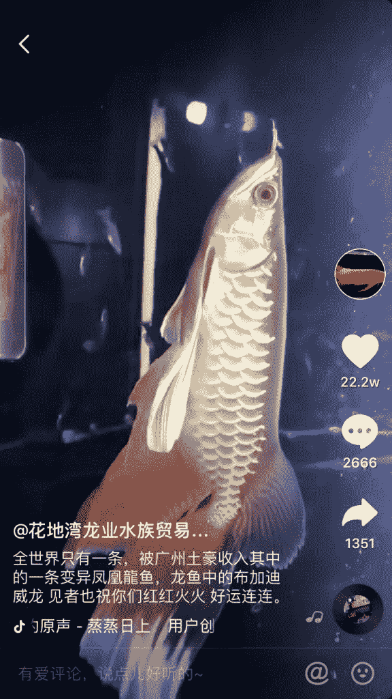
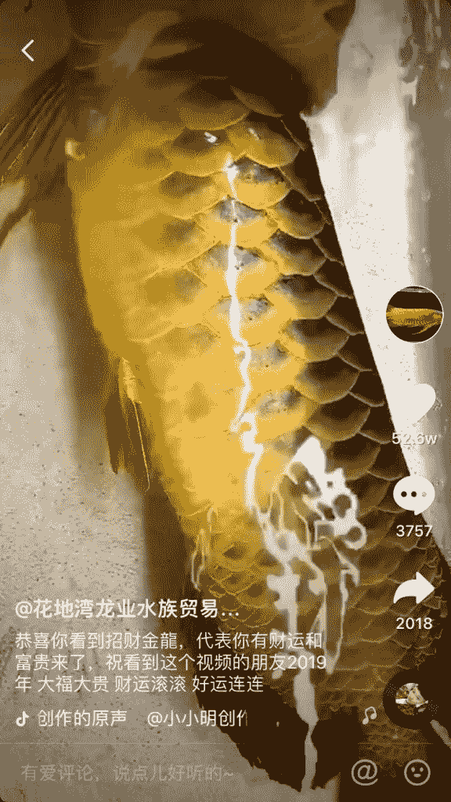
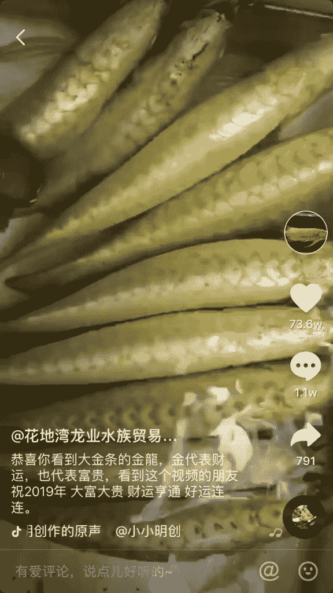
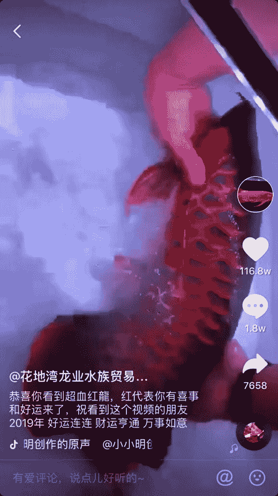

# 锦鲤转发好运的套路

这几天在研究水族行业的抖音，这个行业基本还属于传统行业，也不会有专门的人去思考怎么玩抖音之类的（也许有，我小看人家了）

在看几家抖音的时候，发现有一个账号的粉丝和点赞都特别高，连着翻了几个高赞视频，视频本身没什么特别，关键在于文字引导，见者红红火火，好运连连。

也许这是商家最初的无心之举，发现这样可以爆赞，后面的很多视频都一个套路。

这个套路在别的领域怎么运用，值得尝试一下。应该是个讨巧的办法。

锦鲤转发好运

锦鲤转发好运

锦鲤转发好运

锦鲤转发好运

锦鲤转发好运

锦鲤转发好运

**评论：**

爱拆快递的小白兔：有些鱼很贵的，我朋友有喜欢养鱼的，一条几万块，一鱼缸…哎呀。。

张集慧 回复 爱拆快递的小白兔：是呢，几十万的也有