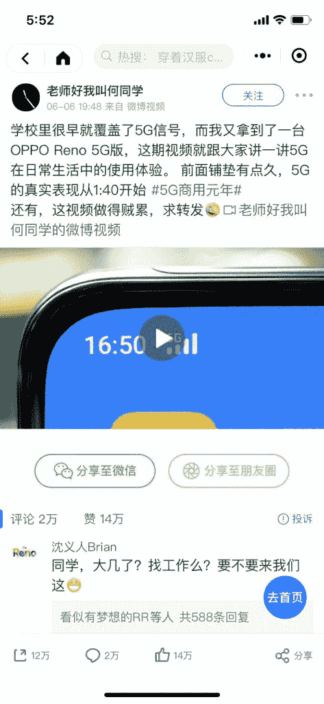

# 5G 究竟意味着什么？

在这种端午+高考自带大热点的日子里面，今天的朋友圈居然被这位何同学刷屏，抱着好奇心点开，一条 7 分半的视频我居然看完了……简单想想了想究竟是什么驱动我看完还忍不住转赞收

1.  后生可畏的惊叹
    被置顶到评论区首条的 oppo 副总现场挖人的留言进一步加剧了整条视频的戏剧化，引来加速围观—— 再次印证行业 KOL 的加盟必然加速话题性事件的发酵
2.  时光倒流反溯法的应用
    何同学通过反溯五年前的 4G 节点，衡量时下 5G 节点下对于未来趋势和改变的预测，更可贵的是能够批判性的反思到当前基于 5G 时代的种种预测仍然是囿于我们对现状的认知——见惯了太多的基于 5G 时代的人云亦云，这种冷静的观点反而更惊艳
3.  沉默之后的反思，5G 究竟意味着什么？
    4G 催生了移动互联网的繁荣，造富了一大批移动互联网时代的豪杰，目前 5G 来临，除了我们常说的 AIoT/车联网/智能家居/自动驾驶，似乎风口会被再一次被无限放大，技术的进一步推广和应用，催生出来的人的欲望和需求的进一步延展，5G 对于一群生财有术的人群来说，意味着什么？

5G

**评论：**

荔枝小一萌：生财有术里的伙伴是推动 5G 时代发展的主力军。

Eric：看完了，很不错

三林：后生可畏