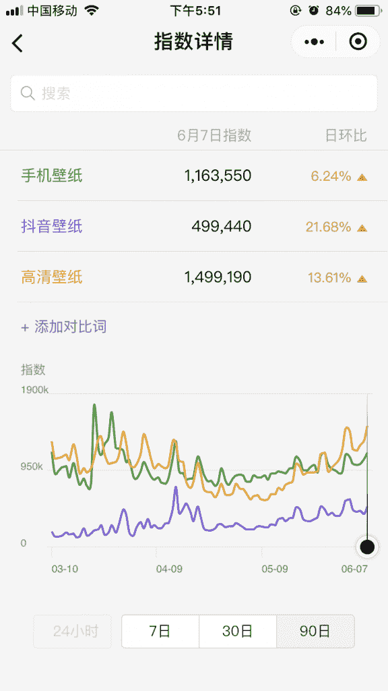
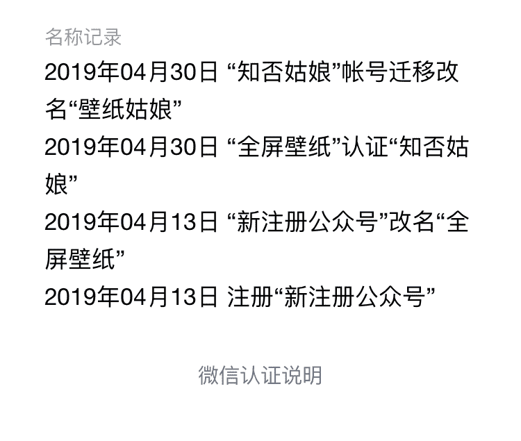
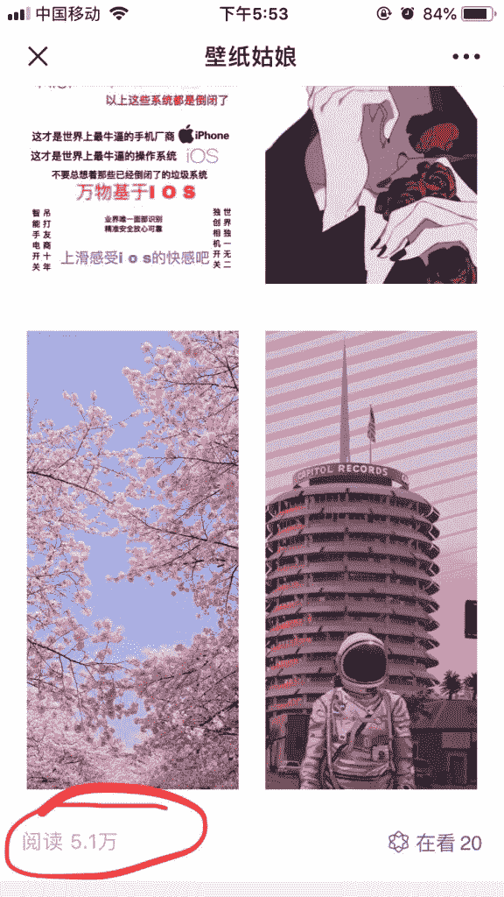

# 微信搜索指数：手机壁纸

1、手机壁纸的微信搜索指数

2、一个新注册不到两月的公众号

3、注册第二天首篇文章阅读量，当然应该是后面叠加的量，但仍然很可怕。

微信搜索指数

微信搜索指数

手机壁纸

**评论：**

Aladdin：应该有其他渠道

张集慧 回复 Aladdin：主要是小红书和抖音，这两软件年轻女孩子居多

三林 回复 张集慧：小红书很多壁纸内容上首页

张集慧 回复 三林：是的，壁纸的搜索量和热度很高

夏木炯：不怕被告版权吗，比如视觉中国

张集慧 回复 夏木炯：哈哈哈哈，不清楚了，不是我的公众号，不过视觉中国还那么牛气么？

新事 回复 夏木炯：可以买视觉中国会员

郭耀天：流量主要来自抖音，找到他们老板了

张集慧 回复 郭耀天：我观察了几个抖音做壁纸的号，转化并不高