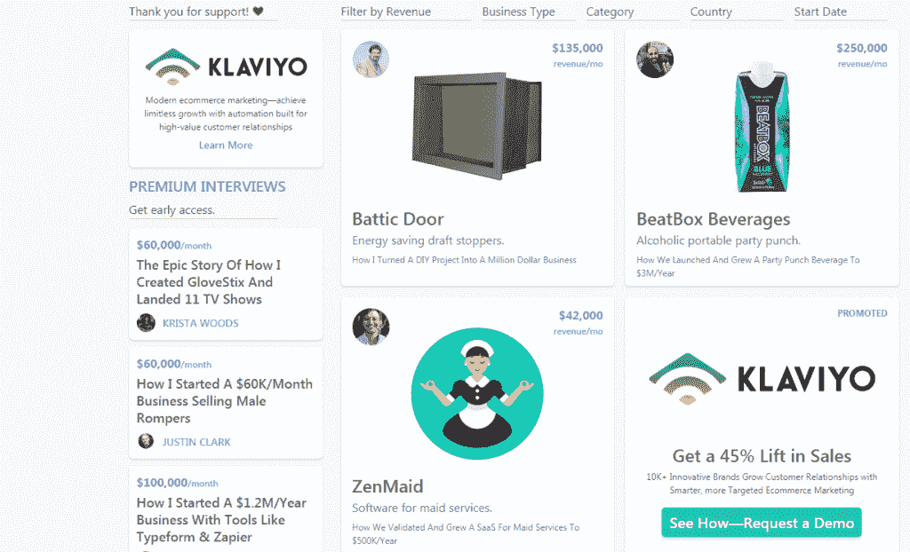
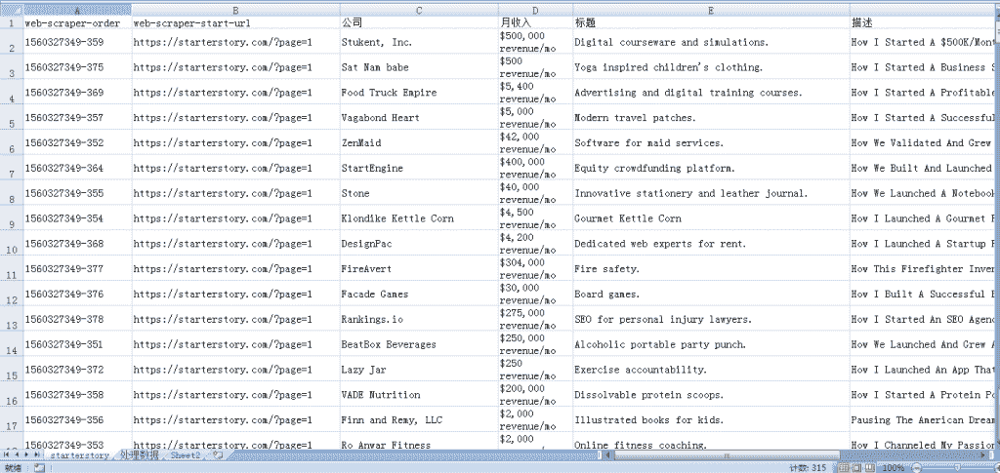
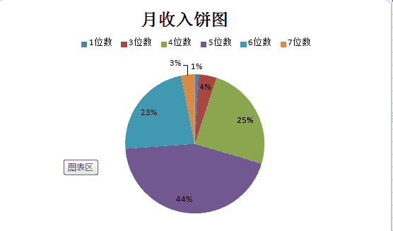

# 生财案例网：starterstory.com

网站上面有 314 个生财的故事（案例）。如图 1

这些案例分享得很细致也很真诚，包含了作者们创业的初衷，踩过了哪些坑，是一个人 soho 还是有公司，公司雇员多少，月收入多少美元等等。

这 314 个案例可分为电商&用户，软件&科技，应用&媒体，服务这 4 个大类。

总共涉及了包括家庭，健康，美容，美食，服饰，配件，艺术，礼品，游戏，宠物，珠宝，户外，婴儿用品，农业在内的 14 个具体的行业以及一个其他行业。让我们在学习本行业经验的同时，也能一窥其他行业一些套路，开一下眼界。

这些案例的主人公们来自美国，英国，日本，德国，新加坡等 11 个国家，让我们可以了解其他国家创业的环境和政策。

但是面对这 314 个案例，不知道从何处着手，哪些案例更适合我们。于是我用明白老师爬虫课里面的知识，抓取了所有案例的标题，月收入，文章链接等数据，方便大家索引。

抓取这 314 个案例，总共花费了 1 分钟不到，还不用写代码，非常方便。如图 2

数据抓取下来后，简单分析了一下，最高收入的是 230 万美元/每月，做的是自动写和擦除机器人；最低的是 0 美元/月，刚刚起步。如图 3

月收入 5 位数（上万美元）的最多，有 139 个，占比 44%；
月收入 4 位数（上千美元）的其次，有 77 个，占比 25%；
月收入 6 位数（上十万美元）的，有 72 个，占比 23%;
月收入 3 位数（上百美元）的，有 13 个，占比 4%；
月收入 7 位数（上百万美元）的，有 10 个，占比 3%；
月收入 0 的，有 3 个，占比 1%；

大佬们喜欢的话点个赞再走吧

图 1 starterstory

图 2 starterstory

图 3 starterstory

**评论：**

hank 回复 明白：看了这篇文章，我第一时间加了明白老师的星球学习爬虫

亦仁：后面@鱼丸出面|亦仁助理 会从这些生财项目中挑一些做案例解读。

萧遥：赞执行力

小辜 回复 萧遥：感谢大佬分享的网站

V 先生：这个网站好，谢谢小辜分享~