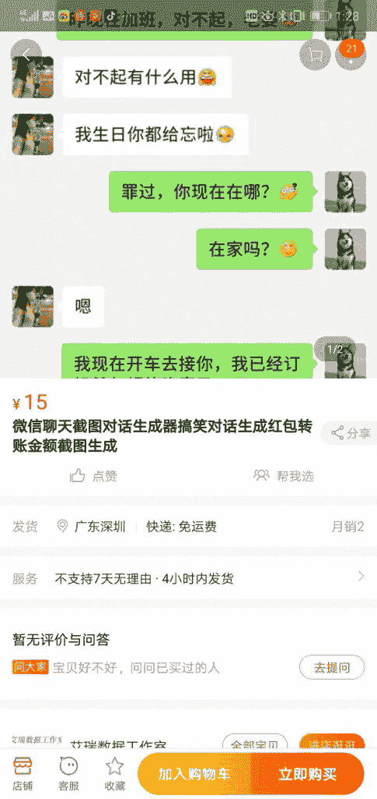
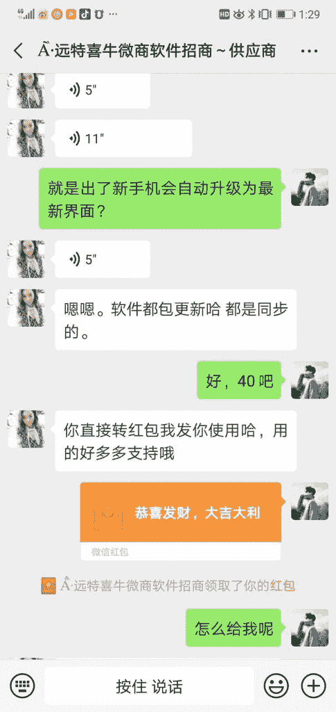

# 生成微信聊天截图的 Github 开源项目

入圈这么久，我想发一次言。虽然自己是一个很普通的打工族，但是我还是想分享下自己的心得。

源起:上次有一个圈友说想把 Github 上一个微信截图的网页做精。结果发现已经有人做了，并且更细化了。因为这个也解决了我们工作中的一个痛点，会用到截图。我就去搜了一下，非常好。但是会员费很高 188，我想怎么没人搬淘宝上。但是那时候也没多想，没去实践。

然后上次另一个圈友说学了明白大佬的爬虫课，然后直接搬淘宝上，然后收入还可以。这就激发我的行动欲了，趁周六日，搜了淘宝，真有人卖，卖软件。因为工作需要，我就花 40 买了一个，还不错，然后，我突发奇想，我可以单卖截图啊，然后用几年前注册的淘宝店用千牛上架了，没想到的是，这个需求很大。我定价 15 争取比竞争对手在价格上好看点。也有直接买软件的，我忽然想到，低价从我买的那个人那里买，然后再直接卖给我的客户。如果有客户咨询直接导流到微信，这样我改了标题。

就这么几天，几乎每天都会成交 2-3 单。昨晚还有一个客户直接说做 30 张。

我为自己能赚到工作之外的一份钱，而感到很兴奋，因为我从小出生在农村，根本没有这种做生意的思维，感谢生财有术，亦仁，各位分享的圈友。目前我还在执行之前你们分享的知乎神贴引流方法，我用明白的爬虫爬知乎答案，感谢明白，让我知道有 webscraper，虽然我没报你的课，我是自学的，但是真的很感谢明白。

底下是一点截图，谢谢各位。

微信截图

微信截图

微信截图

微信截图

**评论：**

亦仁：思路打开了会发现赚钱没那么难，对吧。接下来是想办法怎么把这个市场全拿下来，会是一笔很可观的收入。

柚子（别摸我头会长不大）：恭喜，跨出了第一步，已经比大多数人强很多啦。

罗强光：实践是最好的真理。

谢献锋：一起交流下知乎引流

Eric 回复 谢献锋：可以，我微信:ZHANYAJUN2011

南京杨明：执行才是第一位

张萌萌：朋友圈里微商发的各种微信转账就是这么 p 出来的吧？

无为：执行力是赚钱的法宝

飞：我记得很早以前用过这种软件，不是有生成截图的 app 的吗，微商神器