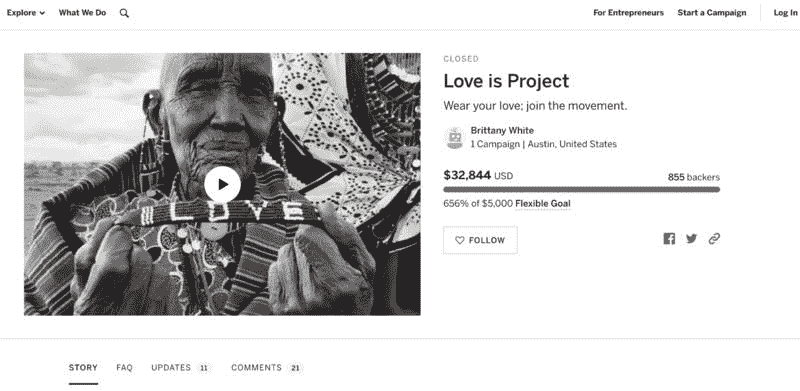
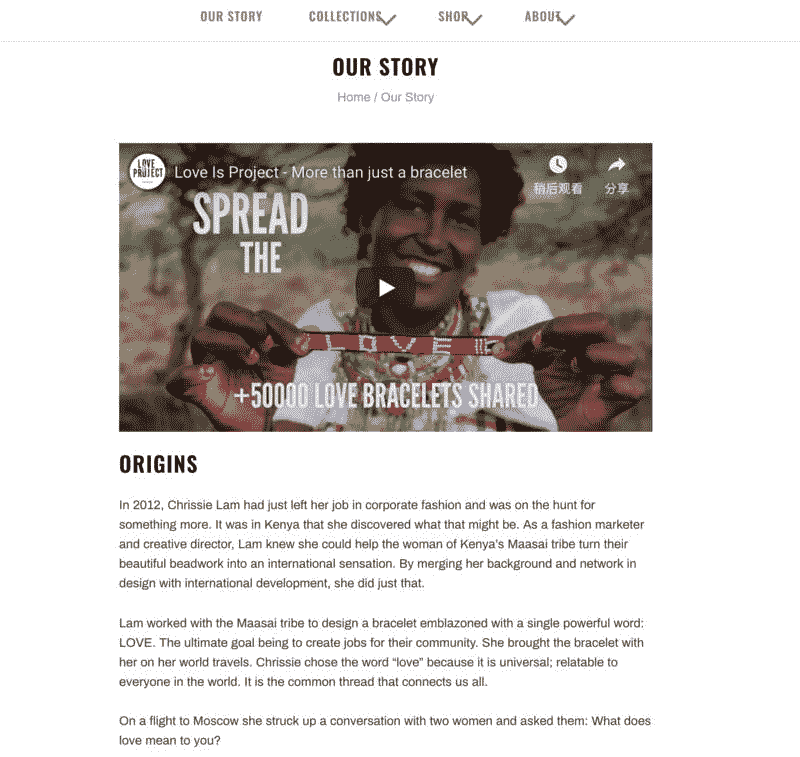
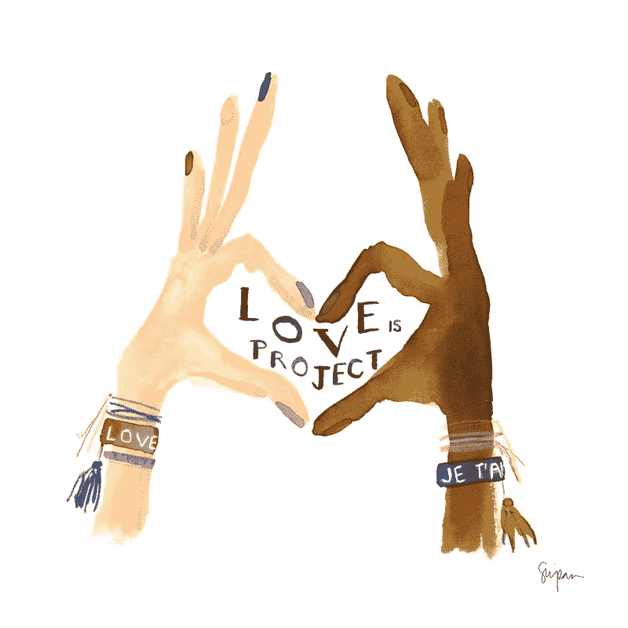
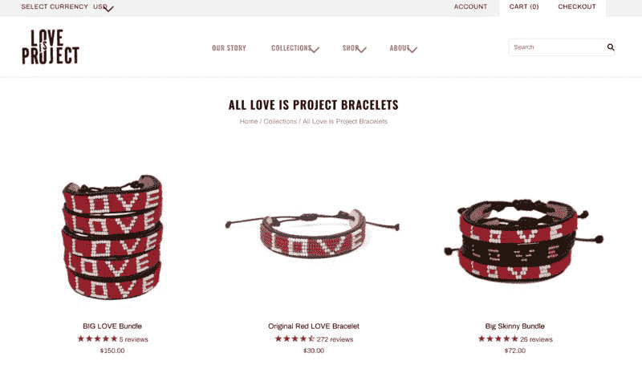
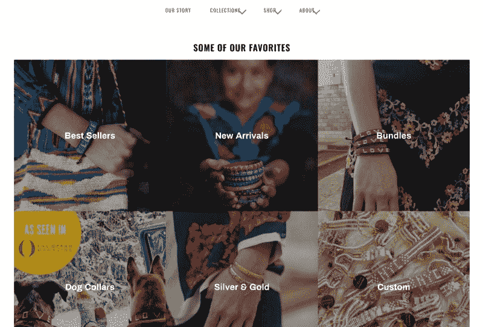

# shopify 独立电商站，一个赚了 120 万美元的案例

又到周五啦，每周五的一起赚美元，分享一个海外赚美元的案例，帮你开眼看世界生财之术~

圈子里面很多小伙伴在做 shopify 独立电商站， 有一些赚到了很多钱，今天的一起赚美元 就是关于 shopify 独立电商站的，一个赚了 120w 美元的案例，而且这个案例的主人公，是在旅行中产生的赚钱点子，她没有团队，只有一个人，做出这个成绩可以说是很惊艳了！

首先是分享一些数据

项目名称叫做 Love is Project，是一个关于爱的手镯，很有设计感， 网站是[Love Is Project | Love Is Bracelet | Spread the Lo…](https://www.loveisproject.co/) ~ 目前每个月 6 万美金的收入，累计 120 万美金的收入，全部工作几乎都是主人公，一个设计师独立完成。

主人公在世界各地旅行的时候，发现了一个部落的颜色很有特点， 获得了设计的灵感， 于是设计了一个简单的手镯。

在飞往俄罗斯的航班上， 主人公拿着手镯询问了两位陌生的人问爱是什么，并将这些记录到了 Instagram 上，访客迅速传播开来，最终成功说服主人公将爱的手镯打造成一个独立的品牌，有关爱的手镯的帖子在 Instagram 上吸引了 24 万的点赞。

后续主人公又走访了很多国家和地区，从当地的风土人情中吸收了很多灵感，比如从巴厘岛的文化中的大米的启发，开始在手镯上加入了圆形小珠子，以形成产品的差异化和竞争力。

不过，主人公从来不认为她能把这个品牌做起来的核心是产品， 她认为是讲故事的能力。

她认为会讲故事，这个是她与竞争对手的核心区别，从本质上讲， 她的公司是一家出售手镯的媒体公司， 内容为王， 而不是产品。

她认为，吸引和留住用户最重要的方式，就是通过真实的故事来建立一个品牌，这些故事来至于工匠、消费者和贡献者，将她擅长的叙事风格和产品的独特魅力结合到一起来，就为产品带来温度：同情心和人情味。

虽然整个故事很简单， 但是作者还是分享了一些经验和教训:

1\. 自己不懂的事情外包给别人也很可能不靠谱。

主人公听说 facebook 广告可以大额提升销量，于是找了个自由职业者帮助投放广告，虽然最终的结果是投放广告后销售额提升为原来的 10 倍，并且借势情人节和特朗普就职典礼（每个人都需要更多的爱），在最初的几个月， 产品基本属于卖光脱销的状态。

但是， 由于广告代理商对 facebook 账户的管理不善，导致 12 万美金的损失， 缺乏经验的营销人员制作粗糙的创意和错误的链接，导致广告数据后来很不理想，而且没有及时的进行更新与替换。

后来，主人公向领域内资深的人学习，在广告创意上钻研了几个月，现在她自己可以投放广告了。

2\. 掉进了第三方物流公司的坑，由于沟通不畅，第三方物流管理不到位，意外的发了 800 多个重复的订单，有一些订单有很多件手镯，导致亏损了 65000 美元。

3\. 每周 100 个小时的工作量不可持续，一直没有招人导致个人的精神状态变差。

4\. 一定要善于用 Shopfiy，这个独立品牌成功的一个很重要的原因是 shopify 平台可以帮助主人公的电商网站实现高度的个性化定制。

5\. 在流程确定下来的情况下，要想办法通过付费流量和其他渠道进行扩张， 比如把这些真实的故事包装成一个一个案例，并且在各种广告渠道进行投放，包括 30%的 facebook 和 isntagram 广告，10%的谷歌广告， 30%的 CRM 电子邮件和 20%的批发。 最后一点尤其适合已完成闭环的产品，如果通过付费广告可以实现 roi 为正，可以靠这个迅速起量实现规模化。

以上， 便是今天的#一起赚美元#， 评论区欢迎留下对你的启发~ 喜欢的圈友请给鱼丸点个赞，每周五和大家不见不散

Shopfiy

Shopfiy

Shopfiy

Shopfiy

Shopfiy

Shopfiy

Shopfiy

Shopfiy

评论：

范嘻嘻 ： 这个超级赞，讲故事的能力确实是核心

鱼丸出面 | 亦仁助理 回复 范嘻嘻 ： 是哦，故事讲的好，个人魅力陡增，产品附带也增值。

鱼丸出面 | 亦仁助理 ： 人类对故事的情感体验需求永远不会消失，根植于基因

鱼丸出面 | 亦仁助理 回复 🔱Alex ： 类似于比较火的茶叶女，柚子妹，可以了解一下。论讲故事的重要性，一点都不小概率

意凝 回复 🔱Alex ： 单看品牌的公关，应该已经不是一个小概率的成功项目，拿到了主流电视和媒体的曝光、好莱坞一线明星的宣传、以及 American Eagle 和 Whole Foods 的大订单，这个宣传实力已经足以说明项目的能力。每次分析类似的案例，深深体会好项目大程度上都不是好运气，而是基本功 hhh

🔱Alex 回复 意凝 ： 其实还是选品和产品思维，推广只是辅助。

严 yan ： 包装能力强

鱼丸出面 | 亦仁助理 回复 严 yan ： 对，促使消费者最后下单的不是需求驱动的，而是购买理由。让他觉得他需要买就行，不一定是真实需求。

Jayden.Liu ： 用故事去塑造品牌！更能打动用户