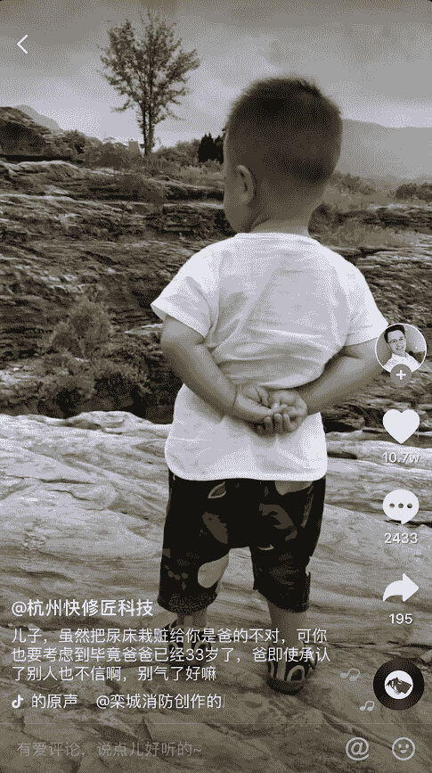
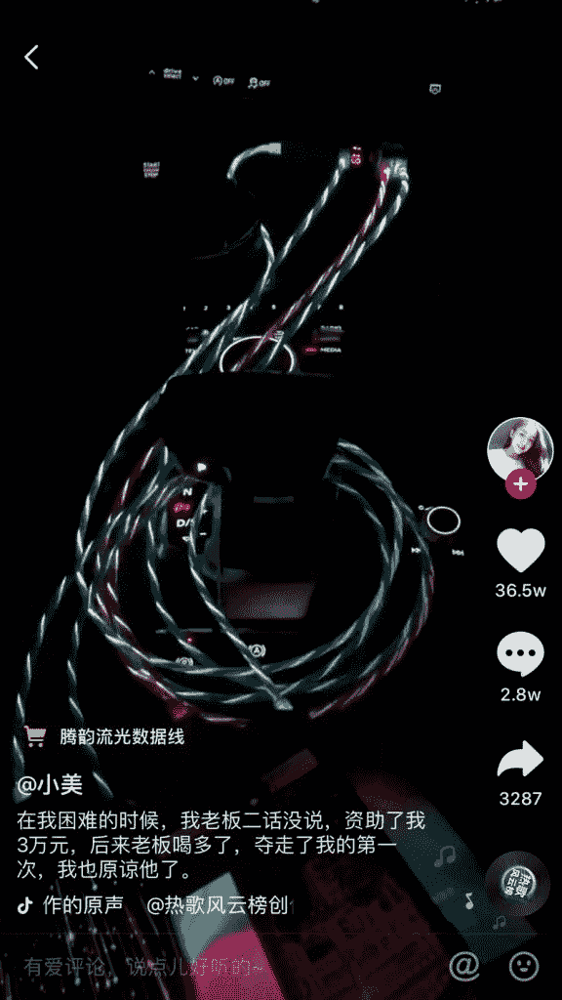

# 抖音荐物号，无库存玩法

抖音变现几乎是所有运营抖音账号人的痛点，空有一把流量而无力变现，那么有没有人在抖音流量这种情况下，还能赚到钱？

当然有，比如生财有术里的@白水 。

生财有术崇尚精益创业，尽可能低成本的去冷启动，不需要自己做产品，不需要囤货，不需要花钱去买流量，战斗力强的话一个人也可以搞定所有事，这样的模式在抖音上有没有？

比如今天@白水 要分享的抖音荐物号无库存玩法。

以下是今天的分享，enjoy！

亦仁大大邀请我做抖音荐物轻享时有点意外，圈子里有不少抖音大神，数据比我们做的好的大有人在，在此仅以我们实际做过程中的流程分享，抛砖引玉。

今天给大家分享是抖音荐物号无库存玩法。

做抖音荐物的门槛很低，有多低？说个玩笑话，我老爸现在赋闲在家，我都想教他做抖音荐物。不需要仓库，不需要多高的拍摄技巧，玩个抖音荐物 1.0 版本的：有个手机，会做个 ppt，挂个淘宝店就能开始卖货，成本多少呢？开淘宝店 30 元保证金，没了，空手套白狼。

正因为门槛低，进入的人也越来越多，但要做好也不是那么容易，需要团队化运作，个人单兵作战也有可能一波肥，但需要批量化运作。抖音荐物号已经过了野蛮收割期，现在拼的是精细化运营。

认识的一位大微商老板，他朋友 2018 年年底进入抖音卖货，4 个人团队，啥都不懂，从 ppt 开始做起,流程理顺后批量化操作，目前 60 人团队，4 个人一个小组负责一个号，现在已经从 PPT 阶段过渡到真人出镜。赚了具体数据不好说，肯定没少赚，只知道团队规模还不断扩大。

以我的经验来看，一个做的还可以的号，一个月 20 万以上利润，60 个人的团队，具体一个月赚多少钱，大家可以估算下。

前期做抖音荐物都是自己在摸索，踩了不少坑，最大的坑就是专注去做粉丝量，而没有批量做号。我们做了两个号，5 月 13 日分享时我们粉丝量是 40 多万，写这篇文章时 90 万，业绩并没有翻倍。

荐物号有三种形式：

1.PPT 图文：抖音最早一批赚钱的人都是从这里出来的，到现在还依然闷声发大财，卖啥？卖书，早期的 ppt 图文类是直接插几张图片，在抖音里合成，现在升级版是电脑端 ppt 录屏，或者将 ppt 打印出来，用笔边划线边讲解。此类号比如：扶笛书语、自律书单、恋爱图书馆、情商等

2.直接拍货：无人设，无真人出境，直接拍产品，画外音对产品进行解说。80%的荐物号都是这种形式。此类号比如：汐囡囡，清单 QingDan,超值好物，又有好物推荐啊等

3.真人出境：有人设，有真人出境，场景和产品推荐结合，相对涨粉容易。操作难度会大，人设是自己还好，如果人设是员工，会面临员工离职后号废掉的情况。此类号比如：步步成熊，贫穷玩家，拆大发，柯东西北等。

上面三种形式分别代表了抖音卖货 1.0，2.0，3.0 版本，一些带货能力强的大号都是真人出镜，今天就主要给大家分享真人出镜荐物号玩法，会将整个流程详细拆解，看了就能直接上手操作。PPT 图文类和直接拍货人员配置方面能力强的话自己一个人就可以搞定，其他流程大同小异，再自己摸索。

一．人员配置

拍摄剪辑 1 名，艺术类院校毕业生为佳；

演员 2 名：艺术类院线毕业生为佳，一男一女，男的放得开，女的好看，嗯，得好看；

编导 1 名：整体把控，团队协调，负责团队 KPI；选品，排期，视频创意，对接合作，脑洞得大；

店铺管理 2 名：找货源，买货，发货，客服，其他杂事。

二. 账号设置

1.找号：

选择什么样抖音号起步直接决定了号能不能做起来，什么样的号最佳？经常刷但没发过视频，这样的号哪里找？你家人的呗，或者身边朋友的。市面也有这样高权重号卖，我没买过，不知深浅。

2.前 10 个视频发布：

发布 10 个视频后才能开通商品橱窗，这 10 个视频直接决定你号的权重，其中第一个视频最为重要，你去看那些能做起来的大号，第一个视频质量都不差的。这 10 个视频调性得一致，想打造什么类型的号，就得发啥类型的。

3.开通橱窗

实名认证，发布 10 个视频后，就能开通商品橱窗了，点“我的”“设置“商品橱窗”“立即申请”按流程操作就行。需要下载淘宝联盟，如果以前没玩过淘客的，是初级账户，通过某宝或 qq 群找途径快速升级高级。

4.对接淘宝店

商品添加到店铺后，在千牛里将商品添加到淘宝联盟，正常情况下，当天添加到淘宝联盟的，隔天才能添加到抖音橱窗。

淘宝店前期准备 2-3 个，做大了之后准备 6-8 个，爆一个视频后店铺分数会被拉到 4.8 分以下，然后就要有新的店铺接上。

二．操作流程

1.选品

选品有两种，第一种是有什么拍什么，你有资源或自己有产品，那就针对现有的进行设计拍摄。第二种是什么火拍什么，在抖音好物榜里找，关注同类账号，别人什么火， 连产品带创意换自己团队的人学习一遍，标题文案，背景音乐都用别人的，什么都不要改。

食品类的不要选，容易被下架，淘宝店铺都会被连累。

2.找进货货源

进货途径：阿里巴巴，淘宝，拼多多。

我们一般抖音上什么火就拍什么。需要找到产品货源，如果货源不足，或不支持一件代发，就不拍。找货源在拍摄之前，辛苦拍摄完了发现没进货渠道会耽误很多时间的。

1.  买货拍摄

选品好，确定有货源，就从淘宝买回，15 天内拍摄完，为啥要 15 天内拍完？你懂得。

1.  淘宝上架

对商品进行上架，在没有啥资源情况下，用软件一键搬运别人店铺的图文。

我们使用软件名称：大淘营，淘宝助理。

这里不用担心版权问题，在我们还是小虾蚁的时候，别人对你咋样，如果有人盯上你了，说明你已经做大，那也不缺招一个美工的钱。

1.  拍摄

用手机竖屏拍摄就行，拍起来简单，剪辑也快。

1.  剪辑

剪辑一个视频一般在 30 分钟左右，几个片段的衔接，bgm 的添加。在整个剪辑环节中，最重要的就是 bgm 的选择，玩抖音就是玩 bgm.所以需要剪辑人员有一定的网感，剪辑出来的视频要符合抖音的调性。平时碰到好的 bgm 都要收藏起来，用时信手拈来。

1.  视频发布

一个号每天发两次，中午 12 点一次，晚上 6 点一次。

文案方面，文字时代玩剩下的放到抖音里依旧有效，吸引注意，引起好奇，引发争论，目的就达到了。

1.  买货

有单子来之后就属于电商环节了，单少时就自己一单单买，单量大时一件导出，让商家一件发货。

1.  发货

买完货商家给完运单号后，复制到自己的淘宝店，单量少时一单单的填，上百单上千单时用烽火速递一件发货。

1.  售后

售后是否及时会影响账号评分，上班时间基本能做到及时回复，下班后团队可以轮流值班。有差评的能找到人就给点钱让删掉。有退货的直接退到买货商家那里。

上面是真人出境自己开淘宝店的玩法，缩减版的是真人出境抖音淘宝客玩法，抖音淘客就是把店铺和进发货这些环节去掉了。淘宝客的选品有两种，那么是在大淘客上选，30%左右的佣金。要么是别人主动找上门后拍他的产品。

用自己淘宝店的优势是：拍什么自己能控制，价格能自己控制；劣势是店铺要经常换，有进货卖货的中间环节麻烦。抖音淘客优势是省心省事，每月都是躺着收钱，劣势是选品不自由，可能你看中想拍的产品佣金不高，视频再爆也是白搭。别人找你给高佣金的产品，也不一定是你想拍的。哪种玩法，可以自己去摸索。

抖音卖货，我们不怎么关心爆流量，只关心赚单，一个 60 万点赞的视频商品链接被下掉了那种痛心疾首你能理解么？爆流量有球用！

爆单的视频都是可遇不可求，我们所有爆了的视频都是我们一脸蒙蔽的情况下爆的，但爆了的视频都有一些共性，主要是以下三点：视频内容不错、产品吸引人、文案让人评论。

前两点都好理解，第三点被很多人忽略，可能你视频拍得稀巴烂，可能文案与产品，与视频内容八竿子打不着，只要文案写得想让人评论，视频可能可能就爆了。参见图 1 图 2。

抖音荐物到现在还能做么？

传闻抖音对荐物号不友好，实际做的过程中感觉也就那样，是没有以前友好，但也没有传说中到打压那个份，主要差别在于货没以前好卖了。货没以前好卖，是因为粉丝进化了，买过一遍被割过，对产品要求更高了。

14 万的点赞量，才卖出去 11 单，我的乖乖，很让绝望有木有。但也别急，昨天又小爆一单，一个视频带货 1440 单，一单赚 26 元，看着也不错。

就平台自身来说，抖音现在也陷入尴尬境地，玩短视频的共识是：快手比抖音好带货。快手的用户层次相对抖音低，更好赚钱。哪里有钱赚，大家才会涌向那里。

昨天和朋友圈交流，一个小姐姐抖音 160 万粉丝，变不了现，没钱赚别人怎么持续去生产优质内容呢？拍个视频也不是写作，最少需要 2-3 个人团队，团队怎么么活？现在抖音里，变现直接的方式就是荐物号，抖音能过于打压么？再打压，大家都赚不到钱，谁还在你抖音里玩，都跑去快手了。所以，抖音对荐物号真实的态度是，只要是视频本身不错，是在用心生产优质内容，平台不会对你怎样，但如果你吃相太难，不贡献内容，只想着撸平台的流量，抖音也是不会留你的。只有共赢，你好，我好，大家好，才有可能持续。

所以，抖音荐物号还能做么？肯定可以。

2 亿粉丝量摆在这里，当然能做，用心做好内容，批量做号。如何批量做号？同一个场景，多个不同角度拍摄，就是多个不同视频。你去看看那些街拍的账号，都是好看看的小姐姐，但各个账号都是同一批批小姐姐，就是这样玩的。

今天就简单分享到这，祝各位老板在抖音里生财有术，欢迎交流：lq834829461，敲门暗号 生财有术。

谢谢大家。

抖音

抖音

**评论：**

亦仁：干货，谢谢分享

徐十胖：老板，好物号的 ROI 怎么样，目前我了解到的貌似都不是很高，竞争也很激烈

白水 回复 徐十胖：我们的数据也很一般般，做得好的都是批量做号，都在闷声大财，比如圈里的平头哥，也做了 10 多个号。做单号除了头部号都活得不好，批量做号能降低风险，爆单的概率更大。

徐十胖 回复 白水：嗯，那就跟我了解的差不多了，感谢！

三林：第二张图片的文案太狗血了啦。抖音用户还真吃这一套

中国蒙男：视频爆了，为什么淘宝店铺分会下降到 4.8 以下呢？是因为差评拥入进来了么？还是竞争对手捣乱？

白水 回复 中国蒙男：消息太多回复不过来，发货来不及，差评，竞争对手举报等一系列因素，主要还是内部的原因。

张璐：还有就是创作的灵感从哪里来呢？

白水 回复 张璐：创意都不是靠灵感的，都是平时刷抖音看到好的创意，新奇的玩法收藏，然后直接抄袭或模仿。

张璐 回复 白水：受教了

逸隆：如何才能刷到这么有创意的抖音呢

谢献锋：在我困难的时候，我老板毫不犹豫的资助了我 3 万。后来我喝醉了，把她睡了。她也原谅了我。那天正是她的 60 大寿。

武冬青｜摄影：看过的最好的抖音运营，也是在这里看过的最有收获的轻享，老板真诚啊

自行车 108ོ：第二张图的文案不会被干掉？