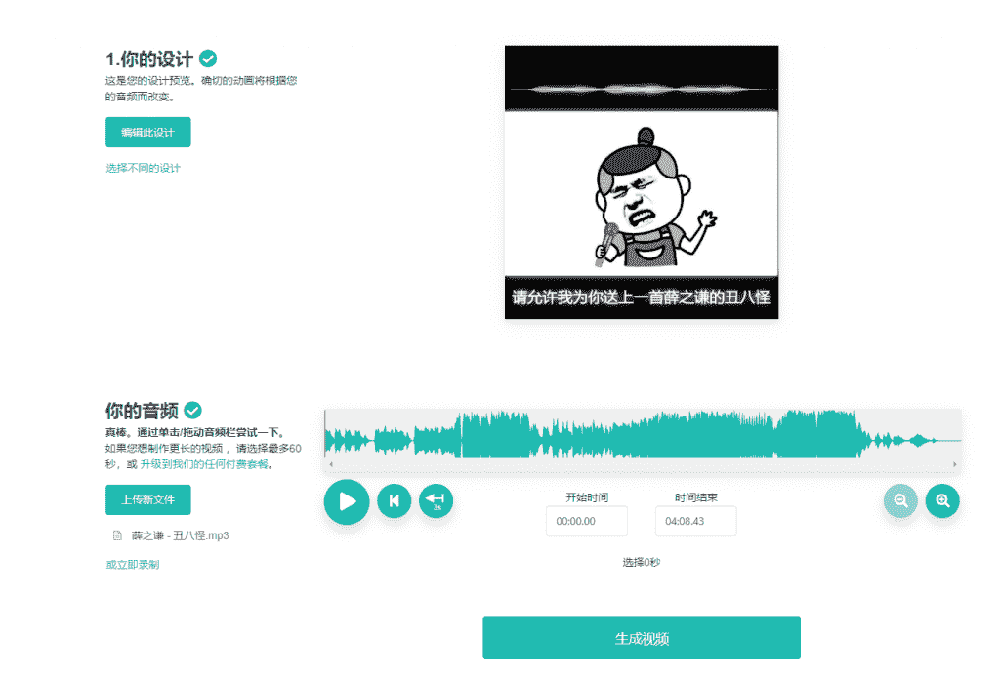
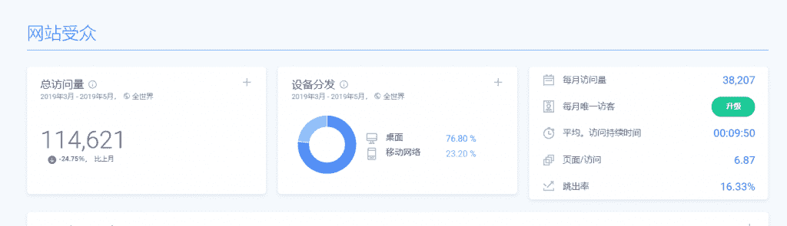

# 音频转视频的项目，月入 49000 美元

分享一个音频转视频月入$49k 的案例

网址：[Wavve](https://app.wavve.co/)

总访问量：11462

定价为$10/月、$18/月、$30/月三个级别

对于这款产品，baird 的技术联合创始人花了大约 12 个小时获得第一个 MVP。

mvp 帮助验证人们会付钱，以及在人们想要和支付的功能方面领先一步。

baird 创始人总共花了 14 个月达到 1 万美元的 MRR，21 个月达到 2 万美元的 MRR，大约 90％的增长来搜索引擎优化或社交媒体共享。

baird 表示推出产品时犯的最大错误是问大家对产品的反馈，这些反馈几乎都是让他开始研究新功能、设计、用户体验等，他认为从第一天起，你的初始目标应该是让付费用户付费。仅从潜在客户那里征求反馈意见，反而会让你专注完善功能。

以下是 baird 的几点心得：

1、不要只是坐下来提出想法，寻找待解决的问题或探索的行业。与人交谈，测试事物，找到你有兴趣在未来 5 年工作的利基。

2、与产品一样开展营销工作，建立 MVP 很容易，获得初始用户/客户很容易。调整产品，商业模式和营销渠道，使他们共同努力促进增长真的很难。

3、玩长游戏！太多人放弃了不错的项目，因为他们在 3-4 个月后没有看到结果，这需要很多的时间。

4、最重要的是捕捉有兴趣的人，这样你就可以开始与他们交谈，并将他们理解为潜在客户。

5、定价反馈是没用的。人们做出关于情绪的购买决策在谈话形式中难以量化。客户会“觉得”您的定价很昂贵，但仍然很乐意付出代价。你只需要选择价格点，继续测试/迭代。

生成视频

网站受众

评论：

潘迪凹 ： 看图一感觉挺有意思，点击网址进去啥都没有先让我注册。 感觉国外的人做产品好傲娇啊，一种老子天下第一爱用不用的姿态

Danny 回复 潘迪凹 ： [GitHub – aviaryan/awesome-no-login-web-apps at wip](https://github.com/aviaryan/awesome-no-login-web-apps?ref=wip) 无需登入的 WEB 应用程序

（工具大集合）

音频和视频

商业和金融

通讯

文档编辑

胶乳

降价

其他

画画

文件转换器

文件托管/共享

游戏

图形，图像和设计

互联网下载

音乐，广播和播客

笔记本和笔记本

隐私，安全和密码学

编程编辑器和 IDE

编程工具

搜索引擎

学习和教育

基于文本的工具