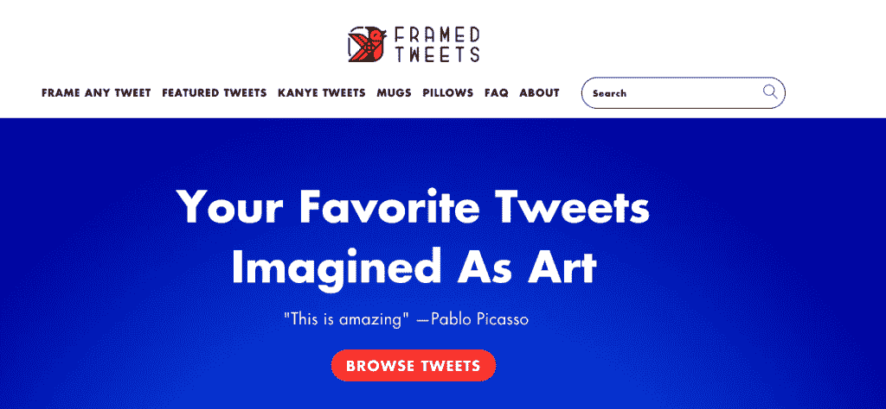
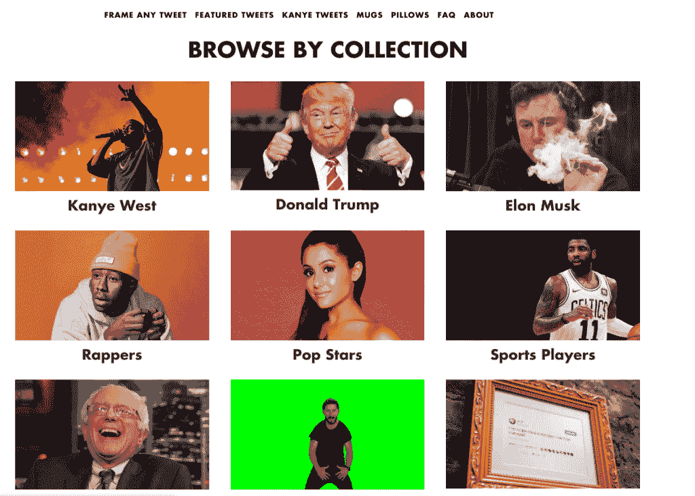
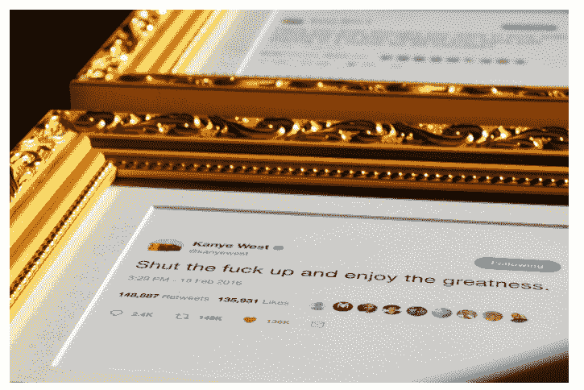
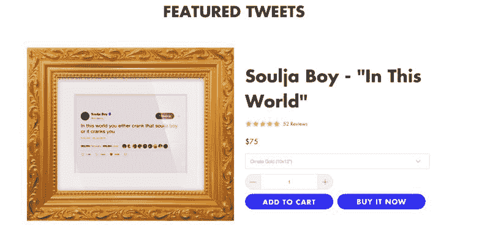
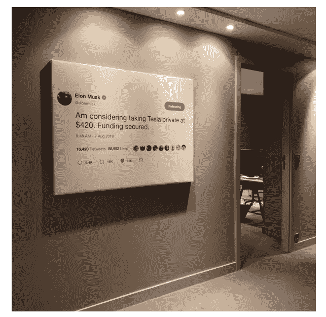
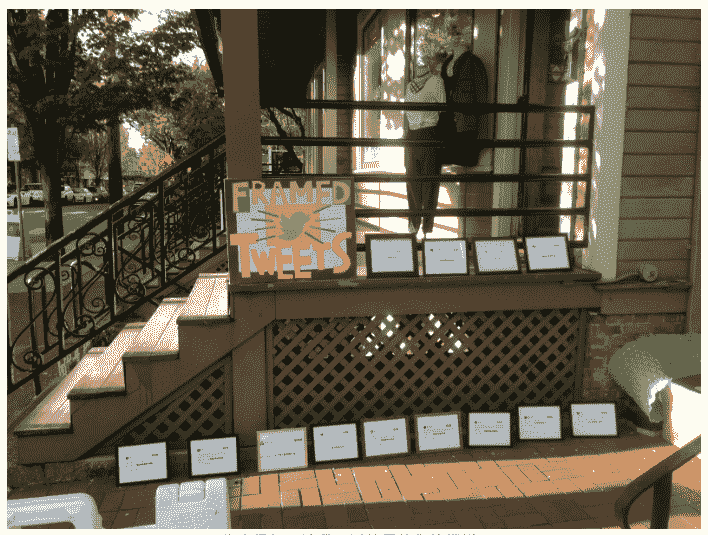
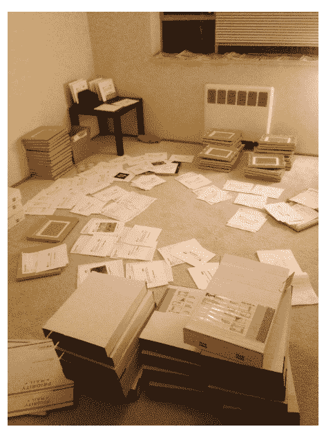
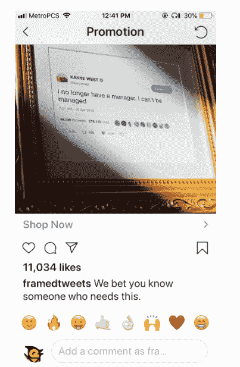

# 一个人的项目，每月赚 25000 美元

每周五，分享一篇海外生财之术，带你一起赚美元。

开始今天的分享之前，老圈友请回忆一下之前在星球提到过的两个项目～

项目一: 心书，可以帮你朋友圈打印成一本书，做成一本纪念册，据说每年的收入是几千万元哦;

项目二: 加个框，一个很有趣的小程序，你上传一张图片，它会帮你把图片放到一个框里面，如果觉得不错，可以买一个实体框回去。

今天分享的这个一起赚美元 案例与上面的两个有点像: 把一些有价值的 Twitter 推文装裱出来，并做成一个实体的画框，邮寄给你。

猜猜看这个项目多少人参与？赚了多少钱？

这是一个人的项目，每个月赚 25000 美元，惊讶吗？鱼丸是挺惊讶的，一起来看看他是怎么做成的吧。

项目名称：Framed Tweets

项目网站：[Framed Tweets | A New Kind Of Art](https://framedtweets.com/)

提供的产品/服务：用一种简单的办法，将别人喜欢的推文精美的塑造成艺术，可以作为礼物分享，或者挂在墙上纪念。

收入情况： 2017 年 5 月份推出，第一年收入 2 万美元，第二年 11 万美元，第三年也就是 2019 年开始投放广告，预计收入能到达 20 万美元以上。

如何想到这个点子？

主人公是 Twitter 深度用户，经常每天浏览很久 Twitter，有一天突然灵机一动，如果可以把喜欢的推文打印出来会怎么样？不过当时主人公并没有立即开始行动，而是把这个点子记录了下来，就去做别的事情了。

后来主人公毕业后，找工作遇到不少挫折，一次回家的路上，遇到有人摆摊在卖自己设计的迷题，问了一下，说生意还不错，又让他想起来之前的那个点子，于是重新开始思考这个点子创业的可能性。

如何开始做出第一个产品？

一开始主人公并不想搞很多设计的框架，只搞了一个美丽、华丽的金色框架开始，适合装裱推文。

主人公想从一家美国的相框公司购买，但找不到适合批量销售的好看的相框，于是主人公找到了万能的阿里巴巴，果然，从上面找到几家供应商要到了样品，并订购其中的 500 份。

如何启动业务？

挑选了一些有趣的推文，并且把他们打出来装进框里，在街上开始摆摊，虽然一开始没有卖出去很多个，大概六七个的样子，但是路过的很多人都会驻足看一看，主人公知道，手上抓到了一个好牌，这一定是一个好生意。

这才开始尝试线上销售，但是犯了一个很多人都会犯的错误： 找人外包从头开始去做一个电商的网站，那个时候主人公还不知道 shopify 这种神器的存在。

等主人公找到了 shopify 之后，花了两个月时间，拍摄产品照片、策划推文、做好产品分类、编写 FAQ 页面，最后终于准备好了一个网站。

然后作者在推特上搜索“把这个推文框起来”等关键词，并去留言推荐自己的网站，第二天早上醒来的时候，主人公发现自己的网站被 producthunt、Mashable、Uncreate 和一些其他网站收录，这些流量为他带来了刚开始的 100 个订单，大概 5000 美元， 但这些流量不可持续，很快又没有新的流量进来。

开始投放付费广告

在 Instagram 投放广告，大概 90%的销售来自于 instagram 广告，目前还没有在 facebook 上投放，因为 instagram 的回报率相当好。

有的时候，甚至只是在 instagram 上发布一些带框推文的照片，也会带来三四个销售。

其他推广方式

1\. PR 还没开始做；

2\. KOL 营销正在尝试，给拥有带来粉丝的人免费发送带框的推文，有的时候，这些 KOL 会帮助推广，不过这种获取流量的方式并不太可控；

3\. 邮件营销：还没开始做，比较感兴趣；

4\. Esty、Amazon、ebay 上也有一些销售， 但比例非常少；

5\. 有一些自然流量会进入网站并成交，但很多都是长尾关键词，比如搜索 明星 礼品 等；

未来的规划

1\. 投放更多的 instagram 广告，目前每个月可以从 instagram 广告中赚到 2 万美金，每个月的广告成本大概是 9000 美元；

2\. 将打印、装裱、运输等纯执行的事情，外包给一个第三方公司来做；

3\. 拓展一项新的业务：把表情包装到框里面；

一些心得与经验

1\. 专业的事情交给专业的人来做，一开始尝试了很久去投放 facebook 却搞的一团糟，后面将 facebook 广告投放委托给一家专业的机构，销售便开始真正的起飞了；

2\. 做成一件事情，并不是一蹴而就，而是你花费大量的时间，解决了大量的问题之后，才做成的，很多事情看着简单，做起来却不简单；

3\. 不管怎么样，再麻烦的事情也要自己亲自做几遍，然后再去寻找简单的办法。比如刚开始从打印、装裱、运输花了很多时间，但也是因为这样，对所有的细节了如指掌，最后外包给别的公司的时候，就知道怎么去监督和要求效果了；

4\. 不要担心分享你的点子，一开始很不愿意跟别人分享 framed Tweets 这个点子，担心被别人抄袭，但是后来发现这样做很愚蠢，事实上，真的也确实有很多人模仿了这个生意，但是无一例外都失败了。点子不值钱，值钱的是你的执行力。

5\. 不要在没有流量的时候加太多戏，比如刚开始每天访客只有二三十个的时候，想着去优化这个字体，那个 icon，实际上没有什么作用，搞定流量，在大流量的基础上，这些优化才有价值。

6\. 做自己真正喜欢做的事情，而不是赚钱，只有你真正喜欢做这件事情的时候，你才会投入全部的时间和精力，才会更有结果产出。

喜欢今天的一起赚美元 的话，给鱼丸点个赞哦

*   

    framed Tweets

*   

    framed Tweets

*   

    framed Tweets

*   

    framed Tweets

*   

    framed Tweets

*   

    framed Tweets

*   

    framed Tweets

*   

    framed Tweets

*   

    framed Tweets

评论：

公子睿 ： “社群挖宝”可以按这个思路搞一搞么？

鱼丸出面 | 亦仁助理 回复 公子睿 ： 感觉又给亦仁老板发掘了一个生财机会

Eric ： 一下子想到了，社群挖宝，照搬

星辰 ： 既然现在是短视频时代，不知道有没有低成本可以承载短视频的“相框”。动态的展现，可能会更吸引人

亦仁 回复 瑞克国 ： 视频版的是做电子相册

Gundy ： 这个心得经验句句良言啊

Teekr.任孟坤 ： 这个是不是有点像“名人名言”摘录哇，如果换成照片，是不是就会有版权主来找你了

张莹 ： 这个产品重点是相框还是 twitter 上内容？我感觉 twitter 上好的内容更重要，然后是加框这样的创新想法