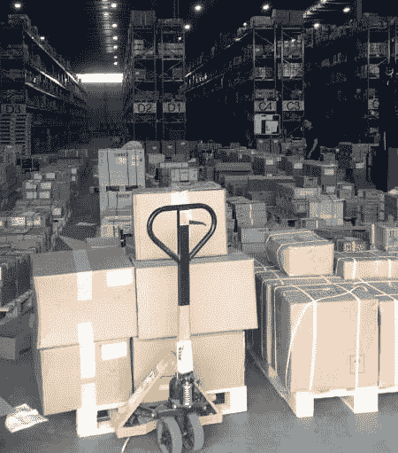
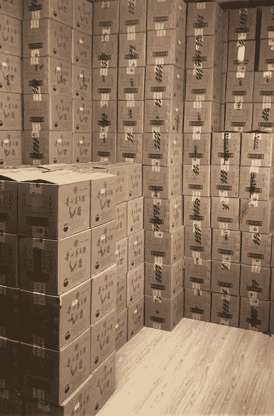
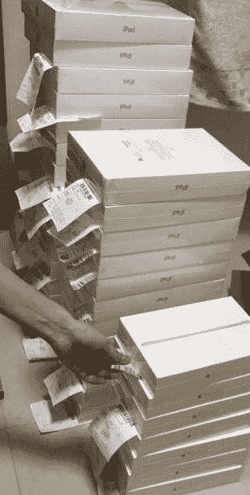
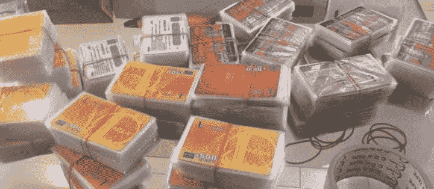

# 案例分享：众包采购与社群经济

身边有这样一个玩卡圈子，黄牛群主组织信用卡持卡人到苏宁，京东，天猫下单到群主提供的地址，下单产品主要有苹果手机，销量好的国产手机，数码配件，黄金，茅台等等，持卡人下单后到金数据报单，群主收货后当天会根据报单数据返款给持卡人，这个群体体量不小

持卡人可以得到：
1.相对较低的刷卡费率甚至无损赚银行积分

2.配合平台返利，银行卡满减活动，手机行情好的时候一单手机可以赚 10-200 不等

3.纯现金下单利用各种渠道得来的打折购物卡套取差价利润，利如 97 折苏宁卡，95 折京东卡

4.下单黄金和茅台的玩家，属于抢购，由于商品量少，配合商家活动能抢到的基本是纯赚 500/单

黄牛的利润：
1.我找朋友拿过电子城批发商报价单对比过黄牛的回款价格，5000-8000 左右的手机，差价在 50-200 元不等，但是如果需要批发商批量回购，每台机子要扣除 100 元左右，那么黄牛的利润大概 0-100/台？

2.我手上有大概 10 个黄牛群，业务有大有小，大的黄牛一天收到的手机量大概 3000-5000 台，全国各地都有收货点，当然这与电商是否有活动有打折有关，不是每天都有那么大批量，如果遇到 6.18，8.18，11.11 这样的日子，收货量应该要翻一翻

3.快递站点，所有参与下单的玩家都会做一个明显的暗号，这样方便快递员一次性把到的货提给黄牛，这么大的到货量，快递点是否会因此而给到一点好处给黄牛？有没有做快递的朋友分析下

4.今天我接触到一个人，他告诉我，其实这些黄牛收到手机之后，又把货回流到了平台，就是电商-黄牛-电商，不然线下没有谁能一下子吃掉那么多货

思考：
一直很想摸清这里面的环节内容，但是总觉得差了一点什么，黄牛每天垫付款达到了几百上千万，这里面的利益关系应该有可以深挖的地方，据我所知，湖北地区做的好的一个黄牛，年利润达到了亿级别，并且利用庞大的信用卡玩家基础，衍生出了很多分支利润点

这个众包采购社群经济是否有可以复制的地方？是否有参考的价值，想听听各位的看法

配几张图片让大家感受下

众包采购

众包采购

众包采购

众包采购

**评论：**

单申甲：手头也有 2 个这样的群，手机、茅台是大头，这两种每单下单成功利润就是上百的……还没搞明白背后的这条巨大的产业链怎么玩的

Cn 回复 单申甲：其实黄金的利润很可观，我身边的朋友都是众筹 1 公斤起定价下单

Maybe 回复 单申甲：怎么进啊

文彬文质彬彬：我见到有人在星球发这个，然后问了下，下单手机后，转寄给黄牛，然后黄牛 2 天返款，风险太大

Cn 回复 文彬文质彬彬：所以这个东西口碑做出来之后，基本很难有竞争对手，通常就是几个大黄牛吃遍整个市场

94：是不是会有人让你做交易 app 啊

林向南：emmmm，这背后的产业链秘密到底是什么🤔，有没有互联网产业链侦探解答下。

镌刻时光：我也有这个群，专门刷手机

你我的益达：也是一直没弄懂这其中的流转渠道，比如 618 京东抢了一堆小米空调，这些空调最终还是会被小米收回去

帆：我也有这种，美亚下单，寄送到某个仓库。然后全款返人民币。群里的人就，信用卡境外返现活动和各个折扣网薅平台羊毛，主要是买打印机。

乌云密布：金数据现在一多半流量都是这个了吧