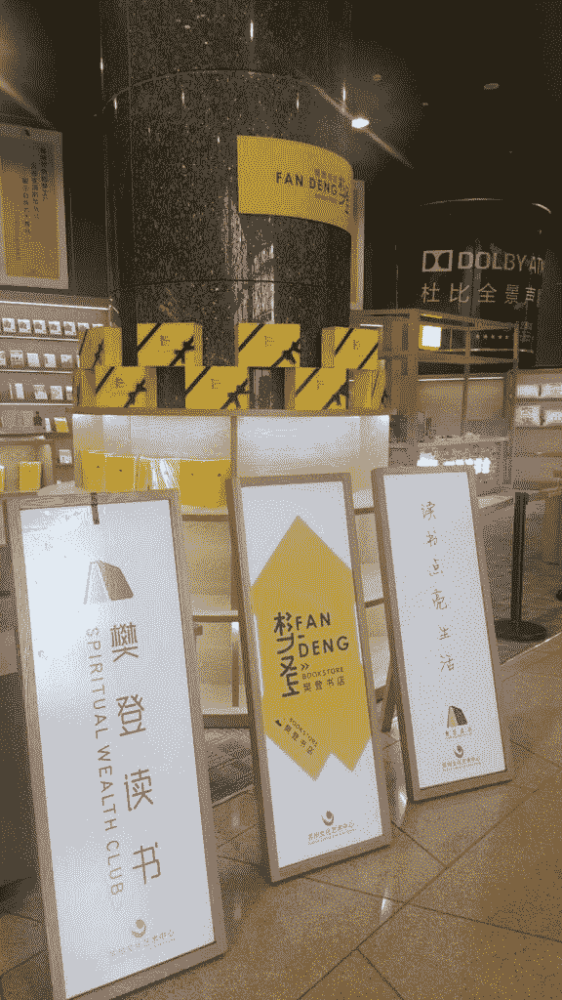
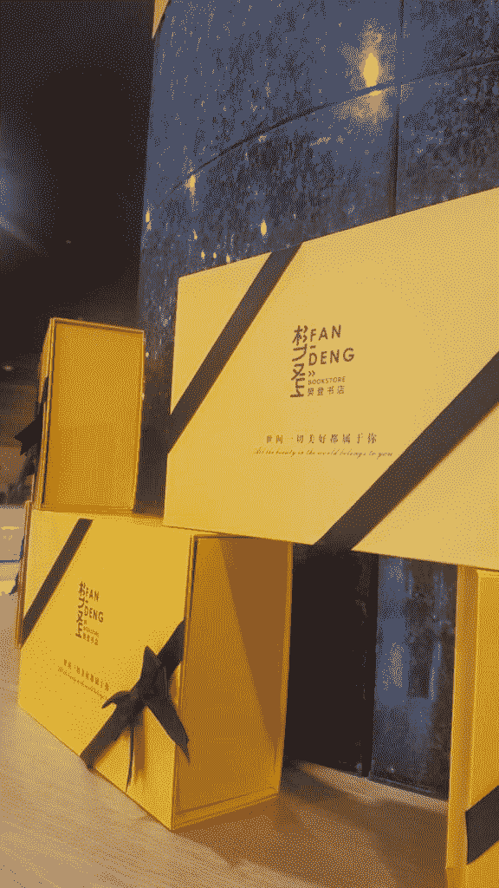
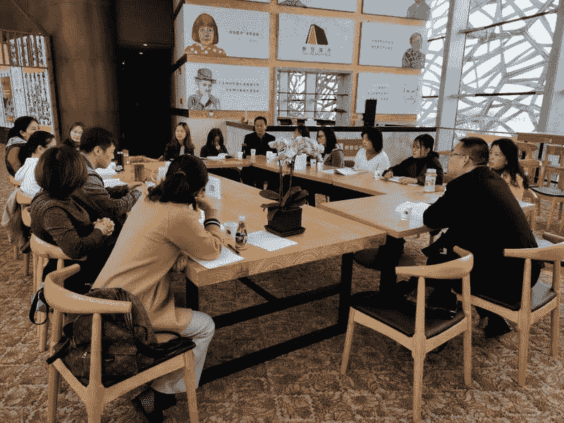
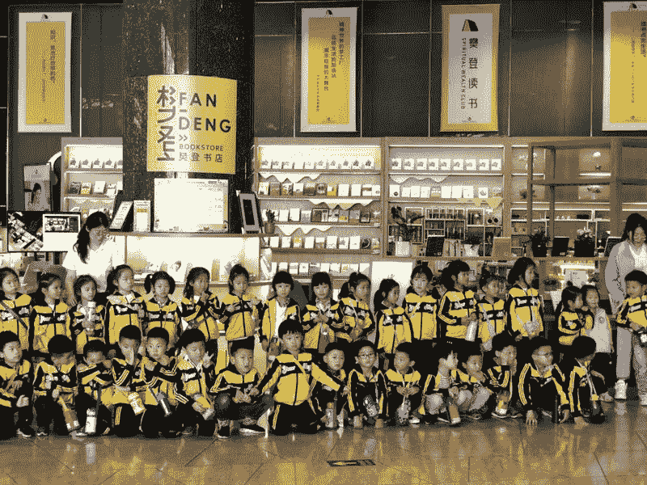

# 亲身体验樊登读书会和樊登书店

每周一，邀请一位圈友分享 TA 的生财之术。

先说几个数据

5 年，1800 万会员；
知识付费最成功的几个 IP 之一；
230 多家线下门店；
每年 20000+线下活动；

想到是谁的数据了吗？ 没错，樊登读书会！

所以，今天我们请到樊登老师来做一个#轻享 。

请大家欢迎！

开个玩笑，樊登老师太忙，没时间来参加轻享，但我们请到了樊登读书会的其中一位加盟商，生财有术圈友@向婷 ，作为亲历者，来聊聊她眼中的樊登读书会和樊登书店是什么样的。

欢迎@向婷 。

以下是本次轻享内容，enjoy！

大家好，我是向婷，我的事业线基本就是在不断跨界中不断震荡成长，大学四年艺术设计专业毕业后，有幸进入到了当时国产动画片生产鼻祖的三辰蓝猫卡通集团，就是做了“蓝猫三千问”的公司里学习了一年的动漫制作。

后来中国游戏开始崛起，我就开始了长达 10 年的网络游戏开发，那时候我的圈子里流行一句话是：一个男人可以带领 3 个女人进入到游戏中，但是一个女人可以带领 10 个男人进入到游戏中，所以我就大量的时间研究开发女性用户游戏。

▌我的创业经历

女性在家庭中的角色就是分阶段的，后来沉寂了 2 年在家相夫教子后，踏上了首次创业的路程，做了一家帮助社区业委会定制解决方案平台，也获得了社区公益项目一等奖，但是叫好不叫座，所以我只能承认自己首次创业不太成功。

在怀二宝期间，做自我思考，决心跨界做金融投资，把自己前 10 年的业余爱好作为事业，和合作伙伴开创了自己的财富工作室并创办了富妈妈社群，帮助身边的女性妈妈学习家庭财富增值资产配置。在财富践行的几年中，有缘与樊登读书会遇见了，并从此一发不可收拾的坚定做起了推广阅读的斜杠青年身份。

▌关于樊登读书会

谢谢亦仁的邀请来说说樊登读书会以及樊登书店。

目前，中国正处于一个消费升级的转型阶段。未来十年，将涌现出一大批中产阶级，中产阶级的兴起，必然会导致以物质刺激为主要手段的传统消费习惯的麻木，而以书籍为代表的新兴精神文化消费习惯的盛行。

我是 2015 年初接触樊登读书会的，那时候全国加盟城市可能还只有 20 几个，目前大大小小的加盟商已经有上千个，速度算是挺快的了，樊老师当时也是响应着国家推进红色书香中国而创办樊登读书会，当时的愿景是：影响中国 3 亿人爱上阅读，在第 6 个年头上，目前全国累积线上会员已经 1800 多万。

我简短的用些篇幅来说说我眼中看到的樊登读书会发展史。

在最开始，樊登读书会的形式是用 PPT 的方式，樊老师啃完一本书后，然后把解读的精华整理进 PPT 里，试图去发展客户，后来发现这种方式慢了点。

当 APP 开始盛行时，樊老师果断迭代产品，做了线上的读书软件，支持听语音和看视频以及看文稿的方式，很快会员量起来了。

接着就开始全国招加盟商，我加入的团队属于加盟省代，2014 年的时候，一个省代加盟费是 30 万，总部给予的支持是相应的卡以及强大的端口平台。

在这里我真心感叹，樊登的成功工具起了重要作用，总部当时花了不少心血在平台工具打造上，让加盟商可以快速推广和营销，重点在推广营销销售这件事，客户的采集和维护，工具帮了大忙。

▌关于樊登书店

2015-2017 是樊登读书会快速发展的 2 年，用一本书名来总结就是要做到用户指数型生长。

就在大家开始思考线上用户的弱连接时，樊登推出了又一重磅项目：樊登书店。书籍，将成为新的消费宠儿。有深厚背书的实体书店，将成为新的消费胜地，樊登书店的口号是：“一家书店点亮一个社区”，读书会希望通过樊登书店这个项目深耕社区，细挖用户。

我想用户线下的连接，才是提升粘着的关键吧，毕竟现在这个时代，时间才是资本，要想办法套牢用户的线下时间，一小群人沉侵式的学习才更有价值，碎片化时间学习已经太泛了。

樊登书店的扩展模式，跟樊登读书会大同小异，也是加盟商的方式，一个市级书店加盟费 30 万，同样给相应价值的线上读书会的会员卡以及相应的管理后台，店铺面积不用太大，20 平方米以上即可。加盟人身份必须是读书会会员，樊登读书会为书店背书。

关于很牛的管理平台上的支持内容主要以下几点：

1.  全面的知识内容资源
2.  宣传资源，每月至少 1 次线下沙龙宣传活动，带给的不单单只是流量的升级，还有想象不到的深厚人脉资源；
3.  导师资源，丰厚的导师资源会员级的消费群体提供事业，家庭及心灵上的特别辅导；
4.  培训资源，樊登读书会提供店员培训或直接派遣店员；
5.  数据资源，运用樊登读书会后台积攒的大量数据和现代化的分析手段。

早期加盟书店还能省 5 万加盟费，但是 2019 年 3 月份以后，福利全部都没了，纯粹的加盟费，卡也没有了，所以有些项目越早进入越受益。

书店的整个加盟流程其实跟传统的奶茶店加盟方式差不多，没有太多新意；

▌如何开一家樊登书店

自从我做了一家地理位置不错的樊登书店后，就总会有人来问到底开一家书店需要多少钱？

这涉及到你所要开的这家书店地理位置、店面面积、装修风格、人员投入、书本配套、宣传推广等一系列的成本问题，少到几万块，多到几百万，都是有可能的。

选择开樊登书店，是因为它跟传统的书店完全不同，相比之下，它的投入是比较可控的、收益又是比较可观的，开一家樊登书店，主要需要投入哪些部分，给大家参考。

第一、加盟费。第一次申请樊登书店，需要向总部缴纳几万元的加盟费（最开始 3 万元逐年提高），总部将配送相应数额的樊登读书会会员卡，并将在前期给予一定的书店补贴（每月一定数量的会员卡）。

第二、公司开立费用。成立相应的文化传播公司，根据经营范围，办理相应的许可证（比如图书经营许可证等）。

第三、店面日常费用。房租、水电费、物业费等，还有一些相应的日常维护费用。在很多情况下，店租是最主要的支出，当然了，也有一些地方可以谈到很低乃至不用租金。看个人能力。

第四、装修费用。这涉及到书店的面积、定位，装修风格以及装修的要求高低等，另外还包括家具家电，软装等等。明年开始，总部将要求统一采用统一 VI，装修风格要经总部审核，所有已开业的老店也要重新改造升级。目前来说，我这个 70 平方的店面，初期装修费用大概在 10 万元左右。当然后来又陆陆续续增设不少东西，那就另说了。

第五、采购费用。包括采购书籍、周边产品以及一些必需品。书籍采购总部是有统一渠道可以选择，当当网或亚马逊打折也是一个不错的选择。以后总部会陆续推出很多周边产品，可以自己选择是否购买。我们的书店初期采购书籍费用大概是在 3 万元左右，除了樊登老师讲过的书之外还有很多儿童书籍，因为我们还有亲子区板块，孩子的书实际上更贵一些。

第六、人力成本。一家书店至少要有 2 名专职人员，否则难以保证日常每天开店。人员工资一般以“底薪+提成”的方式构成。这个标准以当地工资水平为准，还要考虑具体职责分工。
当然，还有宣传推广费用等不定期产生的成本，都要列入考虑范围。

综合来看，如果是像我们一样开起一家小型樊登书店，最起码需要准备 30-50 万的启动资金。如果是大型店面，就要调整更多因素。

但我觉得，如果你没有那么多资金可以投入，那也不是问题。因为樊登书店独有的“线上-线下”模式，完全可以让你摆脱传统经营场所的限制，在各种环境之下都有可能开起一家很不错的书店。

因为，这家书店并不需要很多很多书，只需要有个二维码，只需要几排书架，就可以开起一家樊登书店。目前全国最小的樊登书店只有 17 平，盈利能力也非常好。

▌对樊登读书成功的几点思考

最后想来总结几点在我接触樊登读书会这几年从扁平化组织快速发展做到指数型组织的感触：

1、首先利用互联网的工具，产品本身是一个无边际成本的快速扩散的内容，然后再提供一个强大而好用的后台管理工具很重要；

2、每一个你的强链接客户和每一个你的弱连接客户都可以成为你的合作伙伴，快速扩张的营销方案，以前樊登读书会只开放了省级，市级，县级代理，后来又开放了个人微代，不需要公司主体，只要独立的个人就可以拿下一个樊登读书会微企代理，1 万块钱有 38 张卡，我觉得总部的这个是促使了读书会在这一两年又快速发展的契机；

3、给你的合作伙伴不断的赋能，樊老师不断在做的就是给伙伴以及会员赋能；在 2018 年年会上，樊老师说 2018 年他在飞机上的天数是 288 天，他不断的到处去给大家赋能，不管线下，线上每周的一本书无形的也是在赋能；

4、低风险创业，建议大家可以找这个本或者如果你是樊登读书会会员，多听几遍这本书，时下的互联网环境下，人人都是创业者已经很平常了，但是如何做到低风险创业，如何评估一个项目的好，是否适合自己？让自己能有一个淡定的心开始自己的小事业也是很重要滴。

今天关于读书会和樊登书店的分享到这就差不多了，很多都是我自己的亲身经历，抛砖引玉分享给大家，谢谢与大家的相遇，期待你的交流和指点。

*   

    樊登读书会

*   

    樊登读书会

*   

    樊登读书会

*   

    樊登读书会

*   

    樊登读书会

*   

    樊登读书会

*   

    樊登读书会

*   

    樊登读书会

*   

    樊登读书会

**评论：**

企鹅哥哥：吓我一跳。以为请到了樊登老师。

菇亮：感谢大佬分享 细想 其实凡登初期在宣传 导师 培训和数据方面的支持对很多目前加盟形式的产业都是适用的 只不过目前有不少加盟 抱着割韭菜的心理 缺少对资源支持层面的深耕细作 放任下级代理的野蛮发展 以加盟费置换卡费的形式同样值得借鉴 实物资金置换线上虚拟

微末凡尘：我比较喜欢读书，也想开个书店，但是鉴于电子商务发现很快，很多线下书店都倒闭了，请问下樊登书店盈利模式是什么样子呢，还有在苏州开个像样的樊登书店需要多少钱呢

故事、自己写：很喜欢樊登读书

青木：感谢分享，给了我这个在游戏圈子混了 6-7 年的想要转型的小白带来了希望。

风信子：请问，怎么可以成为樊登读书会会员？