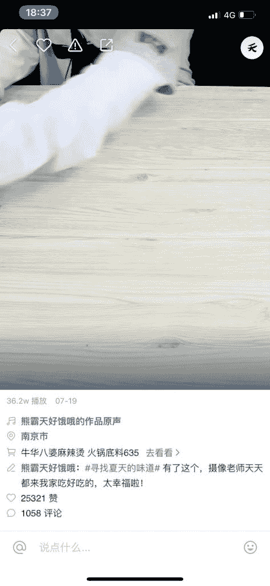

# 快手短视频带货和快手直播带货的现状与分析

举几个例子：
一、都说快手能带货，我也要做快手带货，快点给我快手资源，不管适不适合，能不能达到自己的战略目标；

问题分析：快手为什么能带货？是快手短视频带货还是快手直播带货？是所有的直播都能带货，还是有师徒体系的 kol 能带货？是所有的货都适合直播带货还是特定条件下的产品适合直播带货？

观察到的情况：所谓快手能带货，是指特定的产通过特定主播及他们的快手社会关系销售给他们的老铁。这里面就涵盖了太多条件：
1.商品是被招商团队筛选的，有非常苛刻的条件，商品单价低，分佣比例高，商品认知度高等自然会卡掉一大部分人；
2.主播和老铁是强关系，以前纯打赏直播，现在是买货支持主播，还有点小赚的意思；
3.主播的徒弟，师兄弟会帮主播导流和卖货；
4.主播的导购能力超强；

其实和主播合作下来，大多数的商家是不赚钱的，那为什么还有人做？
1.冲销量，给爆款做好基础销量，提升转化；
2.清库存，变现；
所以我们肯定要明确自己想要的，冲销量，清库存，花点代价是正常的。打品牌，这种方式还真不一定合适。甩货是从品牌账户里掏钱，广告才是给品牌账户存钱。

那快手短视频能高效带货么？个人感觉，效率会低，这个判断是从快手的政策，快手产品设计和实际案例操作分析出来的。快手的政策是不想过分的打扰用户，所以在做产品设计时，购物车的做的很小很不明显，会让人觉得就是普通文字，而抖音的购物车则是弹出式引导；通过实际案例中，抖音和快手挂相同的产品，单价一样，流量上快手甚至高于抖音，产品单价较低，受众面广，排除人群特性，抖音短视频的带货量远远高于快手；如果我判断错了，有带货好的案例，大家也可以分享给我；
二、昨天一个朋友说，我们抖音带货退货比例到了 5%，说我们账号有问题。

乍一看，退货比例确实蛮高的，但是我觉得明显是归因有问题。退货比例高和账号有啥关系，退货难道不是因为产品用户不满意而导致的么？不是应该反思产品问题么？大量的引流，几千单的带货量，自然会对粉丝有个筛选，但是这是整个推广过程中必然面临的问题。想带货量大，还想少产生退货和差评，这个真和流量方没关系，建议反思一下内功，这个锅我还真不想背。

顺带说一下，老客户的留存和新客户的拓展同样重要，必须两手抓两手都要硬。过度的消耗老客户生意必然萎缩，过度的开发新客户，成本又极高，要在维护好老客户的同时，花合理的成本拓展新客户，才是王道。最顶层的还是要防范系统风险，新老客户集体切换到别的频道去了。

好了，先 BB 到这，吐槽，拍砖，交流可加微信：13810012365

附图可以看到快手的购物车设计有多克制。

短视频带货

**评论：**

高智豪：快手、抖音、小红书，这几个目前确实非常火。 只是大家在进军的时候，别听几次课、看几片文章，就一股脑的冲进去了，多花点时间找内行人聊聊，你就清楚“快手能带货”是谁为了什么目的在大肆宣传了。 这段时间在做抖音的投放，欢迎一起交流一下踩过各种坑，微信 gzh166222

Tyler durd*：请问抖音投放 roi 一般是多少？

赵鑫@营销策划&定位 回复 Tyler durd*：这个要看产品

Chance.vi 回复 赵鑫@营销策划&定位：知道杭州一家公司，具他们说他们占快手短视频带货 90%的份额，他们很低调。上半年已经销量十几个亿了。

赵鑫@营销策划&定位 回复 Chance.vi：有号么，了解一下，大神级啊

朝天阙：感谢大佬分享

Tyler durd* 回复 高智豪：你说的很对