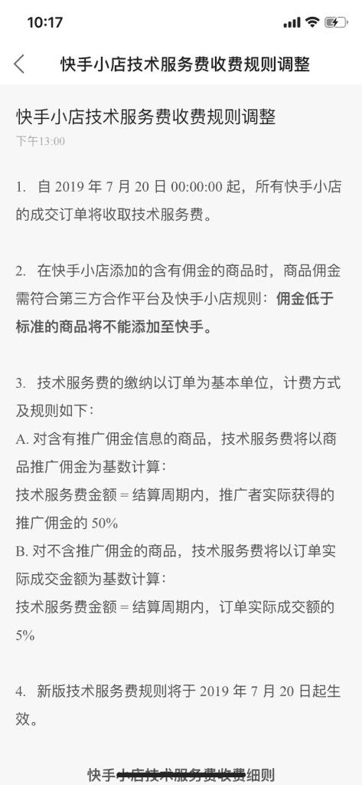
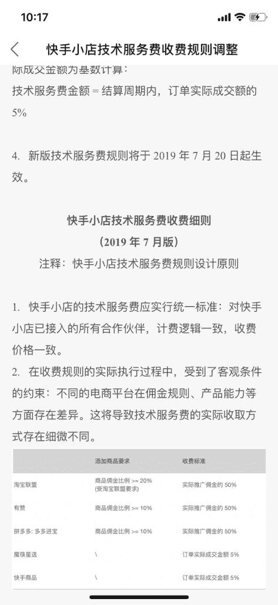
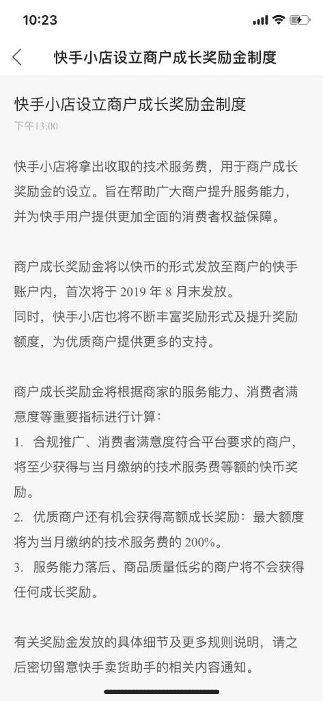

# 快手带货是如何做到这么火

去年一起用快手带货的朋友都惨淡收场，今年突然火的厉害，是不是我们不够坚持捂脸 可是一味的低价真心伤不起哇 捂脸

快手带的货价位一般都不高，快手平台还收取技术服务费，第三方电商平台也要收取一定的佣金，快手带货是怎么做到这么火的啊，商家是在引流吗，靠低价引来的流量会留存多少呢

快手带货

快手带货

快手带货

**评论：**

荔枝小一萌：提取 5-50%佣金，优质商铺奖励制，快手越来越好了说明。

荔枝小一萌：很多电商那钱换货，其实但最后开直播，连续播几天一件都卖不出去。

两点儿水一个马 回复 荔枝小一萌：是的，强者会越来越强。小商家玩儿不起

荔枝小一萌：好多电商的新趋势也是电商挖的新坑。

两点儿水一个马 回复 荔枝小一萌：优胜略汰，适者生存，有坑不怕，有我这种炮灰来填