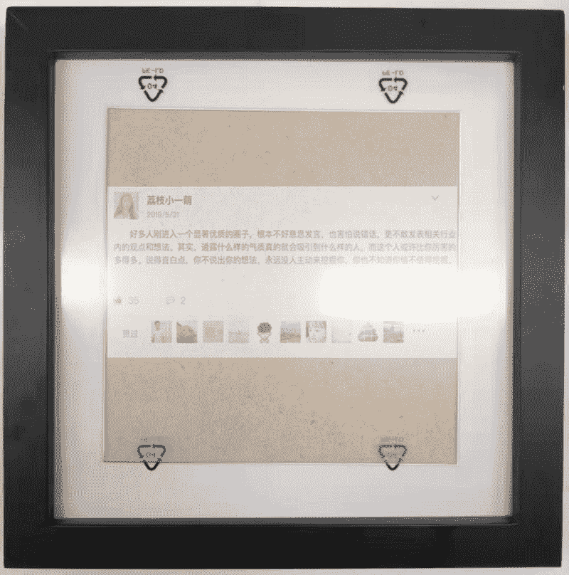
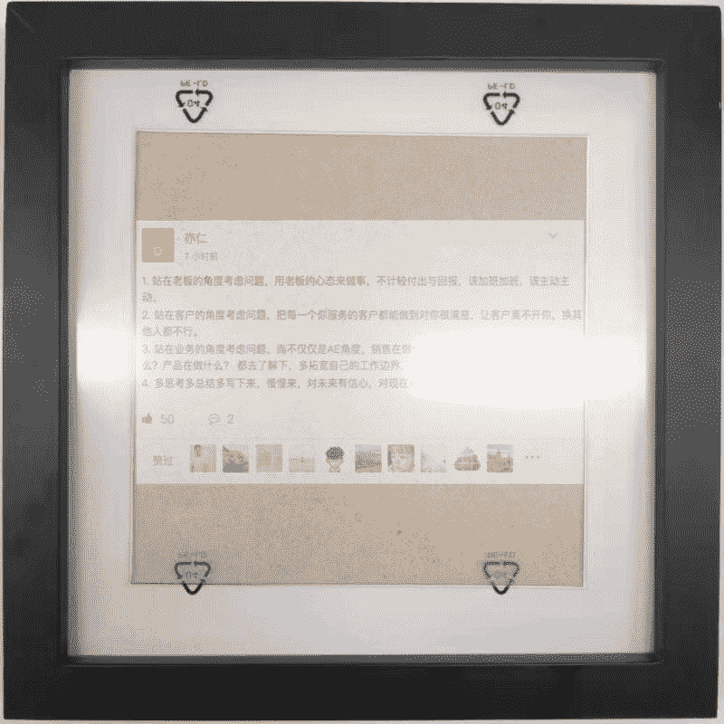
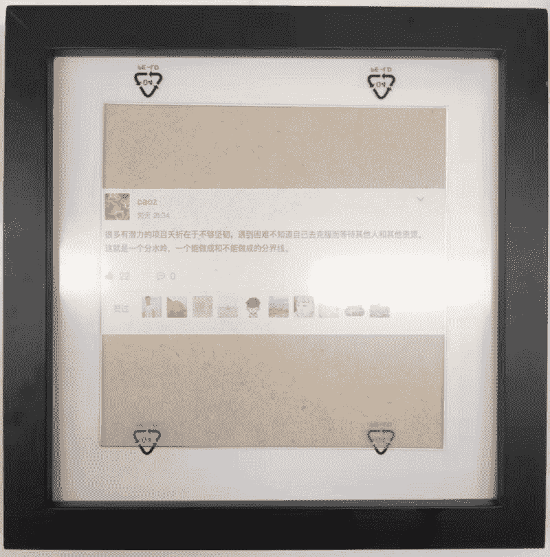

# 复制项目：将 twitter 内容制在相框里

加入此群半月有余，一直在潜水看各种分享，越看越觉得哇靠，还可以这么玩，但仔细想想，每一个项目操作难度其实蛮大的。不灰心，继续往下翻！偶然看到分享中有一篇，“将 twitter 内容制在相框里”，觉得这个难度不大（其实是小瞧它的难度系数），决定就以知识星球和微博的内容来练手，开发流程如下：

1，去某店铺找相框。

2，找前端设计制作。

3，兴冲冲的用 A4 打印出来，放到相框里。发现好丑😂😂！！

想着如何优化，增加质感：去某宝里找实木相框，发现边上那个白的叫卡纸，可以增加实体感，用相册专用纸代替 A4 纸，找彩色打印机，一套流程下来也几天了。

等货的期间心中各种思考什么样内容的会得到认可，思来想去，内容完全定制化。

所有配件全部到货，重新开始设计，打印，安装，成品效果还不错，见下图，原谅我的手机拍照。

请教一下大家：有没有好的推广方案？

PS ： 大家有需要的吗？包邮，内容全定制（只要提供内容链接或者截图），我们有设计师，可 100%真实还原网页效果。

相框

相框

相框

**评论：**

亦仁：微博可以尝试，但知识星球不建议。 知识星球其实走的是亲民路线，而金句需要有一种高高在上的仰视感，这样才能完全信任和信服，挂起来才有一种爽感。 找微博上面的 KOL 试试看，而且要那种超级明星的大 V，经常出金句的那种。

ez 回复 亦仁：好的，非常感谢

亦仁：继续折腾，微博上私信大 v，作为抽奖奖品。

亦仁：知识星球是去神化的平台，得到也许更适合。

ez 回复 亦仁：谢谢，发现找大 V 也是一门技术活呀，我先了解一下，他们是怎么合作的，如果是抽佣就更好了

ez 回复 亦仁：请教一下，如果不得到他的认可，直接用他们的话，会不会侵权？比如我直接@某人：原话，然后我在下面贴我的相框

Axel：里面卡纸挺好看，外面相框🖼可以再换换？

ez 回复 Axel：目前实木黑色，白色还有原色，更多框看大家需要的量有多少在开发吧，你们想要什么框？

Axel 回复 ez：颜色不重要，有质感比较好。可以看看 zarahome 的相框，然后 1688 看有没有替代品？

ez 回复 Axel：好，谢谢，给建议